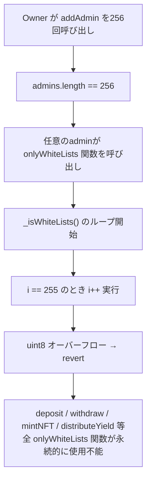

# F-2026-16866: Admin配列ループの整数型不一致によるサービス拒否（DoS）

| 項目 | 内容 |
|------|------|
| コード | F-2026-16866 |
| 種別 | Vulnerability |
| 深刻度 | Low（Impact 4/5, Likelihood 2/5） |
| 対象 | `OnlyWhiteListsBase.sol`, `Initialize.sol`, `InvestmentNFT.sol`, `ControlAdmin.sol` |
| 状態 | **対応済**（2026-05-27 実装完了） |

---

## 1. 概要

プロトコルはホワイトリストベースのアクセス制御を採用しており、`WhiteListsState` に管理者アドレスの配列を保持している。`addAdmin`（`ControlAdmin.sol`）は `uint256` のループカウンタを使用し、配列長の上限チェックを行わないため、256番目以上のadminを制限なく追加できる。

一方、同じ配列を走査する以下3箇所では `uint8` のループカウンタを使用している：

- `OnlyWhiteListsBase._isWhiteLists()`
- `Initialize.initialize()`
- `InvestmentNFT.setURI()`

Solidity ^0.8.28 ではデフォルトで算術オーバーフローがチェックされるため、配列長が256以上になると `i++` の時点で `uint8` のオーバーフローによりrevertが発生する。`_isWhiteLists` はプロトコルの全主要操作（deposit, withdraw, mintNFT, distributeYield, maturity, registerProduct, setAllowedByTierAddress）のゲートとなっているため、**全ホワイトリスト制御関数が永続的に使用不能**となる。

---

## 2. 現状の実装

### 2.1 `OnlyWhiteListsBase._isWhiteLists()`（uint8使用）

```solidity
function _isWhiteLists() internal view returns (bool) {
    address[] memory admins = Storage.WhiteListsState().admins;
    for (uint8 i = 0; i < admins.length; i++) {  // ← uint8: 255でオーバーフロー
        if (admins[i] == msg.sender) {
            return true;
        }
    }
    return false;
}
```

### 2.2 `Initialize.initialize()`（uint8使用）

```solidity
for (uint8 i = 0; i < admins.length; i++) {  // ← uint8: デプロイ時は255以下なら問題なし
    if (admins[i] == address(0)) revert IInvestmentErrors.InvalidAddress();
    Storage.WhiteListsState().admins.push(admins[i]);
    emit IInvestmentEvents.AdminAdded(admins[i], msg.sender);
}
```

### 2.3 `InvestmentNFT.setURI()`（uint8使用）

```solidity
address[] memory adminList = IInvestment(investmentContract).getAdminList();
bool isAdmin = false;
for (uint8 i = 0; i < adminList.length; i++) {  // ← uint8: 255でオーバーフロー
    if (adminList[i] == msg.sender) {
        isAdmin = true;
        break;
    }
}
```

### 2.4 `ControlAdmin.addAdmin()`（uint256使用・上限チェックなし）

```solidity
function addAdmin(address _admin) external onlyOwner {
    address[] memory admins = Storage.WhiteListsState().admins;
    for (uint256 i = 0; i < admins.length; i++) {  // ← uint256: 制限なし
        if (admins[i] == _admin) {
            revert IInvestmentErrors.AlreadyExistsAdmin();
        }
    }
    Storage.WhiteListsState().admins.push(_admin);  // ← 上限チェックなし
    emit IInvestmentEvents.AdminAdded(_admin, msg.sender);
}
```

---

## 3. 脆弱性のメカニズム



### 3.1 トリガー条件

1. Owner が `addAdmin` を計256回呼び出す（重複チェックのみで長さ制限なし）
2. 以降、`_isWhiteLists()` を経由する全関数が revert

### 3.2 影響範囲

| 関数 | 影響 |
|------|------|
| `deposit` | 投資家の入金が不可能 |
| `withdraw` | 投資家の出金が不可能 |
| `mintNFT` | NFT発行が不可能 |
| `distributeYield` | 利払い分配が不可能 |
| `maturity` | 満期処理が不可能 |
| `registerProduct` | 新規商品登録が不可能 |
| `setAllowedByTierAddress` | ティア設定が不可能 |
| `setURI`（InvestmentNFT） | メタデータURI更新が不可能 |

---

## 4. 影響

| 観点 | 内容 |
|------|------|
| 可用性（liveness） | プロトコルの全主要操作が永続的に停止 |
| 回復可能性 | admin配列を256未満に削減する手段（`deleteAdmin`）は Owner が実行可能だが、`deleteAdmin` 自体は `onlyOwner` であり `onlyWhiteLists` ではないため回復可能 |
| 悪用シナリオ | Owner（Safe Multisig）が意図せず大量admin追加。悪意ある攻撃には Owner 権限が必要（Likelihood 2/5） |
| 複雑度 | 単純（addAdmin を繰り返すのみ） |

---

## 5. 監査推奨（要約）

整数型を一貫させる。admin配列を小規模に保つ場合は `addAdmin` に上限255チェックを追加し `uint8` を統一。配列が255を超える可能性がある場合は全ループカウンタを `uint256` に変更する。

---

## 6. 対応方針（推奨）

### 6.1 基本方針: ループカウンタを `uint256` に統一

admin数が実運用で255を超えることは想定しないが、**型の不一致による潜在的DoS**を根本的に排除するため、全ループカウンタを `uint256` に変更する。

理由：
- `uint8` によるガス節約は実質的に存在しない（EVMは内部で32byteに拡張する）
- `ControlAdmin` や `deleteAdmin` は既に `uint256` を使用しており、統一性が向上する
- 将来の変更で上限チェックが漏れるリスクを排除できる

### 6.2 修正箇所

| # | ファイル | 行 | 変更内容 |
|---|---------|-----|---------|
| 1 | `src/investment/functions/onlyWhiteLists/OnlyWhiteListsBase.sol` | L17 | `uint8 i` → `uint256 i` |
| 2 | `src/investment/functions/initializer/Initialize.sol` | L20 | `uint8 i` → `uint256 i` |
| 3 | `src/periphery/InvestmentNFT.sol` | L83 | `uint8 i` → `uint256 i` |

### 6.3 追加対策: `addAdmin` に上限チェックを追加（防御的）

`uint256` への統一で根本的なオーバーフロー問題は解消されるが、admin配列が無制限に肥大化すると走査コストの増大やブロックガスリミット到達のリスクがある。防御的にadmin数の上限を設ける。

```solidity
uint256 private constant MAX_ADMINS = 255;

function addAdmin(address _admin) external onlyOwner {
    address[] memory admins = Storage.WhiteListsState().admins;
    if (admins.length >= MAX_ADMINS) {
        revert IInvestmentErrors.AdminLimitReached();
    }
    // ... 既存ロジック
}
```

> **注**: 上限値は運用要件に応じて調整可能。`uint256` 統一により技術的制約は解消されているため、この上限はビジネスロジック上のガードレールとなる。

---

## 7. 代替案の比較

| 方式 | メリット | デメリット | 採用 |
|------|----------|------------|------|
| **A. `uint256` に統一**（推奨） | 根本解決、最小変更、一貫性向上 | なし | **採用** |
| B. `uint8` 維持 + `addAdmin` に上限255チェック | 明示的な上限 | `uint8` がコード全体に残り混乱を招く、NFT側も修正必要 | 不採用 |
| C. mapping(address => bool) に変更 | O(1) ルックアップ、ガス効率最良 | 変更範囲が大きい、admin一覧取得にenumerable setが必要 | 将来検討 |

---

## 8. 実装タスクチェックリスト

### 8.1 コントラクト

- [x] `OnlyWhiteListsBase.sol` — ループカウンタを `uint256` に変更（§6.2 #1）
- [x] `Initialize.sol` — ループカウンタを `uint256` に変更（§6.2 #2）
- [x] `InvestmentNFT.sol` — ループカウンタを `uint256` に変更（§6.2 #3）
- [x] `ControlAdmin.sol` — `addAdmin` に上限チェック追加（§6.3）

### 8.2 テスト

- [x] `test/fix/F-2026-16866_Uint8OverflowDoS.t.sol` を新規作成し修正後の回帰テストを実施
  - admin数255人で `_isWhiteLists` が正常動作することを検証
  - `addAdmin` が上限（255）到達時に `AdminLimitReached` で revert することを検証
  - 重複追加が `AlreadyExistsAdmin` で revert することを検証
- [x] 既存テストの回帰確認（`forge test` 250 件 Green）

### 8.3 ドキュメント

- [x] 本ファイルのステータス更新
- [ ] 監査報告書への正式回答

---

## 9. 参考リンク

| リソース | パス |
|----------|------|
| ホワイトリストベース | `src/investment/functions/onlyWhiteLists/OnlyWhiteListsBase.sol` |
| 初期化 | `src/investment/functions/initializer/Initialize.sol` |
| NFT（setURI） | `src/periphery/InvestmentNFT.sol` |
| Admin管理 | `src/investment/functions/onlyOwner/ControlAdmin.sol` |

---

## 10. 変更履歴

| 日付 | 内容 |
|------|------|
| 2026-05-27 | 初版作成（監査指摘 F-2026-16866 の整理・対応方針） |
| 2026-05-27 | 実装完了: 3箇所 `uint256` 統一、`addAdmin` 上限チェック追加、`test/fix/F-2026-16866_Uint8OverflowDoS.t.sol` 新規作成、`forge test` 250 件 Green |
