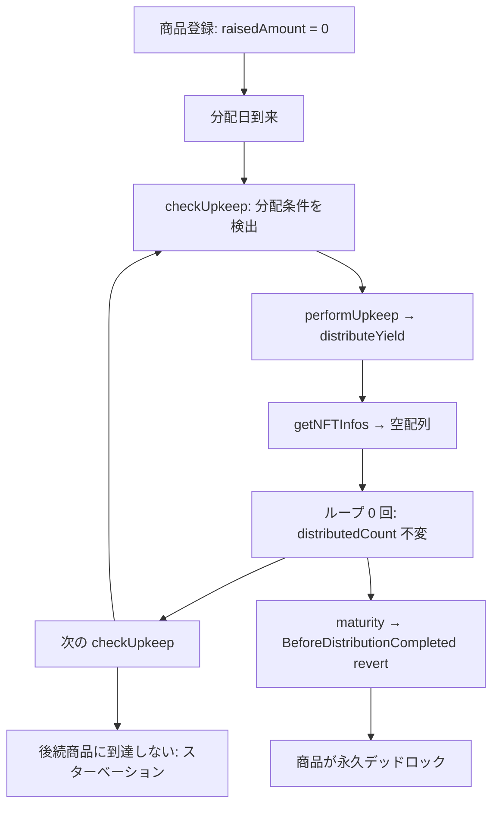
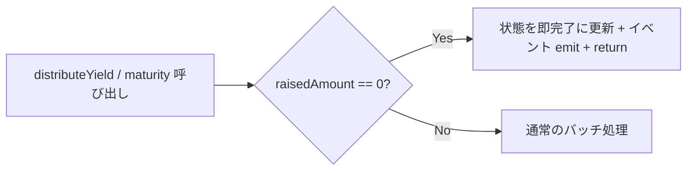

# F-2026-16869: 投資家ゼロの商品で distributeYield が no-op となり Automation が無限ループ・満期デッドロック

| 項目 | 内容 |
|------|------|
| コード | F-2026-16869 |
| 種別 | Vulnerability |
| 深刻度 | Medium（Impact 3/5, Likelihood 3/5） |
| 対象 | `DistributeYield.sol`, `Maturity.sol`, `Automation.sol`, `InvestmentNFT.sol` |
| 状態 | **対応済**（2026-05-26 実装完了） |

---

## 1. 概要

商品が登録されたが投資家が一人も申し込まないまま（`product.raisedAmount == 0`）初回分配日を迎えた場合、`distributeYield` がサイレント no-op（成功するが状態が進まない）となる。これにより Chainlink Automation の `checkUpkeep` が同一商品を繰り返し返し、**後続の全商品の自動分配・満期処理が無期限にブロック**される。

当該商品自体も `distributedCount` が `totalDistributionCount` に到達しないため `maturity` は `BeforeDistributionCompleted` で revert し、**永久デッドロック**状態に陥る。

---

## 2. 現状の実装

### 2.1 利払い分配（`DistributeYield.sol`）

```solidity
uint256 lastTokenId = nft.tokenIdCounter();                    // = 0（NFT 未発行）
// ...
uint256 startTokenId = product.distributedTokenId + 1;         // = 1
IInvestmentNFT.NFTInfo[] memory nftInfos = nft.getNFTInfos(startTokenId);
// nftInfos.length == 0（空配列）

for (uint256 i = 0; i < nftInfos.length; i++) {               // 0 回ループ
    // ...
    if (nftInfos[i].tokenId == lastTokenId) {
        product.distributedCount++;                             // ← 到達しない
    }
}

product.isInsufficientBalance = false;                         // ← 実行される
```

- `startTokenId = 1` に対し `tokenIdCounter = 0` のため、`getNFTInfos` は空配列を返す。
- for ループが 0 回で終了し、`distributedCount` も `distributedTokenId` も更新されない。
- トランザクション自体は成功するため、呼び出し元にエラーは伝播しない。

### 2.2 InvestmentNFT.getNFTInfos の挙動

```solidity
uint256 endTokenId = startTokenId + 49 < tokenIdCounter
    ? startTokenId + 49
    : tokenIdCounter;                        // = 0
uint256 length = endTokenId >= startTokenId
    ? endTokenId - startTokenId + 1
    : 0;                                     // = 0（0 >= 1 は false）
```

`startTokenId(1) > tokenIdCounter(0)` のとき `length = 0` となり空配列が返る。

### 2.3 Automation（`checkUpkeep` / `performUpkeep`）

`checkUpkeep` は全商品を走査し、分配条件を満たす最初の商品を返す。`distributeYield` がスタックした商品は `distributedCount < totalDistributionCount` のまま毎回ヒットし、後続商品は走査されない。

### 2.4 満期処理（`Maturity.sol`）

```solidity
if (product.totalDistributionCount > product.distributedCount) {
    revert IInvestmentErrors.BeforeDistributionCompleted();   // ← ここで常に revert
}
```

`distributedCount` が進まないため、満期処理も永続的に実行不能。

仮に `distributeYield` 側を修正して `distributedCount` を完走させても、`maturity` にも同様の空バッチ問題がある。

```solidity
uint256 startTokenId = product.maturedTokenId + 1;             // = 1
IInvestmentNFT.NFTInfo[] memory nftInfos = nft.getNFTInfos(startTokenId); // 空配列
uint256 lastTokenId = nft.tokenIdCounter();                    // = 0

for (uint256 i = 0; i < nftInfos.length; i++) {               // 0 回ループ
    if (nftInfos[i].tokenId == lastTokenId) {
        product.isMaturity = true;                              // ← 到達しない
    }
}
```

---

## 3. 脆弱性のメカニズム



### 3.1 監査 PoC の要点

1. 商品 1（投資家なし）と商品 2（投資家あり）を登録。
2. 分配日まで時間を進める。商品 1 の NFT コントラクトは `tokenIdCounter == 0`。
3. `distributeYield(PRODUCT_1)` — 成功するが `distributedCount` は 0 のまま（no-op）。
4. `checkUpkeep` を 3 回呼ぶ — 毎回 商品 1 が返される（商品 2 に到達しない）。
5. `maturity(PRODUCT_1)` — `BeforeDistributionCompleted` で revert（永久デッドロック）。

PoC: 監査報告書付属の `PoC_EmptyNFTBatchDoS.t.sol`

---

## 4. 影響

| 観点 | 内容 |
|------|------|
| 可用性（liveness） | 投資家ゼロの 1 商品が Automation パイプライン全体をブロック |
| 後続商品への波及 | 他商品の投資家の分配・満期が無期限に遅延 |
| 当該商品 | `distributedCount` / `isMaturity` が進まず永久デッドロック |
| 回避策 | 手動で各商品の `distributeYield` / `maturity` を直接呼べば回避可能だが、Automation の意義が失われる |
| 悪用 | 独立（外部の悪意ある操作なしに発生し得る） |

---

## 5. 監査推奨（要約）

`raisedAmount == 0`（投資家ゼロ）の場合、分配ラウンドを即座に完了としてスキップする。

```solidity
// distributeYield 内（監査推奨コード）
if (product.raisedAmount == 0) {
    product.distributedCount++;
    product.distributedYieldPerCount = 0;
    product.isInsufficientBalance = false;
    emit IInvestmentEvents.YieldDistributed(productId, product.distributedCount, 0, 0, 0);
    return;
}
```

`raisedAmount` を使うのが推奨（ビジネスレベルの不変条件: 資金調達なし = 投資家なし）。`nft.tokenIdCounter()` への外部呼び出しを回避できる。

---

## 6. 対応方針（推奨）

### 6.1 基本方針: `raisedAmount == 0` の早期リターン

`distributeYield` と `maturity` の両方に、ゼロ調達商品のガードを追加する。



### 6.2 `distributeYield` への変更

既存のバリデーション（`ProductNotFound`, `MaturedProduct`, `DistributionCompleted`, `BeforeDistributionStartDate`）の直後、yield 計算の前に追加する。

```solidity
if (product.raisedAmount == 0) {
    product.distributedCount++;
    product.distributedYieldPerCount = 0;
    product.isInsufficientBalance = false;
    emit IInvestmentEvents.YieldDistributed(productId, product.distributedCount, 0, 0, 0);
    return;
}
```

**挿入位置:** 65 行目（`BeforeDistributionStartDate` チェック）の直後、67 行目（`periodYield` 計算）の前。

**効果:**
- `distributedCount` がインクリメントされ、次回 `checkUpkeep` で同じ分配ラウンドを再検出しなくなる
- `totalDistributionCount` 回分すべてスキップ完了すれば `maturity` の前提条件が満たされる
- yield 計算・`getNFTInfos` 外部呼び出し・ループを完全にスキップしガスを節約

### 6.3 `maturity` への変更

既存のバリデーション（`BeforeDistributionCompleted`）の直後、productPool チェックの前に追加する。

```solidity
if (product.raisedAmount == 0) {
    product.isMaturity = true;
    product.isInsufficientBalance = false;
    emit IInvestmentEvents.ProductMatured(productId, 0, 0, 0);
    return;
}
```

**挿入位置:** 48 行目（`BeforeDistributionCompleted` チェック）の直後、49 行目（`productPool` チェック）の前。

**効果:**
- `isMaturity = true` に設定され、商品ライフサイクルが正常に完了する
- 空バッチによる `isMaturity` 未到達を防止

### 6.4 `checkUpkeep`（Automation.sol）への変更

**変更不要。** `checkUpkeep` でスキップすると `performUpkeep` → `distributeYield` が呼ばれなくなり、`distributedCount` のインクリメントや `YieldDistributed` イベントの発行が行われない。根本原因は `distributeYield` / `maturity` 側の状態遷移の欠如であり、これらのガードで `distributedCount` が正しく進めば `checkUpkeep` は自然に次の商品へ進む。

### 6.5 設計判断の根拠

| 判断 | 理由 |
|------|------|
| `raisedAmount` でチェック | ビジネス不変条件（資金調達なし = 投資家なし）。NFT 外部呼び出し不要 |
| `distributeYield` と `maturity` の両方に追加 | 片方だけでは後段で同様のデッドロックが残る |
| `checkUpkeep` は変更しない | スキップすると `distributeYield` が呼ばれず `distributedCount` が進まない。状態遷移は `distributeYield` / `maturity` 側で完結させる |

---

## 7. 代替案の比較

| 方式 | メリット | デメリット | 採用 |
|------|----------|------------|------|
| **A. `raisedAmount == 0` 早期リターン**（推奨） | 最小限の変更、根本原因に対処、ガス節約 | なし | **採用** |
| B. `checkUpkeep` でスキップのみ | Automation のみ修正 | 手動呼び出し時にデッドロック残存、根本未解決 | 不採用 |
| C. 商品登録時に投資家ゼロの場合は分配不要と設定 | 事前防止 | 登録後に投資家が来る可能性がある、既存フロー変更大 | 不採用 |
| D. `getNFTInfos` で空バッチ時に特殊値を返す | NFT 側で対処 | 呼び出し元の全関数に影響、責務の違反 | 不採用 |

---

## 8. 実装タスクチェックリスト

### 8.1 コントラクト

- [x] `DistributeYield.sol` — `raisedAmount == 0` ガードの追加（§6.2）
- [x] `Maturity.sol` — `raisedAmount == 0` ガードの追加（§6.3）

### 8.2 テスト

- [x] `test/fix/F-2026-16869_EmptyNFTBatchDoS.t.sol` を新規作成し、修正後の回帰テストを実施
  - ゼロ調達商品の `distributeYield` で `distributedCount` が正しく進むことを検証
  - 複数商品混在時に `checkUpkeep` が後続商品へ正しく進むことを検証
  - ゼロ調達商品の `maturity` で `isMaturity = true` に正しく遷移することを検証
- [x] 既存テストの回帰確認（`forge test` 226 件 Green、F-2026-17221 の既存 PoC 1 件は別チケット）

### 8.3 ドキュメント

- [x] 本ファイル（`docs/audit/fix/F-2026-16869-empty-nft-batch-dos.md`）のステータス更新
- [ ] 監査報告書への正式回答

---

## 9. 実装メモ

- `distributeYield` は `totalDistributionCount` 回分のループを 1 回ずつ即完了させる。呼び出し回数分のガスのみ消費。
- `maturity` は 1 回で `isMaturity = true` に遷移。`totalReturnedAmount` は 0 のまま（返還すべき元本がない）。
- `productPool` は `raisedAmount == 0` なら 0 であるべきため、減算処理はスキップして問題ない。
- `distributedYieldPerCount` のリセット（`= 0`）は明示的に行う（中間バッチの累積値がないことを保証）。

---

## 10. 参考リンク

| リソース | パス |
|----------|------|
| 分配実装 | `src/investment/functions/onlyWhiteLists/DistributeYield.sol` |
| 満期実装 | `src/investment/functions/onlyWhiteLists/Maturity.sol` |
| NFT バッチ取得 | `src/periphery/InvestmentNFT.sol`（`getNFTInfos`） |
| Automation | `src/periphery/Automation.sol`（`checkUpkeep` / `performUpkeep`） |
| 監査 PoC | 監査報告書付属 `PoC_EmptyNFTBatchDoS.t.sol` |
| 関連（別指摘） | `docs/audit/fix/F-2026-16871-push-payment-blacklist.md` |

---

## 11. 変更履歴

| 日付 | 内容 |
|------|------|
| 2026-05-26 | 初版作成（監査指摘 F-2026-16869 の整理・対応方針） |
| 2026-05-26 | 実装完了: `DistributeYield.sol`, `Maturity.sol` にガード追加、`test/fix/F-2026-16869_EmptyNFTBatchDoS.t.sol` 新規作成、`forge test` 226 件 Green |
