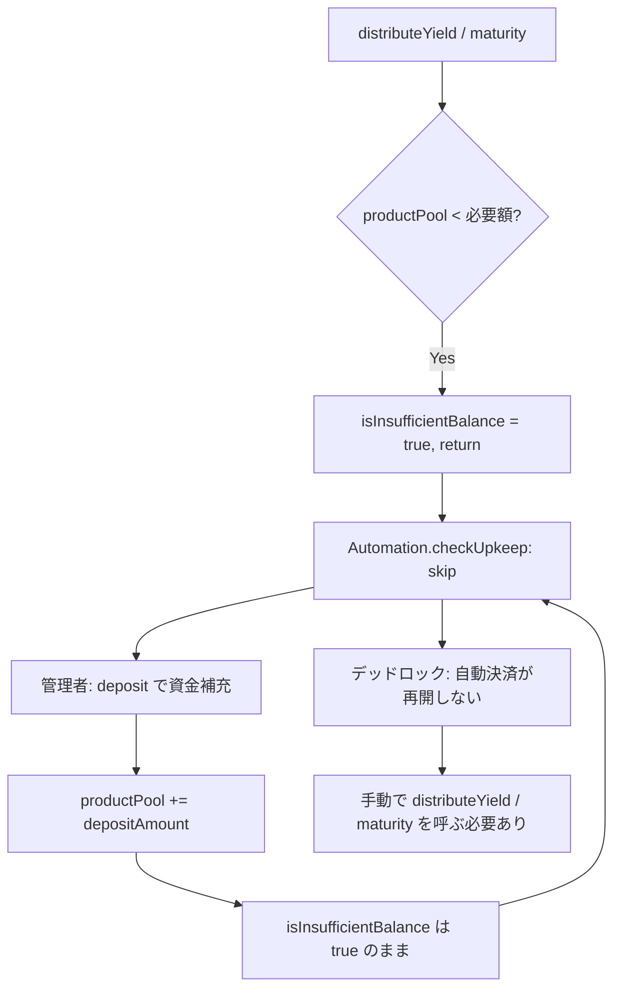

# F-2026-16870: deposit による資金補充が isInsufficientBalance フラグをクリアしない

| 項目 | 内容 |
|------|------|
| コード | F-2026-16870 |
| 種別 | Vulnerability |
| 深刻度 | Low（Impact 2/5, Likelihood 3/5） |
| 対象 | `Deposit.sol`, `Automation.sol`, `DistributeYield.sol`, `Maturity.sol` |
| 状態 | **対応済**（2026-05-27 実装完了） |

---

## 1. 概要

`distributeYield` または `maturity` が `productPool` の不足を検出すると、`isInsufficientBalance = true` を設定し早期リターンする。Automation（Chainlink）の `checkUpkeep` はこのフラグが `true` のプロダクトを無条件でスキップする。

一方、管理者が `deposit` で `productPool` を補充しても、`isInsufficientBalance` フラグはクリアされない。その結果、プールが十分に資金補充されていても Automation はプロダクトをスキップし続け、管理者が手動で `distributeYield` または `maturity` を呼び出さない限り決済が再開されない。

この運用依存は文書化されておらず、一時的な残高不足が発生するたびに手動介入が必要となり、NFT 保有者への利払い・元本返還が遅延する。

---

## 2. 現状の実装

### 2.1 フラグの SET（`DistributeYield.sol` / `Maturity.sol`）

`productPool` が必要額に不足している場合、フラグを `true` にセットして早期リターンする。

```solidity
// DistributeYield.sol L100-105
if (periodYield + periodToleranceRemainder - product.distributedYieldPerCount > product.productPool) {
    product.isInsufficientBalance = true;
    emit IInvestmentEvents.InsufficientProductPoolForDistribution(productId);
    return;
}

// Maturity.sol L57-62
if (product.raisedAmount - product.totalReturnedAmount > product.productPool) {
    product.isInsufficientBalance = true;
    emit IInvestmentEvents.InsufficientProductPoolForMaturity(productId);
    return;
}
```

### 2.2 フラグの CLEAR（`DistributeYield.sol` / `Maturity.sol`）

処理が正常完了した場合にのみフラグをクリアする。

```solidity
// DistributeYield.sol L159-161（正常完了時）
product.productPool -= _distributedYield;
product.isInsufficientBalance = false;

// Maturity.sol L123-126（正常完了時）
product.totalReturnedAmount += _returnedAmount;
product.productPool -= _returnedAmount;
product.isInsufficientBalance = false;
```

### 2.3 フラグの参照（`Automation.sol`）

`checkUpkeep` で `isInsufficientBalance == true` のプロダクトをスキップする。

```solidity
// Automation.sol L48-51
if (product.isMaturity || product.isInsufficientBalance) {
    continue;
}
```

### 2.4 `deposit` 関数（`Deposit.sol`）

`productPool` を増加させるが、`isInsufficientBalance` には一切触れない。

```solidity
// Deposit.sol L50-55
product.productPool += depositAmount;

usdt.safeTransferFrom(msg.sender, address(this), depositAmount);

emit IInvestmentEvents.Deposited(productId, msg.sender, depositAmount, product.productPool);
```

---

## 3. 脆弱性のメカニズム



deposit → フラグ未クリア → Automation スキップ → distributeYield/maturity が自動呼び出しされない → フラグがクリアされない → 永遠にスキップ

### 3.1 監査 PoC の要点

1. 商品登録後、`mintNFT`（fiat path）で投資。`productPool` は 0 のまま。
2. 分配日まで warp。`distributeYield` 実行 → プール不足で `isInsufficientBalance = true`。
3. 管理者が `raisedAmount * 2` を `deposit` で補充。`productPool > 0` に。
4. **`isInsufficientBalance` は依然 `true`** — `deposit` がフラグをクリアしていない。
5. `checkUpkeep` は `false` を返す — 十分な資金があるにも関わらず Automation がプロダクトをスキップ。

PoC: 監査報告書付属の `PoC_InsufficientBalanceFlagStale`

---

## 4. 影響

| 観点 | 内容 |
|------|------|
| 可用性（liveness） | 一時的な残高不足後、資金補充しても Automation が再開しない |
| 運用負荷 | 毎回の残高不足イベント後に手動で `distributeYield` / `maturity` を実行する必要がある |
| 投資家への影響 | 利払い・元本返還の遅延（管理者が手動介入するまで） |
| 深刻度 | Low（資金喪失はないが、運用依存が文書化されていない） |

---

## 5. 監査推奨

### 5.1 選択肢 A: `deposit` 内でフラグを無条件クリア（監査第一推奨）

```solidity
product.productPool += depositAmount;
product.isInsufficientBalance = false;
```

### 5.2 選択肢 B: `checkUpkeep` で再評価

`checkUpkeep` 内で `isInsufficientBalance == true` のプロダクトに対して `productPool` が現在の必要額を満たしているかを再計算する。

### 5.3 選択肢 C: 手動復旧を意図的な仕様として文書化

手動での `distributeYield` / `maturity` 呼び出しが意図的であれば、文書化し復旧イベントを emit する。

---

## 6. 対応方針（確定）

**選択肢 A（`deposit` でフラグを無条件クリア）を採用する。**

### 6.1 採用理由

1. **安全性**: 無条件クリアは安全である。`distributeYield` / `maturity` は実行時に必ず残高チェックを行い、`productPool` が依然不足していれば再度 `isInsufficientBalance = true` をセットする。フラグの冪等な再セットパスが既に存在する。

2. **対称性**: フラグの SET は `distributeYield` / `maturity` で自動的に行われる。CLEAR も `deposit`（資金補充）で自動的に行われるべきであり、SET/CLEAR が対称になる。

3. **変更範囲が最小**: `Deposit.sol` の 1 行追加のみ。他のコントラクト（`Automation.sol`, `DistributeYield.sol`, `Maturity.sol`）に変更不要。

4. **監査推奨と一致**: 監査会社の第一推奨であり、レビュー時の合意がスムーズ。

### 6.2 選択肢 B を不採用とする理由

- `checkUpkeep` は `view` 関数であり、state 変更（フラグクリア）は不可。
- 利回り計算ロジック（`periodYield` 等）を `checkUpkeep` に複製する必要があり、コード重複・保守コストが増大。
- Chainlink Automation の gas 消費も増える。

### 6.3 選択肢 C を不採用とする理由

- 手動復旧は運用負荷が高く、自動化が可能な箇所をわざわざ手動にする合理的理由がない。
- 本プロジェクトの Automation は `checkUpkeep` → `performUpkeep` の自動フローが前提。

---

## 7. 修正内容

### 7.1 `Deposit.sol`（1 行追加）

```solidity
// 修正前
product.productPool += depositAmount;

// 修正後
product.productPool += depositAmount;
product.isInsufficientBalance = false;
```

### 7.2 変更対象ファイル一覧

| 優先度 | ファイル | 修正内容 |
|--------|----------|----------|
| 必須 | `src/investment/functions/onlyWhiteLists/Deposit.sol` | `product.isInsufficientBalance = false;` を追加 |
| 必須 | `test/fix/F-2026-16870_DepositClearsFlag.t.sol`（新規） | 修正検証テスト |

---

## 8. テスト計画

### 8.1 修正検証テスト（新規）

監査 PoC のアサーションを反転させ、修正が正しく機能することを検証する。

| テストケース | 内容 |
|-------------|------|
| `test_depositClearsInsufficientBalanceFlag` | deposit 後に `isInsufficientBalance == false` になることを確認 |
| `test_depositClearsFlag_automationResumes` | deposit 後に `checkUpkeep` が `true` を返し、Automation が再開することを確認 |
| `test_depositClearsFlag_butResetOnNextShortfall` | deposit 額が不足している場合、次の `distributeYield` で再度フラグが `true` になることを確認（冪等性検証） |

### 8.2 既存テスト回帰

`Deposit.sol` 同梱の `DepositTest` は `isInsufficientBalance` を直接検証していないため、修正による既存テストの破損はない。

```bash
forge test --match-contract DepositTest -vv
forge test --match-contract DistributeYieldTest -vv
forge test --match-contract MaturityTest -vv
forge test --match-contract AutomationTest -vv
```

---

## 9. 参考リンク

| リソース | パス |
|----------|------|
| 入金 | `src/investment/functions/onlyWhiteLists/Deposit.sol` |
| 利払い分配 | `src/investment/functions/onlyWhiteLists/DistributeYield.sol` |
| 満期 | `src/investment/functions/onlyWhiteLists/Maturity.sol` |
| Automation | `src/periphery/Automation.sol` |
| Product スキーマ | `src/investment/storage/Schema.sol` |
| 監査 PoC | `PoC_InsufficientBalanceFlagStale`（監査報告書付属） |
| 関連（別指摘） | `docs/audit/fix/F-2026-16871-push-payment-blacklist.md` |

---

## 10. 変更履歴

| 日付 | 内容 |
|------|------|
| 2026-05-26 | 初版作成（監査指摘 F-2026-16870 の整理・対応方針） |
| 2026-05-27 | 実装完了: `Deposit.sol` に 1 行追加、`test/fix/F-2026-16870_DepositClearsFlag.t.sol` 新規作成（3 テスト）、全 250 テスト Green |
