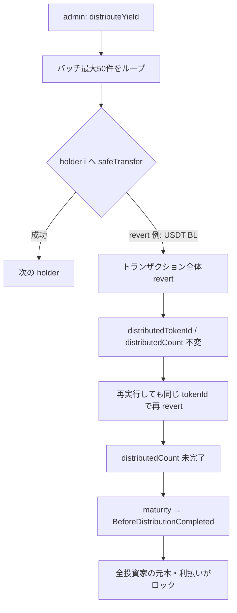
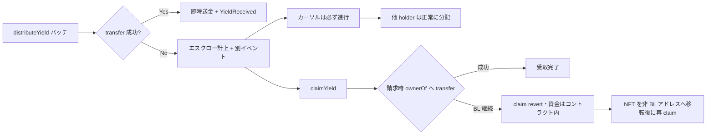
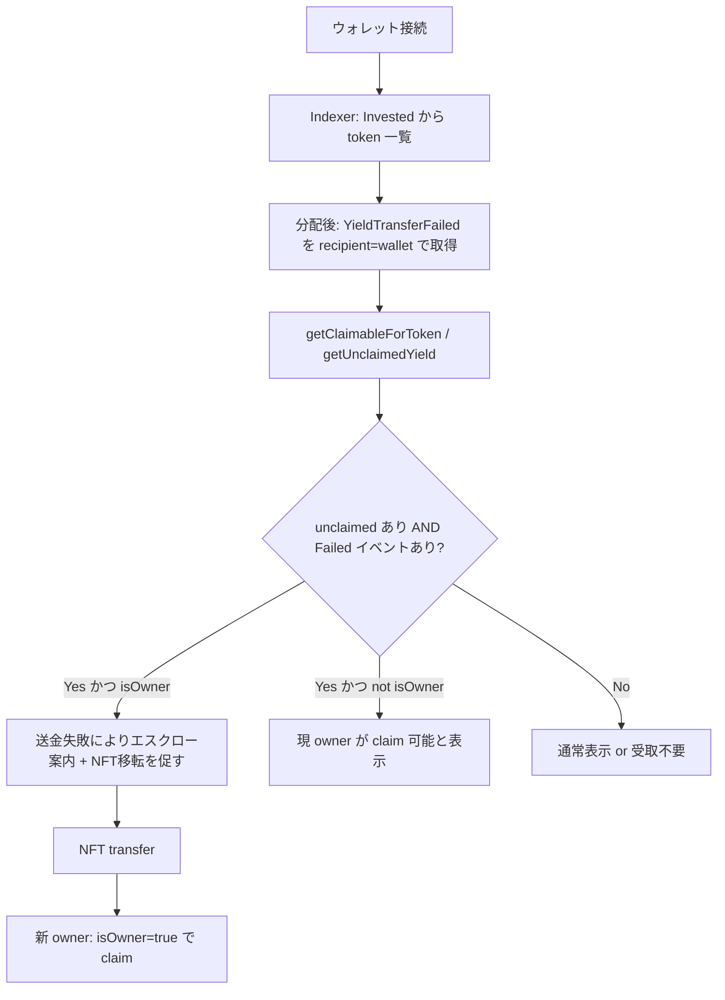

# F-2026-16871: Push 型 USDT 送金ループによる分配・満期の永久停止

| 項目 | 内容 |
|------|------|
| コード | F-2026-16871 |
| 種別 | Vulnerability |
| 深刻度 | Medium（Impact 4/5, Likelihood 3/5） |
| 対象 | `DistributeYield.sol`, `Maturity.sol` |
| 状態 | **対応済**（2026-05-21 実装完了） |

---

## 1. 概要

`distributeYield` および `maturity` は、最大 50 件の NFT 保有者に対し同一トランザクション内で `safeTransfer` による **Push 型送金** を行う。
1 件でも USDT の `transfer` が revert するとトランザクション全体が巻き戻り、バッチカーソル（`distributedTokenId` / `distributedCount` / `maturedTokenId`）が進まない。

USDT（Ethereum / Polygon 等）には Tether による **ブラックリスト** があり、対象アドレスへの送金は revert する。
その結果、**1 人のブラックリスト入り投資家が、同一商品の全投資家の利払い分配および満期返還をブロック**し得る。

---

## 2. 現状の実装

### 2.1 利払い分配（`DistributeYield.sol`）

```solidity
for (uint256 i = 0; i < nftInfos.length; i++) {
    if (nftInfos[i].owner != address(0)) {
        uint256 individualPeriodYield = CalculateYieldLib.calculateIndividualPeriodYield(
            periodYield, nftInfos[i].investmentAmount, product.raisedAmount
        );

        usdt.safeTransfer(nftInfos[i].owner, individualPeriodYield);
        // ...
    }
    // distributedTokenId / distributedCount の更新
}
```

- `getNFTInfos(startTokenId)` は最大 50 件ずつ取得（`InvestmentNFT.sol`）。
- ループ途中で revert すると `distributedCount` は増えず、次回も同じ `startTokenId` から再試行 → **同じ holder で再度 revert**。

### 2.2 満期返還（`Maturity.sol`）

```solidity
for (uint256 i = 0; i < nftInfos.length; i++) {
    if (nftInfos[i].owner != address(0)) {
        usdt.safeTransfer(nftInfos[i].owner, nftInfos[i].investmentAmount);
        nft.burn(nftInfos[i].tokenId);
        // ...
    }
}
```

- `maturity` は `product.totalDistributionCount > product.distributedCount` の場合 `BeforeDistributionCompleted` で revert。
- 分配が止まっている商品は **満期処理も実行不能**。

### 2.3 関連エラー・イベント

| シンボル | 意味 |
|----------|------|
| `BeforeDistributionCompleted` | 分配回数が完了する前の満期実行 |
| `YieldReceived` | Push 送金成功時のみ想定 |
| `InvestmentReturned` | 満期時の元本返還（Push 成功時） |

---

## 3. 脆弱性のメカニズム



### 3.1 監査 PoC の要点

1. 2 名の投資家に NFT を mint、プールに資金 deposit。
2. `vm.mockCallRevert` で `investor2` への `transfer` をブラックリスト相当として失敗させる。
3. `distributeYield` が revert、`distributedCount == 0` のまま。
4. 再試行も同様に失敗。
5. `maturity` は `BeforeDistributionCompleted` で revert。

PoC: 監査報告書付属の `PoC_BlacklistBlocksSettlement`（本リポジトリには未収録）

### 3.2 既知の回避（オンチェーン・非協力的な場合）

監査レポート記載: ブラックリスト入り holder が **NFT をクリーンなアドレスへ transfer** すれば、次の `distributeYield` バッチは進む可能性がある。
ただしブラックリストアドレスは **送金（`transfer`）自体が制限**される場合があり、NFT 移転もできないケースがあり得る。

---

## 4. 影響

| 観点 | 内容 |
|------|------|
| 可用性（liveness） | 1 件の送金失敗で商品単位の分配・満期が停止 |
| 資金 | コントラクト内の USDT は残るが、他の投資家への分配・返還が不能 |
| 悪用 | 意図的な悪用というより USDT 仕様・制裁リスト等への露出 |
| 深刻度 | Medium（単一 holder 起因で多数の資金がロックされ得る） |

---

## 5. 監査推奨とその限界

### 5.1 監査推奨（要約）

各 `safeTransfer` を `try/catch` で囲み、失敗時は revert せず **プル型マッピングにエスクロー**し、後から holder が請求（claim）できるようにする。

```solidity
try usdt.transfer(nftInfos[i].owner, individualPeriodYield) returns (bool success) {
    if (!success) {
        unclaimedYield[nftInfos[i].owner][productId] += individualPeriodYield;
    }
} catch {
    unclaimedYield[nftInfos[i].owner][productId] += individualPeriodYield;
}
```

### 5.2 よくある疑問: ブラックリストのまま claim しても送れないのでは？

**その理解は正しい。**

- Pull 型にしても、請求先アドレスがブラックリストのままなら `claim` 時の `transfer` も revert する。
- したがって推奨案の主目的は「**同じ BL アドレスで必ず受け取れる**」ことではなく、次の 2 点である。

| 目的 | 説明 |
|------|------|
| **プロトコルの liveness** | バッチカーソルを進め、他の投資家への分配・満期を継続可能にする |
| **個別回収経路の分離** | 失敗分をコントラクト内に留保し、**別の受取可能なアドレス**（NFT 移転後の owner 等）で回収する余地を作る |

### 5.3 監査例の `owner` キーについての注意

`unclaimedYield[owner][productId]` のように **分配時点の owner をキー**にすると、NFT 転送後に権利関係が破綻する。

| 問題 | 例 |
|------|-----|
| 旧 owner が claim | 分配後に NFT を売却した元 holder が請求できる |
| 新 owner が claim 不可 | 分配後に NFT を購入した holder に権利がない |

→ 本プロジェクトの対応では **`tokenId` をキー**とし、claim 時に `ownerOf(tokenId)` へ送金する設計を推奨する（後述）。

---

## 6. 対応方針（推奨）

### 6.1 基本方針: A. try/catch + tokenId エスクロー + claim

既存の Push 分配フロー（管理者が `distributeYield` を実行）を維持しつつ、失敗時のみエスクロー + 投資家による claim にフォールバックする。



### 6.2 ストレージ設計（案）

```solidity
// 利払い: productId × tokenId × distributionIndex（= distributedCount + 1 等）
mapping(uint256 productId => mapping(uint256 tokenId => mapping(uint256 distributionIndex => uint256)))
    unclaimedYield;

// 満期元本: productId × tokenId
mapping(uint256 productId => mapping(uint256 tokenId => uint256)) unclaimedPrincipal;
```

- `distributionIndex` は「何回目の分配か」を明示（再分配・照合のため）。
- 二重請求防止: claim 時に **先にマッピングを 0 クリア**してから `transfer`（Checks-Effects-Interactions）。

### 6.3 `distributeYield` の変更要点

| # | 変更 |
|---|------|
| 1 | ループ内 `safeTransfer` → `try IERC20.transfer(...)`（`SafeERC20` は revert を外に出すため catch 不可） |
| 2 | 成功: 従来どおり `YieldReceived`、`_distributedYield` に加算 |
| 3 | 失敗: `unclaimedYield[productId][tokenId][distributionIndex] += amount`、**カーソルは進める** |
| 4 | 失敗時イベント: `YieldTransferFailed(productId, tokenId, recipient, amount, distributionIndex)`（`productId`/`tokenId`/`recipient` を indexed） |
| 5 | `productPool` は失敗分も含めて負債として減算（エスクロー分はコントラクト残高に留まる） |
| 6 | 新関数 `claimYield(productId, tokenId, distributionIndex)`（`nonReentrant`、呼び出し元 = `ownerOf(tokenId)`） |

### 6.4 `maturity` の変更要点

| # | 変更 |
|---|------|
| 1 | 同様に `try/catch` で元本返還 |
| 2 | 失敗時は **即 `burn` しない**（請求権を残す） |
| 3 | `unclaimedPrincipal[productId][tokenId] += investmentAmount` |
| 4 | バッチカーソル `maturedTokenId` は進める |
| 5 | 新関数 `claimPrincipal(productId, tokenId)` — 成功時に `burn` |
| 6 | `isMaturity` の条件を「全 token 処理済み（送金成功 or エスクロー計上）」に変更 |

### 6.5 分配完了・満期の定義の見直し

| 現状 | 変更後（案） |
|------|----------------|
| 全員への Push 成功が暗黙の前提 | 全 tokenId が「送金成功」または「エスクロー計上済み」 |
| `distributedCount` はバッチ完走で increment | 失敗があってもバッチ完走で increment（中身は成功 + エスクロー混在可） |

### 6.6 残存リスク（オンチェーンでは完全解決不可）

次のケースはスマートコントラクトのみでは保証できない。

- ブラックリストのまま NFT も移転できない
- Tether が解除しない

**運用・法務・ガバナンスでの補完（任意）:**

- 利用規約でブラックリスト・制裁リストリスクを明記
- Safe マルチシグによる救済関数（証跡付き代替アドレス送金、長期未請求の treasury 移管等）— 導入時は監査・法務レビュー必須

### 6.7 マイページ（投資家 UI）向けデータ取得

**前提（スコープ外）:** `invest` 実行時・ウォレット接続時に「ブラックリスト入りか」を判定する必要は **ない**。  
**必要なのは分配・満期処理のあと**、「Push 送金が失敗してエスクローされた」事実を UI が示し、NFT 移転 → claim を促すこと。

#### 6.7.1 「分配失敗 → エスクロー」はイベントで判断できるか

**はい。イベントを主軸に判断できる**（オンチェーンで BL フラグを保持する必要はない）。

分配・満期ループで Push が失敗したとき、コントラクトは **必ず** 次を行う。

1. `unclaimedYield` / `unclaimedPrincipal` に計上（getter で残高 > 0 と確認可能）
2. **`YieldTransferFailed` / `PrincipalTransferFailed` を emit**（失敗時の `recipient` は **その時点の NFT owner**）

| 判定したいこと | データ源 | 備考 |
|----------------|----------|------|
| 分配後に Push が失敗した | `YieldTransferFailed` | `recipient` = 失敗時の受取先アドレス |
| まだ請求されていない | `getUnclaimedYield(...) > 0` または `getClaimableYieldSlots` | claim 済みなら 0 |
| 当時の失敗が **接続中ウォレット** に関係する | イベント `recipient == 接続ウォレット` | 接続時 BL チェックは不要 |
| 今 claim できるか | `getClaimableForToken(..., msg.sender).isOwner` | 現 owner のみ |

**UI コピー:** オンチェーンは「ブラックリスト」とは断定しない（Tether リストは Investment 外）。  
表示文言の例: 「**利益分配（または満期返還）時にウォレットへ USDT を送れなかったため、コントラクトに預かっています。** 受取可能な別ウォレットへ NFT を移転し、claim してください。」  
（BL が典型原因だが、イベントが保証するのは **送金失敗 + エスクロー** のみ。）

**indexer 推奨クエリ（利払いの例）:**

```
YieldTransferFailed
  WHERE recipient = :connectedWallet
  AND 対応する getUnclaimedYield(productId, tokenId, distributionIndex) > 0
```

満期元本は `PrincipalTransferFailed` + `getUnclaimedPrincipal > 0` を同様に組み合わせる。

#### 6.7.2 イベント定義（実装で必須とする index）

| イベント | パラメータ（案） | indexed | 用途 |
|----------|------------------|---------|------|
| `YieldTransferFailed` | `productId`, `tokenId`, `recipient`, `amount`, `distributionIndex` | `productId`, `tokenId`, `recipient` | 分配失敗の根拠。`recipient` でウォレット絞り込み |
| `PrincipalTransferFailed` | 同上 | 同上 | 満期返還失敗の根拠 |
| `YieldClaimed` | `productId`, `tokenId`, `recipient`, `amount`, `distributionIndex` | `tokenId`, `recipient` | 受取完了でバナー解除 |
| `PrincipalClaimed` | `productId`, `tokenId`, `recipient`, `amount` | `tokenId`, `recipient` | 元本受取完了 |
| `YieldReceived` | 既存 | 既存 | Push 成功（エスクローなし） |
| `InvestmentReturned` | 既存 | 既存 | 満期 Push 成功 |

`YieldDistributed` はバッチ単位のため、**個別 holder の失敗 UI には `*TransferFailed` を使う**。

#### 6.7.3 claim 表示用 getter（イベントと併用）

| API | 用途 |
|-----|------|
| `getUnclaimedYield(productId, tokenId, distributionIndex)` | イベントと突合し「未請求」を確認 |
| `getUnclaimedPrincipal(productId, tokenId)` | 満期元本エスクロー残 |
| `getClaimableYieldSlots(productId, tokenId)` | claim 対象の `(distributionIndex, amount)` 一覧 |
| `getClaimableForToken(productId, tokenId, address account)` | エスクロー残 + **`isOwner`**（claim ボタン活性） |

**保有 `tokenId` の列挙:** `InvestmentNFT` は Enumerable 非対応。`Invested` / `NFTMinted` を indexer が索引し、マイページはその一覧に対して getter を呼ぶ。

#### 6.7.4 推奨 UX フロー（分配後のみ）



**ケース整理**

| 状態 | UI |
|------|-----|
| `YieldTransferFailed.recipient == 自分` かつ `isOwner` かつ unclaimed > 0 | エスクロー案内 + **NFT 移転** +（移転後）claim |
| unclaimed > 0 かつ `isOwner`、Failed イベントなし | 通常の claim ボタン（他原因のエスクローは稀） |
| unclaimed > 0 かつ `isOwner == false`（移転済み受け取り側） | claim ボタンのみ（失敗時 recipient 向けの移転案内は出さない） |
| unclaimed == 0 | 完了または Push 成功済み（`YieldReceived` 参照） |

---

## 7. 代替案の比較

| 方式 | メリット | デメリット |
|------|----------|------------|
| **A. try/catch + tokenId エスクロー + claim**（推奨） | liveness 確保、NFT 移転で回収可能、既存 admin フロー維持 | ストレージ・会計・テストが増える |
| B. 最初から pull のみ | Push 失敗が原理的に起きない | 大規模変更、投資家が毎回 claim 必要 |
| C. 失敗時スキップ + 管理者再送 | 実装が比較的単純 | 中央集権・透明性の課題 |
| D. ブラックリストなし stable への変更 | 根本原因の回避 | トークン変更はビジネス判断 |

---

## 8. 実装タスクチェックリスト

### 8.1 コントラクト

- [x] `Schema` / `Storage` にエスクロー用マッピング追加
- [x] `DistributeYield.sol` — try/catch、エスクロー、カーソル進行の保証
- [x] `Maturity.sol` — 同上、失敗時 burn 延期
- [x] `Claim.sol` — `claimYield` / `claimPrincipal`
- [x] `IInvestmentEvents.sol` — `YieldTransferFailed` 等の追加
- [x] `Getter.sol` — エスクロー view + `getClaimableForToken` / `getClaimableYieldSlots`（§6.7）
- [x] `IInvestmentErrors.sol` — claim 用エラー追加
- [x] `UsdtTransferLib.sol` — USDT 互換（戻り値なし）の low-level `call`

### 8.2 テスト

詳細なファイル一覧は **§12** を参照。

- [x] `test/fix/F-2026-16871_EscrowClaim.t.sol` を新規作成し、修正後は分配・満期が進むことを検証
- [x] BL 模擬 → エスクロー → NFT 移転 → claim 成功
- [x] BL 模擬 → claim も revert（資金はコントラクト内）
- [x] 同梱 `DistributeYieldTest` / `MaturityTest` / `ClaimTest` のエスクロー系
- [x] §12.4 の既存シナリオ・`zeroYield` 回帰（`forge test` 223 件 Green）

### 8.3 ドキュメント・スクリプト

詳細は **§12.7〜12.9** を参照。

- [x] シーケンス図・要件・セキュリティリスク文書の更新
- [x] シナリオ仕様書（`docs/test/scenario/`）の期待結果更新
- [x] デプロイ辞書（`InvestmentDeployer`）に claim 関数登録
- [ ] 利用規約 / リスク開示（オフチェーン）

---

## 9. Solidity 実装メモ

- ループ内の catch には **`IERC20.transfer` の外部呼び出し**を使う（`safeTransfer` は不可）。
- Polygon 等の USDT は `success == false` と revert の両方を想定。
- `claim*` 関数は `nonReentrant` を付与。
- 会計: エスクロー計上時も `productPool` とコントラクト USDT 残高の整合をテストで固定化。

---

## 10. 参考リンク

| リソース | パス / URL |
|----------|------------|
| 分配実装 | `src/investment/functions/onlyWhiteLists/DistributeYield.sol` |
| 満期実装 | `src/investment/functions/onlyWhiteLists/Maturity.sol` |
| NFT バッチ | `src/periphery/InvestmentNFT.sol`（`getNFTInfos` 最大 50 件） |
| 監査 PoC | 監査報告書付属（リポジトリ外） |

---

## 12. 影響範囲一覧（テスト・ドキュメント・スクリプト）

本節は実装着手前の **修正対象の洗い出し** である。記載パスは **`git ls-files` で追跡済み** のものに限定する（未追跡・未コミットのファイルは含めない）。

優先度の目安: **必須** = 本修正の受け入れに直結、**高** = 分配・満期の E2E / 回帰、**中** = 間接・ドキュメント整合、**低** = 変更不要または軽微な追記。

### 12.1 コントラクト・インターフェース（実装時に連動）

| 優先度 | ファイル | 修正内容 |
|--------|----------|----------|
| 必須 | `src/investment/functions/onlyWhiteLists/DistributeYield.sol` | try/catch、エスクロー、カーソル進行（§6.3） |
| 必須 | `src/investment/functions/onlyWhiteLists/Maturity.sol` | try/catch、失敗時 burn 延期、エスクロー（§6.4） |
| 必須 | `src/investment/storage/Schema.sol` / `Storage.sol` | `unclaimedYield` / `unclaimedPrincipal` 等 |
| 必須 | 新規 `ClaimYield.sol` / `ClaimPrincipal.sol`（または既存モジュール統合） | 投資家向け pull |
| 必須 | `src/investment/interfaces/IInvestmentEvents.sol` | `YieldTransferFailed` 等 |
| 必須 | `src/investment/interfaces/IInvestmentErrors.sol` | claim 用エラー（二重請求・権限等） |
| 必須 | `src/investment/interfaces/IInvestmentFunctions.sol` | `claimYield` / `claimPrincipal` / getter 宣言 |
| 必須 | `src/investment/interfaces/InvestmentFacade.sol` | Facade スタブ追加 |
| 高 | `src/investment/functions/Getter.sol` | §6.7 の getter 群 + 同梱テスト |
| 中 | `src/periphery/Automation.sol` | ロジック変更は基本不要（`distributedCount` 完走で maturity 判定は維持）。未請求エスクローがある状態の運用方針をコメント追記する程度 |
| 中 | `test/investment/mocks/MockInvestmentERC20.sol` | 特定 `to` への `transfer` revert を模擬できるよう拡張（BL PoC 用） |

---

### 12.2 単体テスト（コントラクト同梱 `MCTest`）

`forge test --match-path` で個別実行可能。成功系は **`usdt.balanceOf` 即時増加** と **`expectEmit(YieldReceived)`** に依存しているため、失敗→エスクロー分岐の追加後は **全面見直し** が必要。

#### `DistributeYield.sol`（`DistributeYieldTest`）

| 優先度 | テスト関数 | 修正の要点 |
|--------|------------|------------|
| 必須 | `test_distributeYield_success_distributedCount0` | Push 成功前提の残高・イベント |
| 必須 | `test_distributeYield_success_distributedCount1` | 同上（2 回目分配） |
| 必須 | `test_distributeYield_success_withMonthEnd` | 同上（月末ロジック） |
| 必須 | `test_distributeYield_success_investorsMoreThan51` | 50+50 バッチ・`distributedTokenId`・`distributedYieldPerCount` |
| 高 | `testFuzz_distributeYield_success` | fuzz 成功パス |
| 低 | `test_distributeYield_revert_whenNotAdmin` | 権限のみ・影響小 |
| 低 | `test_distributeYield_revert_whenProductNotFound` | 同上 |
| 低 | `test_distributeYield_revert_whenBeforeDistributionStartDate` | 同上 |
| 低 | `test_distributeYield_revert_whenMaturedProduct` | 同上 |
| 低 | `test_distributeYield_revert_whenDistributionCompleted` | 同上 |
| 中 | `test_distributeYield_revert_whenInsufficientProductPool` | `return` パスは維持想定・要回帰 |
| 低 | `test_distributeYield_revert_whenInsufficientContractBalance` | トランザクション全体 revert・影響小 |

**追加（新規）推奨**

| テスト案 | 内容 |
|----------|------|
| `test_distributeYield_escrowOnTransferRevert` | 1 件だけ BL 模擬 → 他者は受取・カーソル進行 |
| `test_distributeYield_escrow_partialBatch` | バッチ内成功/失敗混在 |
| `test_claimYield_success_afterNftTransfer` | エスクロー → NFT 移転 → 新 owner が claim |
| `test_claimYield_revert_whenBlacklisted` | 同一 BL アドレスで claim revert・残高はコントラクト内 |

#### `Maturity.sol`（`MaturityTest`）

| 優先度 | テスト関数 | 修正の要点 |
|--------|------------|------------|
| 必須 | `test_maturity_success` | Push + 即 `burn` 前提 |
| 必須 | `test_maturity_success_investorsMoreThan51` | バッチ満期・`maturedTokenId` |
| 高 | `testFuzz_maturity_success` | fuzz 成功パス |
| 低 | `test_maturity_revert_whenNotAdmin` 他 revert 系 | 基本維持 |
| 中 | `test_maturity_revert_whenInsufficientProductPool` | early `return` パス |
| 低 | `test_maturity_revert_whenInsufficientFunds` | 全体 revert |

**追加（新規）推奨**

| テスト案 | 内容 |
|----------|------|
| `test_maturity_escrowOnTransferRevert` | 返還失敗 → エスクロー・**burn しない**・カーソル進行 |
| `test_claimPrincipal_success_and_burn` | claim 成功時のみ burn |
| `test_maturity_beforeDistributionCompleted` | `distributedCount` 未完了時 revert（既存仕様の回帰） |

#### `Getter.sol`（同梱テスト）

| 優先度 | 対象 | 修正の要点 |
|--------|------|------------|
| 高 | `test_simulateIndividualPeriodYield_*` 等 | 分配シミュレーションは論理不変想定・回帰確認 |
| 必須 | （新規）`test_getUnclaimedYield_*` / `test_getClaimableForToken_*` | エスクロー残高・owner 判定・スロット列挙 |

#### `Automation.sol`（`AutomationTest`）

| 優先度 | 対象 | 修正の要点 |
|--------|------|------------|
| 低 | `testCheckUpkeep_*` / `testPerformUpkeep_*` | Investment をモックしており **内部 transfer ロジックは未検証**。`checkUpkeep` 条件変更時のみ更新 |
| 中 | `distributedCount >= totalDistributionCount` 前提のテストデータ | エスクロー完走後も `distributedCount` が increment する設計なら **現状維持可** |

---

### 12.3 セキュリティ回帰テスト（新規追加）

| 優先度 | ファイル | 状態 | 修正内容 |
|--------|----------|------|----------|
| 必須 | `test/fix/F-2026-16871_EscrowClaim.t.sol`（実装時に新規作成） | 新規 | 監査 PoC 相当: BL 模擬 → エスクロー・バッチ進行 → NFT 移転 → claim 成功 / BL のまま claim 失敗 |

---

### 12.4 シナリオテスト（`test/investment/*.t.sol`）

| 優先度 | ファイル | テスト関数 | 分配・満期との関係 | 修正の要点 |
|--------|----------|------------|-------------------|------------|
| 必須 | `Investment.scenario.t.sol` | `test_scenario1_SingleDistribution` | Automation 経由で分配→満期、`usdt.balanceOf` 検証 | 即時送金前提の残高 assert |
| 必須 | `Investment.scenario2.t.sol` | `test_scenario2_MultipleDistribution` | 複数回分配・満期、**NFT 譲渡後の分配先**（No26,35,42 等） | §5.3 の tokenId キー設計と整合。譲渡後は **新 owner が claim** するシナリオに読み替え |
| 必須 | `Investment.scenario3.t.sol` | `test_scenario3_FourTimesDistribution` | 手動 `distributeYield` / `maturity`、200 NFT バッチ、不足時 early return | `distributedTokenId`・手動呼び出し・満期バッチ（No39〜42） |
| 必須 | `Investment.zeroYield.t.sol` | `test_zeroYield_longMaturity_singleDistribution_zeroPayout_thenMaturity` | 分配 1 回 + 満期、Automation | ゼロ利回りでもループ・満期到達 |
| 高 | `Investment.scenario6.t.sol` | `test_scenarioX_SimulationAndDistributionMatch` | シミュレーション値と実分配の一致 | 実際の受取額（Push + claim 合算）との比較に拡張検討 |
| 高 | `Investment.scenario7.t.sol` | `test_scenarioM_MonthlyDistribution_MonthEnd_LeapYear` | 月次分配 2 回 | 残高・`distributedCount` |
| 中 | `Investment.scenario4.t..sol` | （ACL テスト） | `distributeYield` / `maturity` の権限 | 関数シグネチャ・権限のみなら **低変更** |
| 低 | `Investment.scenario5.t.sol` | `test_scenario5_UpdateNFTURI` | 分配なし（URI 更新） | 基本不要 |
| 低 | `Investment.scenario8.t.sol` | `test_scenario8_TierRegistry_*` | 投資・mint のみ | 基本不要 |
| 低 | `Investment.scenario9.t.sol` | `test_scenario9_TierRegistry_*` | 同上 | 基本不要 |
| 低 | `Investment.scenario10.t.sol` | `test_scenario10_TierRegistry_*` | 同上 | 基本不要 |
| 低 | `Investment.scenario11.t.sol` | `test_scenario11_TierRegistry_*` | 同上 | 基本不要 |

**シナリオ実行コマンド（回帰用）**

```bash
# 分配・満期を含むシナリオのみ
forge test --match-path "test/investment/Investment.scenario*.t.sol" -vv
forge test --match-path "test/investment/Investment.zeroYield.t.sol" -vv

# 同梱単体
forge test --match-contract DistributeYieldTest -vv
forge test --match-contract MaturityTest -vv
```

---

### 12.5 シナリオ仕様書（`docs/test/scenario/`）

実装後は **試験手順の期待結果** を「Push のみ」から「Push 成功 or エスクロー + 必要なら claim」に更新する。

| 優先度 | ファイル | 分配・満期の記述 | 修正の要点 |
|--------|----------|------------------|------------|
| 必須 | `scenario1.md` | No11〜14: performUpkeep 分配・満期 | 受取確認（ウォレット残高 or claim） |
| 必須 | `scenario2.md` | No16〜43: 分配・満期・NFT 譲渡 | No26,35,42「譲渡先へ分配」→ **譲渡先が claim** の文言に |
| 必須 | `scenario3.md` | No12〜42: 不足時 return、手動分配・満期、200 件バッチ | `distributedTokenId` 進行、満期時 burn タイミング |
| 高 | `scenario6.md` | performUpkeep 分配 3 回 | 分配額一致の確認方法 |
| 高 | `scenario7.md` | performUpkeep 分配・冪等性 | USDT 残高増加の確認 |
| 高 | `zeroYield.md` | No11,15: 分配・満期 | ゼロ利回り商品の完走 |
| 中 | `scenario4.md` | No6,7: `distributeYield` / `maturity` ACL | 関数一覧に `claimYield` / `claimPrincipal` 追加検討 |
| 低 | `scenario5.md` | 分配なし | 不要 |
| 低 | `scenario8.md`〜`scenario11.md` | ティア検証中心 | 不要 |

---

### 12.6 ドキュメント（`docs/` 配下）

| 優先度 | ファイル | 修正の要点 |
|--------|----------|------------|
| 必須 | `docs/design/sequence/Sequence-DistributeYield.md` | ループ内 `transfer` 失敗分岐、エスクロー、`YieldTransferFailed`、`claimYield` |
| 必須 | `docs/design/sequence/Sequence-Maturity.md` | 失敗時エスクロー、遅延 `burn`、`claimPrincipal` |
| 高 | `docs/design/sequence/Sequence-Automation.md` | performUpkeep 後の部分失敗でも tx 成功し得る注記 |
| 高 | `docs/requirements/ja/セキュリティリスク.md` | §3 ERC20 分配: BL・送金失敗・エスクロー・未請求リスクを追記 |
| 高 | `docs/requirements/en/Security-Risks.md` | 同上（英語） |
| 高 | `docs/requirements/ja/要件定義書.md` | §5.5 分配・§5.6 満期: claim フロー、BL リスク |
| 高 | `docs/requirements/en/Requirements-Specification.md` | 同上 |
| 中 | `docs/requirements/ja/ユースケース.md` | §4 利益分配・満期: 投資家 claim のユースケース追加 |
| 中 | `docs/requirements/en/Use-Cases.md` | 同上 |
| 中 | `docs/design/ja/access-control.md` | `claimYield` / `claimPrincipal` の呼び出し主体（NFT owner） |
| 中 | `docs/design/en/access-control.md` | 同上 |
| 中 | `docs/references/特殊ケースまとめ.md` | 分配未了デッドロックの説明をエスクロー対応後に更新 |
| 低 | `docs/design/sequence/Sequence-Getter.md` | 新 getter のシーケンス追加 |
| 低 | `docs/design/sequence/Sequence-RegisterProduct.md` | 登録パラメータ変更なしなら不要 |
| 低 | `docs/references/1つのProxyで扱える商品の限界.md` | ストレージ増のみなら軽微追記 |
| 低 | `docs/references/開発参考資料.md` | 必要に応じてリンク追記 |
| — | `docs/design/architecture.pdf` | バイナリのため **別途** 図面更新が必要なら再出力 |
| — | `docs/audit/Hacken_Darts_*.pdf` | 監査報告書本体（参照用・編集不要） |

---

### 12.7 スクリプト・デプロイ・ローカル環境

| 優先度 | ファイル | 修正の要点 |
|--------|----------|------------|
| 必須 | `script/deploy/InvestmentDeployer.sol` | `_useMainFunctions` に `ClaimYield` / `ClaimPrincipal`（実装名に合わせる）と getter の `mc.use` 登録 |
| 高 | `script/deploy/DeployInvestment.s.sol` | Deployer 経由のため **直接変更なし** が多いが、デプロイ後のコントラクト検証手順を確認 |
| 低 | `script/deploy/DeployAutomation.s.sol` | Investment プロキシ参照のみ・変更不要想定 |
| 低 | `lib/mc/script/*.s.sol` | フレームワーク側・変更不要 |

**デプロイ後確認コマンド（例）**

```bash
# 辞書に claim 関数が載っているか（実装後）
cast call $INVESTMENT_PROXY "getUnclaimedYield(uint256,uint256,uint256)(uint256)" <productId> <tokenId> <distributionIndex>
```

---

### 12.8 修正不要・影響極小

| カテゴリ | ファイル例 | 理由 |
|----------|------------|------|
| ユーティリティ単体 | `CalculateYieldLib.sol` / `DistributionDateLib.sol` 同梱テスト | 算術・日付のみ。送金ロジック非依存 |
| 投資・入出金 | `Invest.sol` / `Deposit.sol` / `Withdraw.sol` 同梱テスト | `productPool` 減算ルール変更時のみ再確認 |
| 商品登録 | `RegisterProduct.sol` 同梱テスト | 登録バリデーションのみ |
| ティア | `PurchasePermissionLib.sol` / シナリオ 8〜11 | 分配・満期と無関係 |
| NFT mint | `src/investment/functions/onlyMinters/MintNFT.sol` / `InvestmentNFT.sol` テスト | burn タイミング変更時は `InvestmentNFT` の burn 権限テストを再確認 |
| README | `README.md` | 現状 1 行のみ。運用手順追記は任意 |

---

### 12.9 推奨テスト実施順序

1. `DistributeYieldTest` / `MaturityTest` の新規エスクロー・claim ケースを追加し Green にする  
2. `test/fix/F-2026-16871_EscrowClaim.t.sol` を追加し、監査 PoC 相当の回帰を通す  
3. `Investment.scenario.t.sol` → `scenario2` → `scenario3` → `zeroYield` → `scenario6` → `scenario7` の順で回帰  
4. `forge test` 全体  
5. 追跡済みドキュメント・`InvestmentDeployer.sol` を実装と同期  

---

## 13. 変更履歴

| 日付 | 内容 |
|------|------|
| 2026-05-21 | 初版作成（監査指摘 F-2026-16871 の整理・対応方針） |
| 2026-05-21 | §12 追加（テスト・シナリオ・docs・スクリプトの影響範囲洗い出し） |
| 2026-05-21 | §12 を git 追跡済みパスのみに整理（未追跡・未コミットの記載を削除） |
| 2026-05-21 | 新規テスト配置を `test/fix/F-2026-16871_EscrowClaim.t.sol` に変更 |
| 2026-05-21 | §6.7 追加（マイページ向け getter・イベント indexer） |
| 2026-05-21 | §6.7 最適化（分配後の `*TransferFailed` イベントでエスクロー UI 判定。接続時/invest 時の BL 判定は対象外） |
| 2026-05-21 | 実装完了: `Claim.sol`, `UsdtTransferLib`, エスクロー state, `test/fix/F-2026-16871_EscrowClaim.t.sol`, 全 `forge test` Green |
