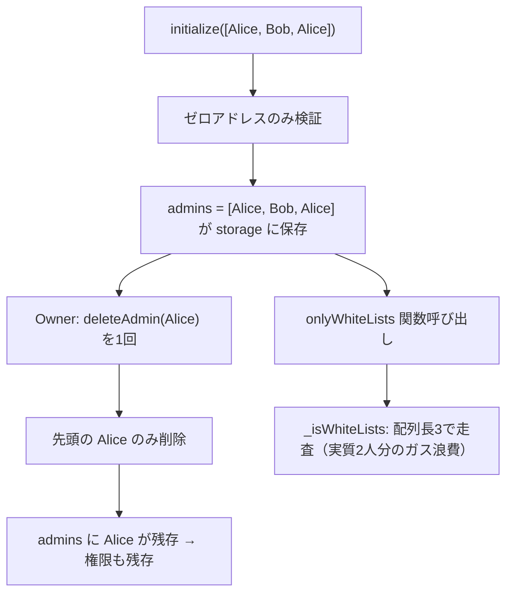

# F-2026-16872: initialize に管理者アドレスの重複チェックがなく冗長エントリが登録される

| 項目 | 内容 |
|------|------|
| コード | F-2026-16872 |
| 種別 | Vulnerability |
| 深刻度 | Info（Impact 2/5, Likelihood 1/5） |
| 対象 | `Initialize.sol`, `ControlAdmin.sol`, `OnlyWhiteListsBase.sol` |
| 状態 | **対応済**（2026-05-29 実装完了） |

---

## 1. 概要

**修正前:** `Initialize.initialize` は calldata の `admins` 配列を走査し、ゼロアドレスのみ拒否したうえで各要素を `WhiteListsState.admins` に `push` していた。**同一アドレスが配列内に複数回含まれていても拒否しなかった。**

一方、運用時の `ControlAdmin.addAdmin` は既存一覧を走査し、重複時に `AlreadyExistsAdmin` で revert する。初期化と運用で **「admin 配列はユニーク」という不変条件が一致していなかった。**

**修正後:** `initialize` でも calldata 内の重複を `AlreadyExistsAdmin` で拒否し、`addAdmin` と同一の不変条件を保証する。

重複が混入した場合、`deleteAdmin` は swap-and-pop で **最初に見つかった1件のみ** 削除するため、`deleteAdmin(Alice)` を1回呼んでも配列に Alice が残りうる。加えて `_isWhiteLists()` は配列長に比例して走査するため、重複は admin ガード付き全関数の **不要なガス消費** を招く。

本指摘は権限昇格や資金窃取ではなく、**初期化時の入力検証不足と運用トラップ** に関する Info レベルの改善である。

---

## 2. 実装

### 2.1 初期化（`Initialize.sol`）— 修正前

```solidity
// 修正前: 重複チェックなし
for (uint256 i = 0; i < admins.length; i++) {
    if (admins[i] == address(0)) revert IInvestmentErrors.InvalidAddress();
    Storage.WhiteListsState().admins.push(admins[i]);
    emit IInvestmentEvents.AdminAdded(admins[i], msg.sender);
}
```

### 2.1b 初期化（`Initialize.sol`）— 修正後（現行）

```solidity
for (uint256 i = 0; i < admins.length; i++) {
    if (admins[i] == address(0)) revert IInvestmentErrors.InvalidAddress();
    for (uint256 j = 0; j < i; j++) {
        if (admins[j] == admins[i]) revert IInvestmentErrors.AlreadyExistsAdmin();
    }
    Storage.WhiteListsState().admins.push(admins[i]);
    emit IInvestmentEvents.AdminAdded(admins[i], msg.sender);
}
```

### 2.2 運用時追加（`ControlAdmin.sol`）— 重複チェックあり

```solidity
function addAdmin(address _admin) external onlyOwner {
    if (_admin == address(0)) revert IInvestmentErrors.InvalidAddress();
    address[] memory admins = Storage.WhiteListsState().admins;
    if (admins.length >= MAX_ADMINS) {
        revert IInvestmentErrors.AdminLimitReached();
    }
    for (uint256 i = 0; i < admins.length; i++) {
        if (admins[i] == _admin) {
            revert IInvestmentErrors.AlreadyExistsAdmin();
        }
    }
    Storage.WhiteListsState().admins.push(_admin);
    emit IInvestmentEvents.AdminAdded(_admin, msg.sender);
}
```

### 2.3 削除（`ControlAdmin.sol`）— 先頭一致のみ削除

```solidity
function deleteAdmin(address _admin) external onlyOwner {
    address[] storage admins = Storage.WhiteListsState().admins;
    for (uint256 i = 0; i < length; i++) {
        if (admins[i] == _admin) {
            admins[i] = admins[length - 1];
            admins.pop();
            break;  // ← 最初の1件のみ
        }
    }
    // ...
}
```

### 2.4 参照（`OnlyWhiteListsBase.sol`）

`onlyWhiteLists` 修飾子は `_isWhiteLists()` で `admins` 配列を線形走査する。重複しても権限判定結果は同じだが、**ループ回数が増える**。

```solidity
function _isWhiteLists() internal view returns (bool) {
    address[] memory admins = Storage.WhiteListsState().admins;
    for (uint256 i = 0; i < admins.length; i++) {
        if (admins[i] == msg.sender) {
            return true;
        }
    }
    return false;
}
```

---

## 3. 脆弱性のメカニズム



### 3.1 具体例

| 初期化入力 | `deleteAdmin(Alice)` 1回後 | 備考 |
|------------|---------------------------|------|
| `[Alice, Bob, Alice]` | `[Bob, Alice]`（末尾側の Alice が残る場合あり） | オーナーは「Alice を外した」と認識しうる |
| `[Alice, Alice]` | `[Alice]` | **2回目の deleteAdmin が必要** |

### 3.2 悪用可能性

| 観点 | 内容 |
|------|------|
| 外部攻撃者 | `initialize` は `initializer` で **デプロイ時1回のみ**。通常は信頼できるデプロイヤーが呼ぶため、単独悪用は困難（Likelihood 1/5） |
| 前提条件 | デプロイ引数 `ADMINS_ADDR` の重複、スクリプト結合ミス、意図しない calldata |
| 権限 | 重複しても「同じアドレスが admin」であるだけで、**権限昇格にはならない** |
| 実害 | 運用ミス（削除漏れ）、ガス増、`MAX_ADMINS`（255）枠の浪費、`getAdminList` 表示の混乱 |

---

## 4. 影響

| 観点 | 内容 |
|------|------|
| 資金・権限昇格 | **影響なし** |
| 運用 | `deleteAdmin` 1回では重複 admin が完全に外れない可能性 |
| ガス | `_isWhiteLists` および `InvestmentNFT.setURI` 等の admin リスト走査コスト増 |
| 上限 | 重複は `addAdmin` の `MAX_ADMINS` 枠を実質的に消費（ユニーク admin 数は増えない） |
| 既存デプロイ | 本修正は **新規デプロイの initialize** にのみ有効。既存プロキシで重複が入っている場合は `deleteAdmin` を必要回数呼ぶ等の運用対応 |

---

## 5. 監査推奨（要約）

`initialize` のループ内で、既存要素との重複を検出したら `AlreadyExistsAdmin` で revert する（`addAdmin` と同様の二重ループ）。

```solidity
for (uint256 i = 0; i < admins.length; i++) {
    if (admins[i] == address(0)) revert IInvestmentErrors.InvalidAddress();
    for (uint256 j = 0; j < i; j++) {
        if (admins[j] == admins[i]) revert IInvestmentErrors.AlreadyExistsAdmin();
    }
    Storage.WhiteListsState().admins.push(admins[i]);
    emit IInvestmentEvents.AdminAdded(admins[i], msg.sender);
}
```

---

## 6. 対応方針（確定）

### 6.1 基本方針: 重複時は revert（監査推奨どおり）

初期化時に calldata 内の重複 admin を **`AlreadyExistsAdmin` で拒否** し、トランザクション全体を失敗させる。

| 判断 | 理由 |
|------|------|
| revert を採用 | `addAdmin` と不変条件を統一（「admin 配列は常にユニーク」） |
| 重複を黙って除去して続行は **不採用** | 設定ミスが静かに通る、イベント数と最終リストの不一致、初期化だけルールが緩い |
| 既存エラー `AlreadyExistsAdmin` を流用 | 新規エラー不要、運用・テスト・監査説明が簡潔 |

### 6.2 `Initialize.sol` への変更

**挿入位置:** ゼロアドレスチェックの直後、`push` および `AdminAdded` emit の直前。

**検証内容:**

| チェック | エラー |
|----------|--------|
| `admins[i] == address(0)` | `InvalidAddress()`（既存） |
| `admins[j] == admins[i]`（`j < i`） | `AlreadyExistsAdmin()`（新規ロジック・既存エラー） |

**ガス:** 初期化は1回のみ、admin 数は運用上小さい想定のため O(n²) の重複チェックで許容。

### 6.3 オフチェーン（推奨・任意）

`script/deploy/DeployInvestment.s.sol` の `_getAdminAddresses` は env の CSV をパースするのみで重複チェックがない。オンチェーン revert に加え、**デプロイ前に CI またはスクリプトでユニーク検証** すると運用ミスを早期に検出できる（本指摘の必須範囲外だが推奨）。

### 6.4 変更しないもの

| 対象 | 理由 |
|------|------|
| `ControlAdmin.addAdmin` / `deleteAdmin` | 既に重複追加は拒否。削除は先頭1件の現仕様のまま（重複が入らなければ問題にならない） |
| `OnlyWhiteListsBase._isWhiteLists` | 配列走査のまま。根本原因は初期化時の汚染防止 |
| `IInvestmentErrors` | `AlreadyExistsAdmin` は既存定義を利用 |

---

## 7. 代替案の比較

| 方式 | メリット | デメリット | 採用 |
|------|----------|------------|------|
| **A. 重複時 revert**（監査推奨） | `addAdmin` と一致、ミスを早期検出、イベントと storage が一致 | デプロイは修正後に再実行が必要 | **採用** |
| B. 重複をスキップして続行 | デプロイが通りやすい | 静かな設定ミス、ルール不整合、イベント数の齟齬 | 不採用 |
| C. 対応不要（運用で回避） | 実装不要 | 不変条件の欠落、監査未クローズ、`deleteAdmin` トラップ残存 | 不採用 |

---

## 8. 実装タスクチェックリスト

### 8.1 コントラクト

- [x] `Initialize.sol` — §6.2 の重複チェックループを追加

### 8.2 テスト（`Initialize.sol` 内 `InitializeTest`）

- [x] `initialize` に同一アドレスを2回含む → `AlreadyExistsAdmin` で revert（`test_initialize_revert_duplicateAdmin`）
- [x] 既存成功系・ゼロアドレス revert 系の回帰（`forge test`）

### 8.3 ドキュメント・監査

- [x] 本ファイル（`docs/audit/fix/F-2026-16872-initialize-duplicate-admin-check.md`）の作成
- [x] 実装完了後に本ファイルのステータスを **対応済** に更新
- [ ] 監査報告書への正式回答

---

## 9. 監査返答案（ドラフト）

> F-2026-16872 について、`Initialize.initialize` が calldata の `admins` 配列に対して重複チェックを行わず、`ControlAdmin.addAdmin` と挙動が不一致である点を認識した。  
> 重複エントリは `deleteAdmin` が先頭1件のみ削除するため、1回の削除で admin 権限が残存しうるほか、`_isWhiteLists` の走査コスト増や `MAX_ADMINS` 枠の浪費を招く。権限昇格には至らない Info レベルの指摘である。  
> 対応として、初期化ループ内で `j < i` の範囲で重複を検出した場合に既存の `AlreadyExistsAdmin` で revert し、`addAdmin` と同一の不変条件（admin 配列のユニーク性）を確保する。重複を黙って除去して初期化を続行する方式は採用しない。

---

## 10. 参考リンク

| リソース | パス |
|----------|------|
| 初期化 | `src/investment/functions/initializer/Initialize.sol` |
| Admin 管理 | `src/investment/functions/onlyOwner/ControlAdmin.sol` |
| ホワイトリスト | `src/investment/functions/onlyWhiteLists/OnlyWhiteListsBase.sol` |
| エラー定義 | `src/investment/interfaces/IInvestmentErrors.sol` |
| デプロイ | `script/deploy/DeployInvestment.s.sol`, `script/deploy/InvestmentDeployer.sol` |
| 関連（admin 上限） | `docs/audit/fix/F-2026-16866-uint8-admin-loop-dos.md` |

---

## 11. 変更履歴

| 日付 | 内容 |
|------|------|
| 2026-05-29 | 初版作成（監査指摘 F-2026-16872 の整理・対応方針: 重複時 revert） |
| 2026-05-29 | 実装完了: `Initialize.sol` 重複チェック、`test_initialize_revert_duplicateAdmin` 追加 |
| 2026-05-29 | 関連ドキュメント更新: セキュリティリスク、アクセス制御、Sequence-ControllAddmin、F-2026-16865/16866 相互参照 |
