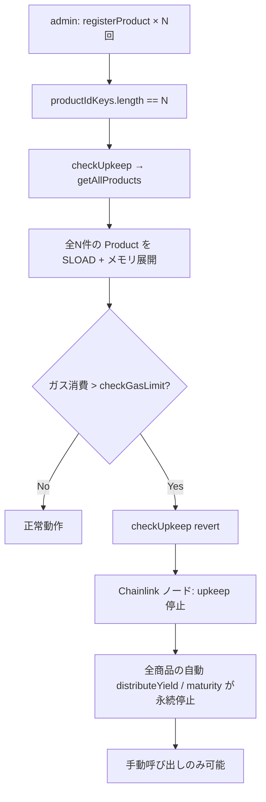
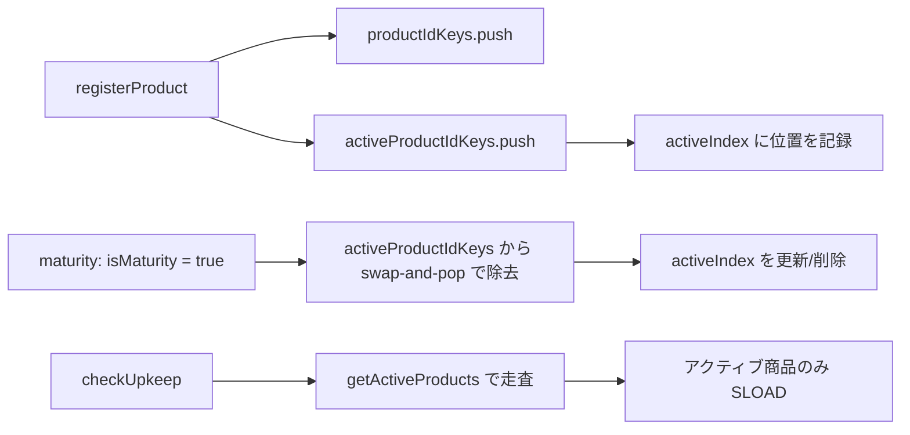

# F-2026-16873: Append-Only Product Registry による Chainlink Automation checkUpkeep の永続的 DoS

| 項目 | 内容 |
|------|------|
| コード | F-2026-16873 |
| 種別 | Vulnerability |
| 深刻度 | Medium（Impact 4/5, Likelihood 3/5） |
| 対象 | `Automation.sol`, `Getter.sol`, `RegisterProduct.sol` |
| 状態 | **対応済** |

---

## 1. 概要

`productIdKeys` 配列は追記専用（append-only）であり、商品が満期を迎えても削除されない。`getAllProducts` はこの配列の全長分のメモリ配列を確保し、全 `Product` 構造体（約 23 SLOAD）をコピーする。

`Automation.checkUpkeep` は `getAllProducts` を STATICCALL で呼び出し、返却された全商品をイテレーションする。Chainlink Automation の `checkGasLimit`（Polygon Mainnet: 10,000,000）を考慮すると、**累積 170〜300 商品で `checkUpkeep` がガスリミットを超過して revert** する。

Chainlink ノードは upkeep の実行を完全に停止し、**全アクティブ商品の自動利益分配（`distributeYield`）および満期処理（`maturity`）が永続的に無効化**される。管理者による手動呼び出し（`distributeYield` / `maturity`）は引き続き機能するが、Chainlink 統合の目的が失われる。

---

## 2. 現状の実装

### 2.1 商品登録（`RegisterProduct.sol`）— 追加のみ、削除なし

```solidity
// RegisterProduct.sol L122-123
Storage.ProductsState().products[args.productId] = product;
Storage.ProductsState().productIdKeys.push(args.productId);
```

`productIdKeys.push()` で追加されるのみ。削除する関数は存在しない。

### 2.2 全商品取得（`Getter.sol`）— 無条件に全件返却

```solidity
// Getter.sol L35-43
function getAllProducts() external view returns (Schema.Product[] memory productsInfo) {
    uint256 productCount = Storage.ProductsState().productIdKeys.length;
    productsInfo = new Schema.Product[](productCount);
    for (uint256 i = 0; i < productCount; i++) {
        uint256 pid = Storage.ProductsState().productIdKeys[i];
        productsInfo[i] = Storage.ProductsState().products[pid];
    }
    return productsInfo;
}
```

満期済み・未了を問わず全件をメモリに展開し、各 `Product` 構造体（23 フィールド ≈ 23 SLOAD）を読み出す。

### 2.3 Automation（`Automation.sol`）— 全商品をイテレーション

```solidity
// Automation.sol L40-84
function checkUpkeep(bytes calldata) external view override returns (bool upkeepNeeded, bytes memory performData) {
    Schema.Product[] memory products = IInvestment(investmentContract).getAllProducts();
    for (uint256 i = 0; i < products.length; i++) {
        Schema.Product memory product = products[i];
        if (product.isMaturity || product.isInsufficientBalance) {
            continue;
        }
        // ... calculateNextDistributionDate per non-matured product ...
    }
}
```

`isMaturity` や `isInsufficientBalance` の商品は `continue` でスキップするが、**メモリ割り当てと SLOAD は `getAllProducts` 呼び出し時点で既に発生済み**であり、ガス削減にはならない。

### 2.4 満期処理（`Maturity.sol`）— `isMaturity = true` でも配列から除去されない

```solidity
// Maturity.sol L89-91
if (nftInfos[i].tokenId == lastTokenId) {
    product.isMaturity = true;
    product.maturedTokenId = nftInfos[i].tokenId;
```

`isMaturity = true` を設定するのみで、`productIdKeys` からの除去処理は行われない。

### 2.5 ストレージスキーマ（`Schema.sol`）

```solidity
struct $ProductsState {
    mapping(uint256 productId => Product) products;
    uint256[] productIdKeys;
}
```

`productIdKeys` にはアクティブ／満期済みの区別がない。

---

## 3. 脆弱性のメカニズム



### 3.1 ガス消費の推計

| 項目 | 値 |
|------|-----|
| Product 構造体のフィールド数 | 23 |
| コールドストレージ SLOAD | 2,100 gas / slot |
| 1 商品あたりの推定ガス（コールド） | 23 × 2,100 = 48,300 gas + メモリ拡張 + ループオーバーヘッド |
| Chainlink `checkGasLimit`（Polygon） | 10,000,000 gas |
| 推定限界商品数 | 170〜300 商品（PoC 実証済み） |

### 3.2 監査 PoC の要点

1. 50 商品を登録 → `checkUpkeep` のガス消費を計測
2. さらに 50 商品を追加（合計 100）→ ガス消費が増加することを確認
3. 1 商品あたりのコールドストレージガスを推計し、300 商品未満で 10M ガスリミットを超過することを検証

PoC: `test/PoC_AppendOnlyRegistryDoS.t.sol`（監査提出物）

### 3.3 回復手段の不在

- 満期済み商品を `productIdKeys` から削除する管理関数が存在しない
- コントラクト再デプロイ以外に回復パスがない

---

## 4. 影響

| 観点 | 内容 |
|------|------|
| 可用性（liveness） | `checkUpkeep` が恒久的に revert し、Chainlink Automation による自動実行が停止 |
| 影響範囲 | 全アクティブ商品の `distributeYield` / `maturity` の自動実行 |
| 手動操作 | 管理者による直接呼び出しは引き続き機能 |
| 悪用 | 攻撃者による意図的な悪用ではなく、通常運用での商品蓄積により発生 |
| 深刻度 | Medium — 自動化の完全停止だが、手動での回避は可能 |

---

## 5. 対応方針（推奨）: アクティブ商品配列の分離管理

### 5.1 基本方針

ストレージに **アクティブ商品 ID 配列** (`activeProductIdKeys`) を新設し、満期完了時に除去する。`checkUpkeep` はアクティブ配列のみを走査する `getActiveProducts()` を使用する。

既存の `productIdKeys` / `getAllProducts()` は後方互換性のために維持する。



### 5.2 ストレージ変更（`Schema.sol`）

```solidity
struct $ProductsState {
    mapping(uint256 productId => Product) products;
    uint256[] productIdKeys;              // 全商品（既存・互換性維持）
    uint256[] activeProductIdKeys;        // アクティブ商品のみ
    mapping(uint256 productId => uint256) activeIndex;  // O(1) 削除用インデックス（1-indexed）
}
```

`activeIndex` は **1-indexed** とする（値 0 = 未登録と区別するため）。

### 5.3 各ファイルの変更概要

| ファイル | 変更内容 |
|----------|----------|
| `Schema.sol` | `$ProductsState` に `activeProductIdKeys` と `activeIndex` を追加 |
| `RegisterProduct.sol` | 商品登録時に `activeProductIdKeys.push` + `activeIndex` を設定 |
| `Maturity.sol` | `isMaturity = true` 設定時に `activeProductIdKeys` から swap-and-pop で除去 |
| `Getter.sol` | `getActiveProducts()` を新設 |
| `Automation.sol` | `getAllProducts()` → `getActiveProducts()` に切り替え |

### 5.4 RegisterProduct の変更

```solidity
// 既存
Storage.ProductsState().products[args.productId] = product;
Storage.ProductsState().productIdKeys.push(args.productId);

// 追加
Storage.ProductsState().activeProductIdKeys.push(args.productId);
Storage.ProductsState().activeIndex[args.productId] = Storage.ProductsState().activeProductIdKeys.length;
// activeIndex は 1-indexed（実際の配列位置 = activeIndex - 1）
```

### 5.5 Maturity の変更

`isMaturity = true` を設定する箇所（全 NFT 処理完了時）に、swap-and-pop による除去を追加する。
また、投資家ゼロ（`raisedAmount == 0`）の満期早期リターンでも、同様に `activeProductIdKeys` から除去して **zero-investor 商品がアクティブ配列に残留し続ける**ケースを防ぐ。

```solidity
if (nftInfos[i].tokenId == lastTokenId) {
    product.isMaturity = true;
    product.maturedTokenId = nftInfos[i].tokenId;

    // activeProductIdKeys から除去（swap-and-pop）
    _removeFromActiveProducts(productId);

    emit IInvestmentEvents.ProductMatured(productId, startTokenId, lastTokenId, _returnedAmount);
}
```

投資家ゼロの場合（満期処理がバッチループに入らない）:

```solidity
if (product.raisedAmount == 0) {
    product.isMaturity = true;
    if (product.isInsufficientBalance) {
        product.isInsufficientBalance = false;
    }
    _removeFromActiveProducts(productId);
    emit IInvestmentEvents.ProductMatured(productId, 0, 0, 0);
    return;
}
```

swap-and-pop ヘルパーの実装イメージ:

```solidity
function _removeFromActiveProducts(uint256 productId) internal {
    Schema.$ProductsState storage s = Storage.ProductsState();
    uint256 oneIndexed = s.activeIndex[productId];
    if (oneIndexed == 0) return; // 未登録なら何もしない

    uint256 idx = oneIndexed - 1;
    uint256 lastIdx = s.activeProductIdKeys.length - 1;

    if (idx != lastIdx) {
        uint256 lastId = s.activeProductIdKeys[lastIdx];
        s.activeProductIdKeys[idx] = lastId;
        s.activeIndex[lastId] = oneIndexed;
    }

    s.activeProductIdKeys.pop();
    delete s.activeIndex[productId];
}
```

**注意**: `Maturity.sol` はバッチ処理に対応しており、`isMaturity = true` が設定されるのは**最終バッチ完了時**（`nftInfos[i].tokenId == lastTokenId`）のみ。中間バッチでは `maturedTokenId` のみ更新され、`activeProductIdKeys` からは除去されない。

### 5.6 Getter の追加

```solidity
function getActiveProducts() external view returns (Schema.Product[] memory productsInfo) {
    uint256 count = Storage.ProductsState().activeProductIdKeys.length;
    productsInfo = new Schema.Product[](count);
    for (uint256 i = 0; i < count; i++) {
        uint256 pid = Storage.ProductsState().activeProductIdKeys[i];
        productsInfo[i] = Storage.ProductsState().products[pid];
    }
    return productsInfo;
}
```

### 5.7 Automation の変更

```solidity
// 変更前
Schema.Product[] memory products = IInvestment(investmentContract).getAllProducts();

// 変更後
Schema.Product[] memory products = IInvestment(investmentContract).getActiveProducts();
```

---

## 6. 代替案の比較

| 方式 | メリット | デメリット | 採用 |
|------|----------|------------|------|
| **A. アクティブ配列分離（推奨）** | 根本解決。ガス消費が同時稼働商品数にのみ依存 | ストレージスロット追加（`activeIndex` マッピング） | **採用** |
| B. ページネーション | 既存スキーマ変更不要 | 全商品走査に複数サイクル必要、検出遅延、Upkeep の `checkData` 管理が複雑 | 不採用 |
| C. `checkUpkeep` で `getProduct` を個別呼び出し | 全件メモリ展開を回避 | ガス消費の上限は同じ（SLOAD 数は変わらない） | 不採用 |
| D. 期間ベースのフィルタ | 比較的単純 | 長期商品が残り続けるため根本解決にならない | 不採用 |

### 6.1 アプローチ A を選択する理由

1. **根本解決**: 満期済み商品がイテレーション対象から外れるため、ガス消費が**同時稼働商品数**にのみ依存する
2. **シンプルなセマンティクス**: `checkUpkeep` は「今処理が必要な商品」だけを走査する
3. **既存互換性**: `getAllProducts()` は既存のまま残し、`getActiveProducts()` を新設するため後方互換を維持
4. **拡張容易**: `isInsufficientBalance` 設定時にもアクティブ配列から除去する拡張が容易
5. **O(1) 削除**: swap-and-pop + `activeIndex` マッピングにより、除去操作のガスコストは定数

---

## 7. 実装タスクチェックリスト

### 7.1 コントラクト

- [x] `Schema.sol` — `$ProductsState` に `activeProductIdKeys` / `activeIndex` を追加
- [x] `RegisterProduct.sol` — 商品登録時に `activeProductIdKeys` へ追加 + `activeIndex` 設定
- [x] `Maturity.sol` — `isMaturity = true` 時に `activeProductIdKeys` から除去（swap-and-pop）
- [x] `Getter.sol` — `getActiveProducts()` を新設
- [x] `Automation.sol` — `getAllProducts()` → `getActiveProducts()` に切り替え
- [x] `IInvestment.sol` / `IInvestmentFunctions.sol` — `getActiveProducts()` のインターフェース宣言
- [x] `InvestmentFacade.sol` — Facade スタブ追加

### 7.2 テスト

- [x] `RegisterProduct` 同梱テスト — `activeProductIdKeys` への追加を検証
- [x] `Maturity` 同梱テスト — 満期後に `activeProductIdKeys` から除去されることを検証
- [x] `Getter` 同梱テスト — `getActiveProducts()` が満期済みを除外することを検証
- [x] `Automation` 同梱テスト — `getActiveProducts()` ベースの `checkUpkeep` テスト
- [x] `test/fix/F-2026-16873_PoCVerification.t.sol` — 修正後の PoC 検証（満期済み商品のガス除外を確認、ゼロ投資家満期の prune 回帰を追加）
- [ ] 既存シナリオテスト（`scenario1`〜`scenario3`, `zeroYield`）の回帰

### 7.3 ドキュメント・スクリプト

- [x] `InvestmentDeployer.sol` — 辞書に `getActiveProducts` 登録
- [x] `docs/design/sequence/Sequence-Automation.md` — `getActiveProducts()` を使うシーケンスに更新
- [x] 本ファイルの状態を「対応済」に更新

---

## 8. 参考リンク

| リソース | パス |
|----------|------|
| Automation | `src/periphery/Automation.sol` |
| 全商品取得 | `src/investment/functions/Getter.sol` |
| 商品登録 | `src/investment/functions/onlyWhiteLists/RegisterProduct.sol` |
| 満期処理 | `src/investment/functions/onlyWhiteLists/Maturity.sol` |
| ストレージスキーマ | `src/investment/storage/Schema.sol` |
| ストレージアクセス | `src/investment/storage/Storage.sol` |
| 監査 PoC | `test/PoC_AppendOnlyRegistryDoS.t.sol`（監査提出物） |
| Chainlink Automation docs | https://docs.chain.link/chainlink-automation/overview |

---

## 9. 変更履歴

| 日付 | 内容 |
|------|------|
| 2026-05-26 | 初版作成（監査指摘 F-2026-16873 の整理・対応方針） |
| 2026-05-26 | 修正完了 — activeProductIdKeys / getActiveProducts() 導入、全テスト Green 確認 |
| 2026-06-02 | 追加修正 — ゼロ投資家（`raisedAmount == 0`）満期パスでも `_removeFromActiveProducts` を実行し、回帰テストを追加 |
