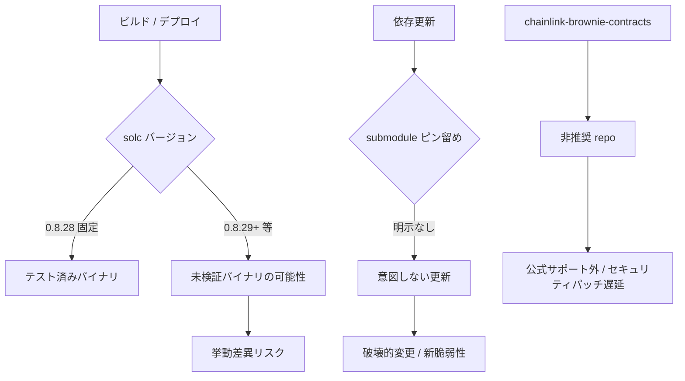

# F-2026-16938: Floating Pragma・依存関係未固定・非推奨 Chainlink 依存

| 項目 | 内容 |
|------|------|
| コード | F-2026-16938 |
| 種別 | Vulnerability |
| 深刻度 | Info（Impact 1/5, Likelihood 1/5） |
| 対象 | 全自前 Solidity ファイル、`foundry.toml`、`remappings.txt`、`.gitmodules`、`.github/workflows/test.yml` |
| 状態 | **対応済**（2026-05-30 実装完了） |

---

## 1. 概要

本プロジェクトの自前コントラクトはすべて `pragma solidity ^0.8.28;`（floating pragma）を使用している。floating pragma は指定範囲内の任意の互換コンパイラバージョンでのコンパイルを許容するため、十分にテストされていないコンパイラバージョンでビルド・デプロイされるリスクがある。コンパイラバージョンの差異は、本番実行時の挙動に微妙な変更をもたらし得る。

加えて、git submodule として取り込んだ依存ライブラリは `.gitmodules` に URL のみが記載されており、プロジェクト設定上でバージョンやコミットが明示されていない。`foundry.toml` にも `solc` の固定指定がなく、CI は Foundry **nightly** を使用しているため、ビルド環境の再現性が担保されていない。

さらに、Chainlink コントラクトの取得元として `smartcontractkit/chainlink-brownie-contracts` を使用しているが、同リポジトリは Chainlink 公式により **新規プロジェクト向け非推奨（deprecated）かつ archived** とされており、正規のソースである `smartcontractkit/chainlink-evm` への移行が推奨されている。

本指摘は直接的な exploit ではなく、**ビルド・デプロイの再現性と保守性** に関する Info レベルの指摘である。

> **Chainlink Automation との関係:** 本プロジェクトが Chainlink から import しているのは `AutomationCompatibleInterface`（インターフェース）と vendor の `DateTime` のみ。Registry / Forwarder コントラクト本体は import せず、`DeployAutomation.s.sol` で `FORWARDER_ADDR_{chainId}` を constructor に渡す運用モデル。`performUpkeep` は Forwarder 制限済み（Chainlink ベストプラクティス「Use the Forwarder」に整合）。よって Phase C の依存移行は **コンパイル時の import 解決の変更** であり、既デプロイ済み Automation upkeep のオンチェーン挙動には影響しない。

---

## 2. 監査時点の実装（移行前）

> **現状（移行後）** は §9「実装結果」を参照。以下は指摘時点のスナップショット。

### 2.1 Floating Pragma

自前コード（`src/` / `test/` / `script/`）の **57 ファイル** がすべて `^0.8.28` を使用。固定版 `0.8.28` は 0 件。

```solidity
pragma solidity ^0.8.28;
```

`foundry.toml` に `solc` / `solc_version` の指定がない:

```toml
[profile.default]
src = "src"
out = "out"
libs = ["lib"]
optimizer = true
optimizer_runs = 1_000_000
via_ir = true
```

CI（`.github/workflows/test.yml`）は Foundry **nightly** を使用。加えて `FOUNDRY_PROFILE: ci` を指定しているが、`foundry.toml` に `[profile.ci]` セクションが存在しない（実質 `[profile.default]` が使われる）:

```yaml
env:
  FOUNDRY_PROFILE: ci

- name: Install Foundry
  uses: foundry-rs/foundry-toolchain@v1
  with:
    version: nightly
```

### 2.2 サブモジュール依存

`.gitmodules` には URL のみ。タグ・ブランチ・コミットの明示なし:

```ini
[submodule "lib/mc"]
	path = lib/mc
	url = https://github.com/metacontract/mc
[submodule "lib/chainlink-brownie-contracts"]
	path = lib/chainlink-brownie-contracts
	url = https://github.com/smartcontractkit/chainlink-brownie-contracts
```

親リポジトリの git tree 上ではコミット SHA により間接的にピン留めされている（現状）:

| 依存 | コミット | 参照 |
|------|----------|------|
| `lib/chainlink-brownie-contracts` | `5cb41fb...` | タグ `1.3.0` |
| `lib/mc` | `c75f753...` | `v0.1.0-alpha-361-gc75f753` |

ただし、プロジェクト設定ファイルやドキュメント上では明示されておらず、`git submodule update --remote` 等で意図せず更新されるリスクがある。

### 2.3 非推奨 Chainlink 依存

`remappings.txt`:

```
@chainlink/=lib/chainlink-brownie-contracts/contracts
```

Chainlink 利用箇所（自前コード）:

| 用途 | ファイル | インポート |
|------|----------|------------|
| Automation インターフェース | `src/periphery/Automation.sol` | `AutomationCompatibleInterface` |
| 日付計算 | `src/investment/utils/DistributionDateLib.sol` | `DateTime` ライブラリ |
| 日付計算 | `src/investment/functions/onlyWhiteLists/RegisterProduct.sol` | `DateTime` ライブラリ |
| 日付計算 | `src/investment/functions/onlyWhiteLists/DistributeYield.sol` | `DateTime` ライブラリ |
| 日付計算 | `src/periphery/Automation.sol` | `DateTime` ライブラリ |
| テスト | `test/investment/Investment.scenario7.t.sol` 等 | `DateTime` ライブラリ |

`Automation.sol` の remapping 経由インポート:

```solidity
import "@chainlink/src/v0.8/automation/interfaces/AutomationCompatibleInterface.sol";
```

`DateTime` は remapping を使わず直接パス指定が多い:

```solidity
import {DateTime} from "lib/chainlink-brownie-contracts/contracts/src/v0.8/vendor/DateTime.sol";
```

---

## 3. リスクのメカニズム



### 3.1 影響シナリオ

| シナリオ | 結果 |
|----------|------|
| CI / デプロイ環境で solc 0.8.29+ が使われる | テスト未実施のバイナリがデプロイされる可能性 |
| submodule が意図せず更新される | ビルド失敗または挙動変更 |
| chainlink-brownie-contracts が更新停止 | セキュリティパッチの取得経路が非正規のまま |

---

## 4. 影響

| 観点 | 内容 |
|------|------|
| 直接的な資金窃取 | なし（Info 妥当） |
| コンパイラ差異による挙動変化 | 理論上あり（`^0.8.28` + solc 未固定 + CI nightly） |
| 依存更新による破壊的変更 | `git submodule update --remote` 等で発生し得る |
| 非推奨 repo 利用 | 公式サポート・セキュリティ更新の観点で望ましくない |
| 悪用可能性 | Independent（外部攻撃者による exploit ではない） |

---

## 5. 監査推奨（要約）

1. 全コントラクトの pragma を特定バージョンに固定（例: `^0.8.28` → `0.8.28`）
2. git submodule 依存を特定コミットハッシュまたはリリースタグに固定し、プロジェクト設定に明示
3. `smartcontractkit/chainlink-brownie-contracts` から `smartcontractkit/chainlink-evm`（特定リリースタグ固定）へ移行
4. `foundry.toml` の remapping を更新

---

## 6. 対応方針

### 6.1 基本方針: 3 段階で対応

再現性リスクの低減を優先し、以下の順序で実施する。

1. **Phase A（低コスト・高効果）:** pragma 固定 + `foundry.toml` / CI の solc 固定
2. **Phase B（低コスト）:** 依存バージョンの明示ドキュメント化（本ファイル + README 等）
3. **Phase C（中コスト）:** `chainlink-evm` への移行（**`contracts-v1.4.0` 以上** — 後述）

**運用前提（2026-05-30）:** コントラクトは未デプロイ・未運用のため、Phase A〜C を初回デプロイ前に一括適用可能（オンチェーン移行リスクなし）。

Phase A / B と Phase C は別 PR に分割可能だが、未デプロイ環境では同一タイミングでの実施を推奨。

> **検証メモ（2026-05-30）:** `chainlink-evm` リポジトリには `contracts-v1.3.0` タグが **存在しない**（利用可能な最古の contracts タグは `contracts-v1.4.0`）。Phase C では `contracts-v1.4.0`（コミット `e06cc226`）を採用。`AutomationCompatibleInterface.sol` / `DateTime.sol` は brownie `1.3.0` と **byte-identical** であることを diff で確認済み（§6.4 / §9.4）。

### 6.2 Phase A: Pragma 固定

**対象:** `src/` / `test/` / `script/` 内の全 57 ファイル

```solidity
// 変更前
pragma solidity ^0.8.28;

// 変更後
pragma solidity 0.8.28;
```

**`foundry.toml` への追加:**

```toml
[profile.default]
solc = "0.8.28"
```

**CI 変更（`.github/workflows/test.yml`）:**

```yaml
- name: Install Foundry
  uses: foundry-rs/foundry-toolchain@v1
  with:
    version: stable
```

> **注:** `lib/mc` 等の submodule 内コードは `^0.8.22`〜`^0.8.23` 等が混在するが、監査対象は自前コントラクトの pragma 固定である。submodule 側は各リポジトリの責務。

### 6.3 Phase B: 依存関係の明示ピン留め

1. サブモジュールは git tree 上のコミット SHA でピン留め（`.gitmodules` + 親 repo の gitlink）
2. 本ファイル、README、`foundry.lock` に依存バージョンを記載:

```
lib/mc                          @ c75f753 (v0.1.0-alpha-361-gc75f753)
lib/chainlink-evm               @ contracts-v1.4.0 (e06cc226086ad91cfede63e96c63e5b3440c9801)
```

3. 運用手順で `git submodule update --remote` を禁止する旨を明記
4. clone 時は `git clone --recurse-submodules` または `git submodule update --init --recursive` を README に記載

### 6.4 Phase C: `chainlink-evm` への移行

**方針:** `chainlink-evm` で利用可能な **`contracts-v1.4.0`** を採用する（`contracts-v1.3.0` タグは evm 側に存在しない）。本プロジェクトが利用する `AutomationCompatibleInterface` と `DateTime` は v1.4.0 でも同一 API・同一パスに存在することを確認済み。1.5.x へのアップグレードは別途検討（OpenZeppelin 複数バージョン remapping が追加で必要になる可能性あり）。

**手順（推奨 — git submodule）:**

```bash
git rm lib/chainlink-brownie-contracts
git submodule add https://github.com/smartcontractkit/chainlink-evm lib/chainlink-evm
cd lib/chainlink-evm && git checkout contracts-v1.4.0
```

> **注:** `forge install smartcontractkit/chainlink-evm@contracts-v1.4.0` でも submodule として追加できる（mc / 旧 brownie と同方式）。`--no-git` は使わないこと（通常ディレクトリとして配置され、git 管理と乖離する）。

**ピン留め結果（2026-05-30 再検証）:**

| 項目 | 値 |
|------|-----|
| タグ | `contracts-v1.4.0` |
| コミット | `e06cc226086ad91cfede63e96c63e5b3440c9801` |
| git 上の形 | submodule（gitlink `160000`） |
| brownie 1.3.0 との互換 | `AutomationCompatibleInterface.sol` / `DateTime.sol` は **byte-identical**（2026-05-30 確認） |

clone 後の依存取得は `git submodule update --init --recursive`。**新規参加者が `forge install` で Chainlink を再取得する必要はない。**

**`remappings.txt` 変更（2 案）:**

| 案 | remapping | import 変更量 |
|----|-----------|---------------|
| **A（推奨）** | `@chainlink/=lib/chainlink-evm/contracts/` | 最小 — 既存 `@chainlink/src/v0.8/...` を維持可能 |
| B | `@chainlink/contracts/=lib/chainlink-evm/contracts/` | 中 — `@chainlink/contracts/src/v0.8/...` に変更 |

```txt
# 変更前
@chainlink/=lib/chainlink-brownie-contracts/contracts

# 変更後（案 A 推奨）
@chainlink/=lib/chainlink-evm/contracts/
```

**インポートパス更新（直接パス指定 6 ファイル — remapping 案 A でも必須）:**

| 変更前 | 変更後 |
|--------|--------|
| `lib/chainlink-brownie-contracts/contracts/src/v0.8/...` | `lib/chainlink-evm/contracts/src/v0.8/...` |

remapping 案 A を採用する場合、`@chainlink/src/v0.8/automation/interfaces/AutomationCompatibleInterface.sol`（`Automation.sol`）は **変更不要**。

**変更対象ファイル:**

- `src/periphery/Automation.sol`
- `src/investment/utils/DistributionDateLib.sol`
- `src/investment/functions/onlyWhiteLists/RegisterProduct.sol`
- `src/investment/functions/onlyWhiteLists/DistributeYield.sol`
- `test/investment/Investment.scenario7.t.sol`
- `test/fix/F-2026-16949_PoCVerification.t.sol`

**検証:** `forge build` + `forge test` 全件 Green

### 6.5 設計判断の根拠

| 判断 | 理由 |
|------|------|
| pragma を `0.8.28` に固定 | 現行テスト済みバージョンと一致。監査推奨どおり |
| `foundry.toml` + CI 両方で solc 固定 | ローカル・CI・デプロイ環境の再現性を担保 |
| chainlink-evm は `contracts-v1.4.0` | evm に 1.3.0 タグなし。利用 API（Automation + DateTime）は v1.4.0 で互換確認済み |
| remapping 案 A を優先 | `@chainlink/` プレフィックス維持で import 変更を直接パス 6 ファイルに限定 |
| Phase 分割を許容 | pragma 固定のみでも監査指摘の主要部分に対応可能 |
| DateTime を vendor コピーしない | 監査推奨は chainlink-evm 移行。MIT ライセンスだが正式経路を優先 |

---

## 7. 代替案の比較

| 方式 | メリット | デメリット | 採用 |
|------|----------|------------|------|
| **A. pragma 固定 + foundry.toml solc 指定**（推奨） | 最小変更、高効果 | 57 ファイル一括置換が必要 | **採用** |
| B. pragma のみ固定、foundry.toml は未指定 | ファイル変更のみ | forge デフォルト solc に依存し残る | 不採用 |
| **C. chainlink-evm@contracts-v1.4.0 移行**（推奨） | 公式正規ソース、監査推奨一致 | evm に 1.3.0 タグなし。直接パス 6 ファイル修正 + 全テスト必要 | **採用** |
| D. DateTime のみ vendor コピー | Chainlink 依存削減 | 監査推奨（evm 移行）と不一致、保守コスト | 不採用 |
| E. chainlink 1.5.x へ直接アップグレード | 最新機能 | OZ remapping 追加、変更範囲大 | 将来検討 |

---

## 8. 実装タスクチェックリスト

### 8.1 Phase A: Pragma / solc 固定

- [x] `src/` / `test/` / `script/` 全 57 ファイル — `^0.8.28` → `0.8.28`（§6.2）
- [x] `foundry.toml` — `solc = "0.8.28"` 追加（§6.2）
- [x] `.github/workflows/test.yml` — Foundry `nightly` → `stable`、`FOUNDRY_PROFILE: ci` 削除（未定義 profile のため）（§6.2）
- [x] `forge build` + `forge test` 全件 Green（279 件）

### 8.2 Phase B: 依存明示

- [x] `README.md` に submodule バージョン表を追加（§6.3）
- [x] `git submodule update --remote` 禁止を README に明記（§6.3）
- [x] `foundry.lock` に submodule コミット SHA を記載（§6.3 / §9.2）

### 8.3 Phase C: chainlink-evm 移行

- [x] `lib/chainlink-brownie-contracts` 削除、`lib/chainlink-evm` を submodule として追加（§6.4）
- [x] `.gitmodules` 更新 — `smartcontractkit/chainlink-evm`（§6.4）
- [x] submodule ピン — タグ `contracts-v1.4.0` / コミット `e06cc226`（§6.4）
- [x] `foundry.lock` — `lib/chainlink-evm` @ `e06cc226`（§6.4）
- [x] `remappings.txt` — `@chainlink/=lib/chainlink-evm/contracts/`（案 A）（§6.4）
- [x] 直接パス指定 6 ファイルの import 更新（§6.4）
- [x] `AutomationCompatibleInterface` / `DateTime` が brownie 1.3.0 と byte-identical であることを確認（§6.4）
- [x] `forge build` + `forge test` 全件 Green（279 件）

### 8.4 ドキュメント

- [x] 本ファイル作成
- [x] 本ファイルのステータスを「対応済」に更新
- [ ] 監査報告書への正式回答

---

## 9. 実装結果（移行後の正規状態）

Phase A〜C 適用後の依存関係は以下のとおり。

### 9.1 Git submodules

```ini
[submodule "lib/mc"]
	path = lib/mc
	url = https://github.com/metacontract/mc
[submodule "lib/chainlink-evm"]
	path = lib/chainlink-evm
	url = https://github.com/smartcontractkit/chainlink-evm
```

| Path | タグ / 参照 | コミット（短縮） |
|------|-------------|------------------|
| `lib/mc` | `v0.1.0-alpha-361-gc75f753` | `c75f753` |
| `lib/chainlink-evm` | `contracts-v1.4.0` | `e06cc226` |

親リポジトリが記録するのは submodule **gitlink（1 行のコミット参照）** のみ。`lib/chainlink-evm/` 配下の全ファイルは Chainlink 側リポジトリの内容であり、親 repo の diff には個別ファイルとして現れない。

### 9.2 `foundry.lock`

```json
{
  "lib/chainlink-evm": { "rev": "e06cc226086ad91cfede63e96c63e5b3440c9801" },
  "lib/mc": { "rev": "c75f753d23f73a7b49ced5201979f858ce6479fe" }
}
```

### 9.3 新規参加者のセットアップ

```bash
git clone --recurse-submodules <repo-url>
forge build
forge test
```

`forge install` で Chainlink を追加する必要はない（submodule で復元される）。

### 9.4 旧 brownie との対応

| 旧（移行前） | 新（移行後） |
|--------------|--------------|
| `lib/chainlink-brownie-contracts` @ `1.3.0` (`5cb41fb`) | `lib/chainlink-evm` @ `contracts-v1.4.0` (`e06cc226`) |
| `@chainlink/=lib/chainlink-brownie-contracts/contracts` | `@chainlink/=lib/chainlink-evm/contracts/` |

### 9.5 Phase A 適用後の設定（抜粋）

**`foundry.toml`:**

```toml
[profile.default]
solc = "0.8.28"
```

**`remappings.txt`（Chainlink 部分）:**

```txt
@chainlink/=lib/chainlink-evm/contracts/
```

**CI（`.github/workflows/test.yml`）:** Foundry `stable`、`FOUNDRY_PROFILE: ci` 削除。

**Pragma:** 自前 57 ファイルすべて `pragma solidity 0.8.28;`（floating なし）。

---

## 10. 参考リンク

| リソース | パス / URL |
|----------|------------|
| Foundry 設定 | `foundry.toml` |
| Remapping | `remappings.txt` |
| Submodule 定義 | `.gitmodules` |
| CI | `.github/workflows/test.yml` |
| Automation 実装 | `src/periphery/Automation.sol` |
| 日付ユーティリティ | `src/investment/utils/DistributionDateLib.sol` |
| chainlink-evm（正規ソース） | https://github.com/smartcontractkit/chainlink-evm |
| chainlink-brownie-contracts（非推奨） | https://github.com/smartcontractkit/chainlink-brownie-contracts |
| Foundry starter kit（移行参考） | https://github.com/smartcontractkit/foundry-starter-kit |

---

## 11. 変更履歴

| 日付 | 内容 |
|------|------|
| 2026-05-30 | 初版作成（監査指摘 F-2026-16938 の整理・対応方針） |
| 2026-05-30 | 再検証: `chainlink-evm@contracts-v1.3.0` 不存在を修正（→ v1.4.0）、remapping 案 A 追加、Chainlink Automation 影響範囲・CI `[profile.ci]` 欠如・brownie archived を追記 |
| 2026-05-30 | 実装完了: Phase A〜C 一括適用、`forge test` 279 件 Green |
| 2026-05-30 | 再検証・ドキュメント修正: 正しい submodule コミットは `e06cc226`（`contracts-v1.4.0`）。誤記 `1d28339f` を訂正。`foundry.lock` を `chainlink-evm` に更新。§9 実装結果・clone 手順・submodule 管理方式を追記 |
