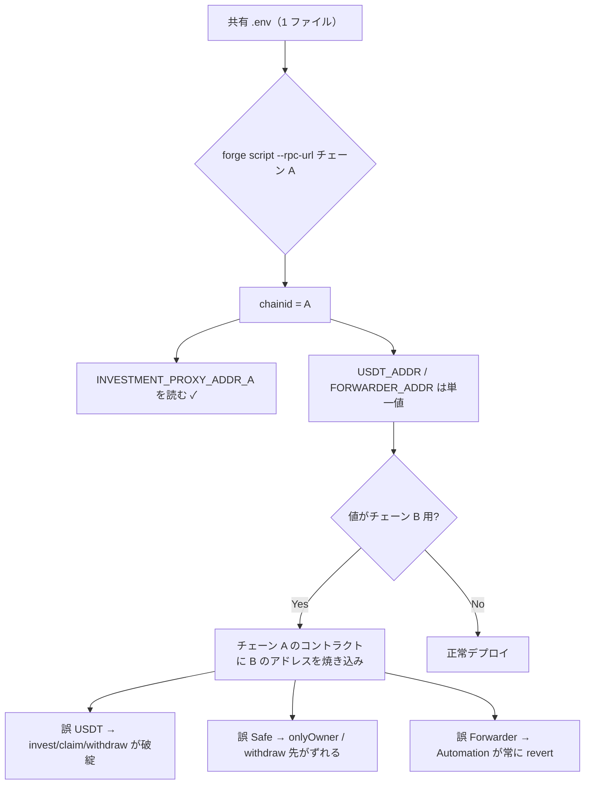

# F-2026-16945: チェーン固有アドレスの環境変数が chainId スコープされていない（マルチチェーン誤設定リスク）

| 項目 | 内容 |
|------|------|
| コード | F-2026-16945 |
| 種別 | Vulnerability |
| 深刻度 | Info（Impact 3/5, Likelihood 1/5） |
| 対象 | `script/deploy/DeployAutomation.s.sol`, `script/deploy/DeployInvestment.s.sol`, `src/periphery/Automation.sol`（間接） |
| 状態 | **対応済**（2026-05-29 最小対応実装完了） |

---

## 1. 概要

デプロイスクリプトは、一部のアドレスを **チェーン ID 付き** の環境変数から読み込む一方、USDT・Safe Multisig・Chainlink Forwarder は **グローバル名**（`USDT_ADDR`, `SAFE_MULTISIG_WALLET_ADDR`, `FORWARDER_ADDR`）のままである。

共有 `.env` で複数チェーンに `forge script` を実行すると、**別ネットワーク用のアドレスを誤って焼き込む** 運用ミスが起こりうる。本指摘は外部攻撃者による exploit ではなく、**デプロイ運用の footgun**（Exploitability: Independent, Complexity: Simple）である。

誤設定の影響はチェーン上で長期化しやすい。

| 設定先 | 設定タイミング | 事後修正 |
|--------|----------------|----------|
| `Automation.forwarderAddress` | コンストラクタ（immutable 相当） | **Automation の再デプロイ**が必要 |
| `ConfigState.USDT_ADDRESS` | `initialize`（1 回のみ） | 本番に変更関数なし → **プロキシ再デプロイ**が必要 |
| `ConfigState.SAFE_MULTISIG_WALLET` | `initialize`（1 回のみ） | 本番に変更関数なし → **プロキシ再デプロイ**が必要 |

一方、`INVESTMENT_PROXY_ADDR_{chainId}` および `AUTOMATION_ADDR_{chainId}` はすでに `chainId` スコープが取られており、**読み書きの規約が不統一**である。

---

## 2. 現状の実装

### 2.1 環境変数のスコープ一覧

| 環境変数 | スコープ | 読み込み元 | 書き込み |
|----------|----------|------------|----------|
| `INVESTMENT_PROXY_ADDR_{chainId}` | チェーン別 | `DeployAutomation.s.sol` | `DeployInvestment` → `_saveAddrToEnv` |
| `AUTOMATION_ADDR_{chainId}` | チェーン別 | （参照用） | `DeployAutomation` → `_saveAddrToEnv` |
| `USDT_ADDR` | **グローバル** | `DeployInvestment.s.sol` | 手動 `.env` |
| `SAFE_MULTISIG_WALLET_ADDR` | **グローバル** | `DeployInvestment.s.sol` | 手動 `.env` |
| `FORWARDER_ADDR` | **グローバル** | `DeployAutomation.s.sol` | 手動 `.env` |
| `ADMINS_ADDR` / `MINTERS_ADDR` | **グローバル** | `DeployInvestment.s.sol` | 手動 `.env`（本指摘の必須範囲外、§6.4 参照） |

### 2.2 `DeployAutomation.s.sol` — 混在パターン

```solidity
function run() public startBroadcastWith("DEPLOYER_PRIV_KEY") {
    string memory _name = _chainIdConcat("INVESTMENT_PROXY_ADDR_");
    address investment = vm.envAddress(_name);
    address forwarder = vm.envAddress("FORWARDER_ADDR");  // ← 非スコープ
    address _automation = address(new Automation(investment, forwarder));
    _saveAddrToEnv(_automation, "AUTOMATION_ADDR_");
}
```

`_chainIdConcat` は当ファイル内の private ヘルパー（`chainid()` を suffix に連結）。`DeployInvestment.s.sol` には **同ヘルパーが存在しない**。

### 2.3 `DeployInvestment.s.sol` — 非スコープの入力アドレス

```solidity
function run() public startBroadcastWith("DEPLOYER_PRIV_KEY") {
    address[] memory admins = vm.envAddress("ADMINS_ADDR", ",");
    address[] memory minters = vm.envAddress("MINTERS_ADDR", ",");
    address usdtAddress = vm.envAddress("USDT_ADDR");
    address safeMultisigWallet = vm.envAddress("SAFE_MULTISIG_WALLET_ADDR");
    address _investment = InvestmentDeployer.deployInvestment(
        mc, admins, minters, usdtAddress, safeMultisigWallet
    );
    _saveAddrToEnv(_investment, "INVESTMENT_PROXY_ADDR_");
    Dictionary(mc.toDictionaryAddress()).transferOwnership(safeMultisigWallet);
}
```

### 2.4 `_saveAddrToEnv`（`MCScript`）— 書き込み側は一貫してスコープ済み

```solidity
// lib/mc/src/devkit/MCScript.sol（抜粋）
vm.writeLine(
    string.concat(vm.projectRoot(), "/.env"),
    string.concat(envKeyBase, _chainIdString, "=", vm.toString(address(addr)))
);
```

デプロイ結果のアドレスは `{KEY}{chainId}=0x...` 形式で `.env` に追記される。

### 2.5 `.env.example`（現状）

```
USDT_ADDR=
SAFE_MULTISIG_WALLET_ADDR=
FORWARDER_ADDR=

# Deployed contracts
# （INVESTMENT_PROXY_ADDR_* / AUTOMATION_ADDR_* はデプロイ後に追記）
```

チェーン別キーの例示がなく、マルチチェーン運用時の規約がドキュメント化されていない。

### 2.6 オンチェーンでの固定化

**Automation — forwarder はコンストラクタで固定、`performUpkeep` は forwarder のみ許可:**

```solidity
constructor(address _investmentContract, address _forwarderAddress) {
    investmentContract = _investmentContract;
    forwarderAddress = _forwarderAddress;
}

function performUpkeep(bytes calldata performData) external override {
    if (msg.sender != forwarderAddress) {
        revert NotForwarder(msg.sender);
    }
    // ...
}
```

**Investment — `initialize` で USDT / Safe を 1 回だけ設定:**

```solidity
function initialize(
    address[] calldata admins,
    address[] calldata minters,
    address usdtAddress,
    address safeMultisigWallet
) external initializer {
    // ...
    Storage.ConfigState().USDT_ADDRESS = usdtAddress;
    Storage.ConfigState().SAFE_MULTISIG_WALLET = safeMultisigWallet;
}
```

本番向け関数に `USDT_ADDRESS` / `SAFE_MULTISIG_WALLET` を更新する API はない（`Withdraw`・`Invest` 等は読み取り専用で参照）。

---

## 3. 問題のメカニズム



### 3.1 なぜチェーンごとに値が異なるか

| アドレス | チェーン間で異なる理由の例 |
|----------|---------------------------|
| USDT（ERC20） | Ethereum / Polygon / Amoy でコントラクトアドレスが異なる |
| Safe Multisig | ネットワークごとに別 Safe を運用する場合がある |
| Chainlink Forwarder | チェーン・Registry バージョンごとに forwarder アドレスが異なる |

### 3.2 再現条件（運用ミス）

1. 1 つの `.env` に `INVESTMENT_PROXY_ADDR_80002` と `INVESTMENT_PROXY_ADDR_31337` を併記する。
2. `USDT_ADDR` / `FORWARDER_ADDR` 等は **1 行のみ**（あるチェーン用の値）。
3. 別チェーン向け RPC で `DeployInvestment` / `DeployAutomation` を実行する。
4. スクリプトは `chainId` 付きキーでプロキシは正しく参照するが、USDT / Safe / Forwarder は **常に同じグローバル値** を使う。

### 3.3 影響の整理

| 観点 | 内容 |
|------|------|
| Exploitability | **Independent**（攻撃者ではなくオペレータの設定ミス） |
| Likelihood 1/5 | 単一チェーンのみ運用なら遭遇しにくい。マルチチェーン共有 `.env` で顕在化 |
| Impact 3/5 | 誤 USDT / Safe は資金フロー・権限の重大なずれ。誤 Forwarder は Automation 全停止 |
| 復旧 | 誤ったコントラクトは **再デプロイ**（プロキシ・Automation の作り直し、状態移行は別途） |
| スマートコントラクト変更 | **不要**（本件はデプロイスクリプトと `.env` 規約の問題） |

---

## 4. 監査推奨（要約）

チェーン固有のアドレスは、既存の `INVESTMENT_PROXY_ADDR_{chainId}` パターンに揃え、`vm.envAddress(_chainIdConcat("..."))` で読み込む。

```solidity
address forwarder = vm.envAddress(_chainIdConcat("FORWARDER_ADDR_"));
address usdtAddress = vm.envAddress(_chainIdConcat("USDT_ADDR_"));
address safeMultisigWallet = vm.envAddress(_chainIdConcat("SAFE_MULTISIG_WALLET_ADDR_"));
```

---

## 5. 対応方針（確定・最小）

監査 Remediation を **そのまま** 適用する。`MCScript` の変更・`DeployScriptBase` 等の新規抽象化は **行わない**。

### 5.1 基本方針

| 項目 | 方針 |
|------|------|
| スコープ | 監査指摘の **3 変数** の `vm.envAddress` 呼び出しのみ `_{chainId}` 化 |
| 実装場所 | `DeployAutomation.s.sol`（1 行）, `DeployInvestment.s.sol`（2 行 + ヘルパー）, `.env.example` |
| `_chainIdConcat` | `DeployAutomation` に **既存**（変更なし）。`DeployInvestment` には **同関数をコピー** |
| `MCScript` / 新規基底 | **変更・追加しない** |
| オンチェーン | **変更しない** |
| 既存デプロイ済み環境 | 手元 `.env` のキー名マイグレーションのみ（再デプロイは本修正の必須条件ではない） |

### 5.2 環境変数キーの命名（移行後）

| 旧キー | 新キー（例: Amoy `80002`） |
|--------|---------------------------|
| `USDT_ADDR` | `USDT_ADDR_80002` |
| `SAFE_MULTISIG_WALLET_ADDR` | `SAFE_MULTISIG_WALLET_ADDR_80002` |
| `FORWARDER_ADDR` | `FORWARDER_ADDR_80002` |

Anvil ローカル（`31337`）など、利用するチェーンごとに同名プレフィックス + `chainid` を定義する。

### 5.3 `DeployAutomation.s.sol` への変更（1 行のみ）

```solidity
// 変更前
address forwarder = vm.envAddress("FORWARDER_ADDR");

// 変更後
address forwarder = vm.envAddress(_chainIdConcat("FORWARDER_ADDR_"));
```

- 既存の `_chainIdConcat`（L24–32）は **そのまま残す**
- `INVESTMENT_PROXY_ADDR_` の読み込みは変更不要

### 5.4 `DeployInvestment.s.sol` への変更（2 行 + ヘルパー）

```solidity
// 変更前
address usdtAddress = vm.envAddress("USDT_ADDR");
address safeMultisigWallet = vm.envAddress("SAFE_MULTISIG_WALLET_ADDR");

// 変更後
address usdtAddress = vm.envAddress(_chainIdConcat("USDT_ADDR_"));
address safeMultisigWallet = vm.envAddress(_chainIdConcat("SAFE_MULTISIG_WALLET_ADDR_"));
```

`DeployAutomation.s.sol` と同一の `_chainIdConcat` を当ファイル末尾に **コピー**する（`MCScript` 継承はそのまま）。

### 5.5 `.env.example` の更新例

```
# Addresses（チェーンごとに定義。{chainId} は forge script 実行時の chainid）
USDT_ADDR_80002=
SAFE_MULTISIG_WALLET_ADDR_80002=
FORWARDER_ADDR_80002=

USDT_ADDR_31337=
SAFE_MULTISIG_WALLET_ADDR_31337=
FORWARDER_ADDR_31337=

# Deployed contracts（デプロイ後に自動追記）
# INVESTMENT_PROXY_ADDR_{chainId}=...
# AUTOMATION_ADDR_{chainId}=...
```

### 5.6 運用・移行

| 手順 | 内容 |
|------|------|
| 1 | 各チェーンの正しい USDT / Safe / Forwarder アドレスを確認 |
| 2 | 既存 `.env` / `.env.amoy` 等で `USDT_ADDR` → `USDT_ADDR_{chainId}` にリネーム（値はそのチェーン用のものか再確認） |
| 3 | デプロイ前チェックリストに「`forge script` の RPC の `chainid` と env キーの suffix が一致」を追加 |
| 4 | 旧グローバルキーは削除またはコメントアウト（残すと誤って参照し続けるリスクは低いが、混乱の元） |

### 5.7 変更しないもの（本チケット）

| 対象 | 理由 |
|------|------|
| `Automation.sol` / `Initialize.sol` | デプロイ入力の誤り防止が目的。契約ロジックは不変 |
| `InvestmentDeployer.sol` | 引数は `address` のまま。env 読み込みはスクリプト層のみ |
| 既にデプロイ済みの本番コントラクト | スクリプト修正のみでは過去デプロイは自動修正されない |

### 5.8 任意拡張（本チケット必須外）

| 項目 | 検討 |
|------|------|
| `ADMINS_ADDR` / `MINTERS_ADDR` | チェーンごとに admin/minter が異なる運用なら同様に `_{chainId}` 化。全チェーン共通なら現状維持でよい |
| `RPC_URL` / `VERIFIER` | 多くのプロジェクトではチェーン別ファイル（`.env.amoy`）で分離済み。共有 `.env` 運用なら将来同型の指摘になりうる |
| デプロイ前アサーション | スクリプト先頭で `block.chainid` と env suffix の一致ログ、またはゼロアドレスチェック |

---

## 6. 代替案の比較

| 方式 | メリット | デメリット | 採用 |
|------|----------|------------|------|
| **A. 監査どおり 3 行 + `_chainIdConcat` コピー**（最小） | 差分最小・`lib/mc` 非接触・Remediation と一致 | `_chainIdConcat` が 2 ファイルに重複 | **採用** |
| B. `DeployScriptBase` / `MCScript` に共通化 | DRY・将来のスクリプト追加に有利 | 新規ファイル or サブモジュール変更 | 不採用（本チケットは過剰） |
| C. チェーン別 `.env` のみ（コード変更なし） | 実装不要 | スクリプトと `.env.example` が不整合のまま | 不採用（監査未クローズ） |
| D. デプロイ時の chain / アドレス照合 | 誤チェーン検出を強化 | 実装・メンテコスト大 | 将来任意 |

---

## 7. 実装タスクチェックリスト

### 7.1 スクリプト（最小）

- [x] `DeployAutomation.s.sol` — `FORWARDER_ADDR` → `vm.envAddress(_chainIdConcat("FORWARDER_ADDR_"))`（1 行）
- [x] `DeployInvestment.s.sol` — USDT / Safe を `_chainIdConcat` 化（2 行）
- [x] `DeployInvestment.s.sol` — `_chainIdConcat` を `DeployAutomation` からコピー

### 7.2 設定・ドキュメント

- [x] `.env.example` をチェーン別キー形式に更新
- [ ] 手元の `.env` / `.env.amoy` 等を移行（**秘密情報をコミットしない**）
- [ ] フロントエンド seed 手順・Anvil 手順で旧キー名を参照していないか確認（例: `.cursor/plans/anvil_frontend_seed_script_*.plan.md`）

### 7.3 検証

- [x] デプロイスクリプトのコンパイル確認（`forge build script/deploy/DeployAutomation.s.sol script/deploy/DeployInvestment.s.sol`）
- [ ] 対象チェーンの RPC で `DeployInvestment` → `DeployAutomation` が新キーで成功（手動）
- [ ] 意図的に suffix 不一致の env で実行し、Foundry がキー未存在で失敗すること（手動）

### 7.4 監査

- [x] 本ファイルのステータスを **対応済** に更新
- [ ] 監査報告書への正式回答

---

## 8. 監査返答案（ドラフト）

> F-2026-16945 について、デプロイスクリプトが `INVESTMENT_PROXY_ADDR_{chainId}` 等はチェーン ID でスコープしている一方、`USDT_ADDR`・`SAFE_MULTISIG_WALLET_ADDR`・`FORWARDER_ADDR` はグローバル名のままであり、共有 `.env` によるマルチチェーン展開時に別ネットワークのアドレスを誤設定しうる点を認識した。Forwarder は `Automation` コンストラクタで、USDT および Safe Multisig は `initialize` で一度だけ設定され、本番に修正 API がないため、誤設定時の復旧には再デプロイが必要になりうる。  
> 対応として、監査 Remediation どおり当該 3 変数を `_chainIdConcat` パターン（例: `USDT_ADDR_80002`）に統一し、`DeployAutomation.s.sol`（1 行）および `DeployInvestment.s.sol`（2 行 + 既存と同型の `_chainIdConcat` ヘルパー）を更新する。`MCScript` や新規基底コントラクトへの変更は行わない。`.env.example` と手元 `.env` のキー名を合わせて改訂する。本変更はデプロイ層の運用安全性向上であり、オンチェーンのセキュリティモデル自体は変更しない。

---

## 9. 参考リンク

| リソース | パス |
|----------|------|
| Automation デプロイ | `script/deploy/DeployAutomation.s.sol` |
| Investment デプロイ | `script/deploy/DeployInvestment.s.sol` |
| env 追記ヘルパー | `lib/mc/src/devkit/MCScript.sol` |
| Automation（forwarder 固定） | `src/periphery/Automation.sol` |
| 初期化（USDT / Safe） | `src/investment/functions/initializer/Initialize.sol` |
| 環境変数例 | `.env.example` |
| 関連（env 読み込み統一） | `docs/audit/fix/F-2026-16947-deploy-admins-env-address-cheatcode.md` |

---

## 10. 変更履歴

| 日付 | 内容 |
|------|------|
| 2026-05-29 | 初版作成（監査指摘 F-2026-16945 の整理・対応方針: チェーン ID スコープ付き env への統一） |
| 2026-05-29 | 対応方針を最小化: 監査 Remediation 3 行 + `DeployInvestment` へ `_chainIdConcat` コピー。`MCScript` / `DeployScriptBase` は採用しない |
| 2026-05-29 | 実装完了: 両デプロイスクリプト・`.env.example` 更新、デプロイスクリプト `forge build` 確認 |
