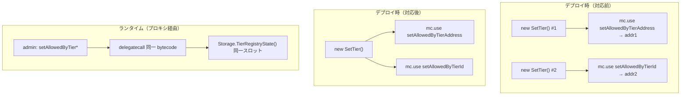
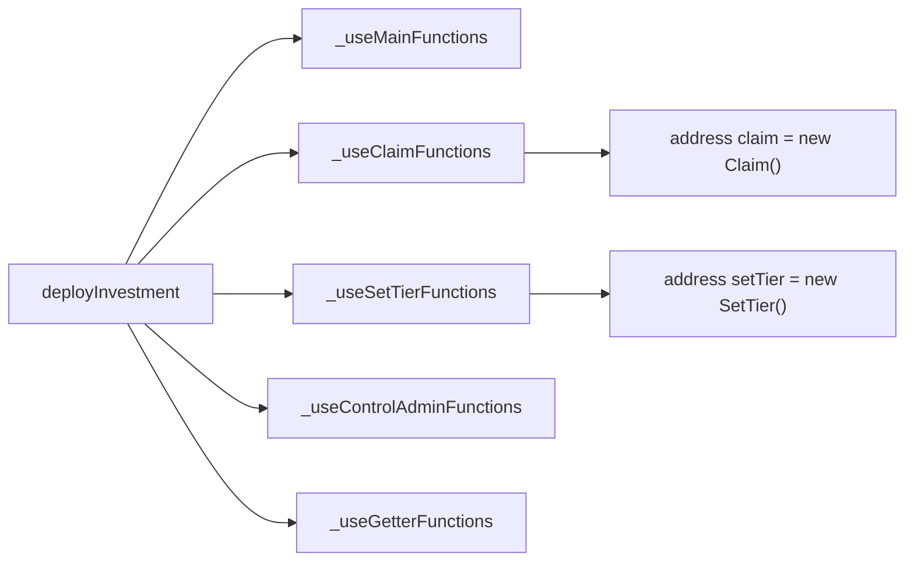

# F-2026-16946: SetTier 実装コントラクトの重複デプロイ

| 項目 | 内容 |
|------|------|
| コード | F-2026-16946 |
| 種別 | Vulnerability |
| 深刻度 | Info（Impact 1/5, Likelihood 5/5） |
| 対象 | `InvestmentDeployer.sol`（`Claim` / `SetTier` デプロイ登録） |
| 状態 | **対応済**（2026-05-29 実装完了） |

---

## 1. 概要

`InvestmentDeployer` は MC DevKit の `mc.use` により、各関数セレクタを実装コントラクトアドレスへルーティングする。対応前は `SetTier` について `setAllowedByTierAddress` と `setAllowedByTierId` の **2 セレクタに対して別々の `new SetTier()` インスタンス** をデプロイしていた。

一方、同ファイル内の `ControlAdmin` や `Getter` は **1 インスタンスを共有** し、複数セレクタを同一実装アドレスへ登録するパターンを採用している。

`SetTier` はインスタンス変数を持たず、すべての状態を ERC-7201 固定スロット（`Storage.TierRegistryState()` 等）経由で **プロキシ側ストレージ** に読み書きするステートレスな実装である。そのため 2 インスタンスでも **ランタイムの正しさ・権限・資金安全性には影響しない**。

本指摘はセキュリティ上の exploit ではなく、**デプロイ時の無駄なバイトコード配置と、デプロイ登録パターンの不統一** に関する Info レベルの改善である。

---

## 2. 現状の実装

### 2.1 対応前の登録（`InvestmentDeployer.sol`）

```solidity
// _useMainFunctions 内（対応前）
mc.use("claimYield", Claim.claimYield.selector, address(new Claim()));
mc.use("claimPrincipal", Claim.claimPrincipal.selector, address(new Claim()));
mc.use("setAllowedByTierAddress", SetTier.setAllowedByTierAddress.selector, address(new SetTier()));
mc.use("setAllowedByTierId", SetTier.setAllowedByTierId.selector, address(new SetTier()));
```

各 `mc.use` 呼び出しごとに `new SetTier()` / `new Claim()` が評価されるため、**同一バイトコードの実装コントラクトが重複** してチェーン上にデプロイされていた。

### 2.2 対応後の登録（`InvestmentDeployer.sol`）

`ControlAdmin` / `Getter` と同様に、専用ヘルパー関数へ分離し 1 インスタンス共有とした。

```solidity
// deployInvestment 内
_useMainFunctions(mc);
_useClaimFunctions(mc);
_useSetTierFunctions(mc);
_useControlAdminFunctions(mc);
_useGetterFunctions(mc);

function _useClaimFunctions(MCDevKit storage mc) internal {
    address claim = address(new Claim());
    mc.use("claimYield", Claim.claimYield.selector, claim);
    mc.use("claimPrincipal", Claim.claimPrincipal.selector, claim);
}

function _useSetTierFunctions(MCDevKit storage mc) internal {
    address setTier = address(new SetTier());
    mc.use("setProductRequiredTier", SetTier.setProductRequiredTier.selector, setTier);
    mc.use("setAllowedByTierAddress", SetTier.setAllowedByTierAddress.selector, setTier);
    mc.use("setAllowedByTierId", SetTier.setAllowedByTierId.selector, setTier);
}
```

F-2026-16955 追補により `setProductRequiredTier` セレクタが追加されたが、**1 インスタンス共有の方針は変わらない**（3 セレクタとも同一 `setTier` アドレス）。

`_useMainFunctions` は単一セレクタのコントラクト登録のみを担当する。

### 2.3 プロジェクト内の参照パターン

```solidity
// _useControlAdminFunctions
address controlAdmin = address(new ControlAdmin());
mc.use("addAdmin", ControlAdmin.addAdmin.selector, controlAdmin);
mc.use("deleteAdmin", ControlAdmin.deleteAdmin.selector, controlAdmin);

// _useGetterFunctions
address getter = address(new Getter());
mc.use("getProduct", Getter.getProduct.selector, getter);
// ... 他 13 セレクタも同一 getter アドレス
```

### 2.4 `SetTier` / `Claim` がステートレスである根拠

`SetTier` / `Claim` にはコントラクトレベルの storage 変数がなく、`Storage` ライブラリ経由でプロキシ storage を参照する。

```solidity
// SetTier.sol（抜粋）
Storage.TierRegistryState().allowedByTierAddress[tier] = sbts;
// ...
Storage.TierRegistryState().allowedByTierId[tier][sbt] = ids;
```

MC DevKit プロキシ経由の呼び出しでは、実装コードは **プロキシの storage コンテキスト** で実行される。どちらの実装アドレスがルーティング先であっても、読み書き先は同一の ERC-7201 スロットである。

### 2.5 テスト側（本件スコープ外）

`SetTier.sol` 内の `SetTierTest.setUp` でも `SetTier` を 2 回デプロイしているが、**本対応ではテスト側の修正は行わない**。テスト用 MCTest の setUp は本番デプロイパスとは独立しており、機能上の問題はない。

---

## 3. 問題のメカニズム



| 観点 | 2 インスタンス（対応前） | 1 インスタンス（対応後） |
|------|--------------------------|---------------------------|
| プロキシ storage | 同一 | 同一 |
| 権限（`onlyWhiteLists`） | 同一 | 同一 |
| 関数の振る舞い | 同一 | 同一 |
| デプロイガス | 実装 bytecode 分だけ多い | 削減 |
| コードの一貫性 | `ControlAdmin` / `Getter` と不一致 | 統一 |

---

## 4. 影響

| 観点 | 内容 |
|------|------|
| セキュリティ | **影響なし**（状態はプロキシ storage に集約、権限モデル不変） |
| 資金・不変条件 | **影響なし** |
| デプロイコスト | 不要な `SetTier`（および `Claim`）実装の bytecode デプロイ分のガス増 |
| 保守性 | 「1 論理コントラクト = 1 実装インスタンス」という意図が読み取りにくい |
| 既存デプロイ済みプロキシ | **影響なし**（再デプロイ時のみ効果） |
| 深刻度 Info | exploit や資金リスクではなく、設計・効率の改善 |

---

## 5. 監査推奨（要約）

`SetTier` を 1 回だけデプロイし、両セレクタを同一アドレスへ登録する。

```solidity
address setTier = address(new SetTier());
mc.use("setAllowedByTierAddress", SetTier.setAllowedByTierAddress.selector, setTier);
mc.use("setAllowedByTierId", SetTier.setAllowedByTierId.selector, setTier);
```

---

## 6. 対応方針（確定）

### 6.1 基本方針

| 項目 | 方針 |
|------|------|
| 監査主対象 | **`SetTier` の 1 インスタンス共有** — 監査推奨どおり実装 |
| 変更範囲（本番） | `InvestmentDeployer.sol` のみ（`_useClaimFunctions` / `_useSetTierFunctions` を新設） |
| ランタイム挙動 | **変更なし**（ルーティング先アドレスが変わるだけ） |
| テスト | **`SetTierTest` 等の修正は行わない**（本番デプロイパスのみ対象） |



### 6.2 `InvestmentDeployer.sol` への変更（`SetTier`）

`_useSetTierFunctions` を新設し、1 インスタンスを全 SetTier セレクタへ登録する（当初 2 本、F-2026-16955 追補で `setProductRequiredTier` が 3 本目に追加）。

```solidity
function _useSetTierFunctions(MCDevKit storage mc) internal {
    address setTier = address(new SetTier());
    mc.use("setProductRequiredTier", SetTier.setProductRequiredTier.selector, setTier);
    mc.use("setAllowedByTierAddress", SetTier.setAllowedByTierAddress.selector, setTier);
    mc.use("setAllowedByTierId", SetTier.setAllowedByTierId.selector, setTier);
}
```

`deployInvestment` から `_useMainFunctions` の後、`_useControlAdminFunctions` の前に呼び出す。

### 6.3 `InvestmentDeployer.sol` への変更（`Claim` — 補足）

監査レポート外だが、同一理由・同一パターンのため **あわせて `_useClaimFunctions` として統一** した。

```solidity
function _useClaimFunctions(MCDevKit storage mc) internal {
    address claim = address(new Claim());
    mc.use("claimYield", Claim.claimYield.selector, claim);
    mc.use("claimPrincipal", Claim.claimPrincipal.selector, claim);
}
```

### 6.4 変更しないもの

| 対象 | 理由 |
|------|------|
| `SetTier.sol` / `Claim.sol` 本体 | ロジック変更なし |
| `SetTierTest` 等のテスト setUp | 本番デプロイパスとは独立。本件スコープ外 |
| `_useControlAdminFunctions` / `_useGetterFunctions` | 既に正しいパターン |
| 単一セレクタの `mc.use`（`Invest`, `Deposit` 等） | 重複デプロイなし |
| 既デプロイ済み Investment プロキシ | 再デプロイまで影響なし |

### 6.5 設計判断の根拠

| 判断 | 理由 |
|------|------|
| Info でも修正 | 監査クローズ、デプロイパターン統一、無駄な bytecode 削減 |
| `Claim` も同時修正 | 同一 anti-pattern。`_useMainFunctions` 内に不統一が残るのを防止 |
| ヘルパー関数へ分離 | `_useControlAdminFunctions` / `_useGetterFunctions` と構造を揃え、可読性を向上 |
| テストは修正しない | 本番デプロイ登録のみが監査対象。MCTest setUp の重複は機能上問題なし |
| 再デプロイ必須ではない | 既存環境は 2 インスタンスでも正常動作。次回デプロイから適用 |

---

## 7. 代替案の比較

| 方式 | メリット | デメリット | 採用 |
|------|----------|------------|------|
| **A. 1 インスタンス共有 + ヘルパー関数分離** | パターン統一、可読性向上、デプロイガス削減 | なし（実質） | **採用** |
| B. `SetTier` のみ修正、`Claim` は据え置き | 監査指摘のみクローズ | 同一ファイル内に不統一が残る | 不採用 |
| C. 対応不要（現状維持） | 実装不要 | 監査未クローズ、無駄デプロイ継続 | 不採用 |
| D. テスト setUp も本番と揃える | 完全な一貫性 | スコープ外、本番挙動に影響なし | 不採用 |

---

## 8. 実装タスクチェックリスト

### 8.1 デプロイ

- [x] `InvestmentDeployer.sol` — `_useSetTierFunctions` を新設し `SetTier` 1 インスタンス共有（§6.2）
- [x] `InvestmentDeployer.sol` — `_useClaimFunctions` を新設し `Claim` 1 インスタンス共有（§6.3）
- [x] `deployInvestment` — ヘルパー関数の呼び出し順を整理

### 8.2 テスト

- [x] `SetTierTest` 等 — **修正しない**（スコープ外）
- [x] `forge test` 全体で回帰確認（Green）

### 8.3 ドキュメント・監査

- [x] 本ファイル（`docs/audit/fix/F-2026-16946-duplicate-settier-deployment.md`）の作成
- [x] 実装完了後に本ファイルのステータスを **対応済** に更新
- [ ] 監査報告書への正式回答（§9 ドラフトをベースに）

---

## 9. 監査返答案（ドラフト）

> F-2026-16946 について、`InvestmentDeployer` が `SetTier` の 2 関数セレクタに対して別々の実装インスタンスをデプロイしていた点を認識した。  
> `SetTier` は ERC-7201 プロキシ storage 経由のステートレス実装であり、2 インスタンスでもランタイムの正しさや権限に影響はないが、`ControlAdmin` / `Getter` と異なる登録パターンであり、不要な bytecode デプロイが発生する。  
> 対応として、監査推奨どおり `SetTier` を 1 回デプロイし、`setAllowedByTierAddress` と `setAllowedByTierId` の両セレクタを同一実装アドレスへ登録する `_useSetTierFunctions` を新設した。  
> あわせて同一ファイル内の `Claim`（`claimYield` / `claimPrincipal`）についても `_useClaimFunctions` として同型の重複デプロイを解消し、`ControlAdmin` / `Getter` と同様のヘルパー関数パターンに統一した。

---

## 10. 参考リンク

| リソース | パス |
|----------|------|
| デプロイ登録 | `script/deploy/InvestmentDeployer.sol` |
| Tier 設定実装 | `src/investment/functions/onlyWhiteLists/SetTier.sol` |
| Claim 実装 | `src/investment/functions/Claim.sol` |
| ストレージ（ERC-7201） | `src/investment/storage/Storage.sol` |
| Tier レジストリスキーマ | `src/investment/storage/Schema.sol` |
| 関連（Tier 入力検証） | `docs/audit/fix/F-2026-17004-setAllowedByTierAddress-zero-duplicate.md` |
| 関連（Tier 未設定商品・対応済） | `docs/audit/fix/F-2026-16955-missing-tier-registry-validation-register-product.md` |

---

## 11. 変更履歴

| 日付 | 内容 |
|------|------|
| 2026-05-29 | 初版作成（監査指摘 F-2026-16946 の整理・対応方針。`Claim` 補足を含む） |
| 2026-05-29 | 実装完了: `InvestmentDeployer.sol`（`_useClaimFunctions` / `_useSetTierFunctions`）、`forge test` Green |
| 2026-05-29 | ドキュメント更新: ヘルパー関数分離を反映、`SetTierTest` 修正はスコープ外と明記 |
| 2026-05-29 | ドキュメント追記: `_useSetTierFunctions` に `setProductRequiredTier` セレクタ追加（F-2026-16955 追補） |
