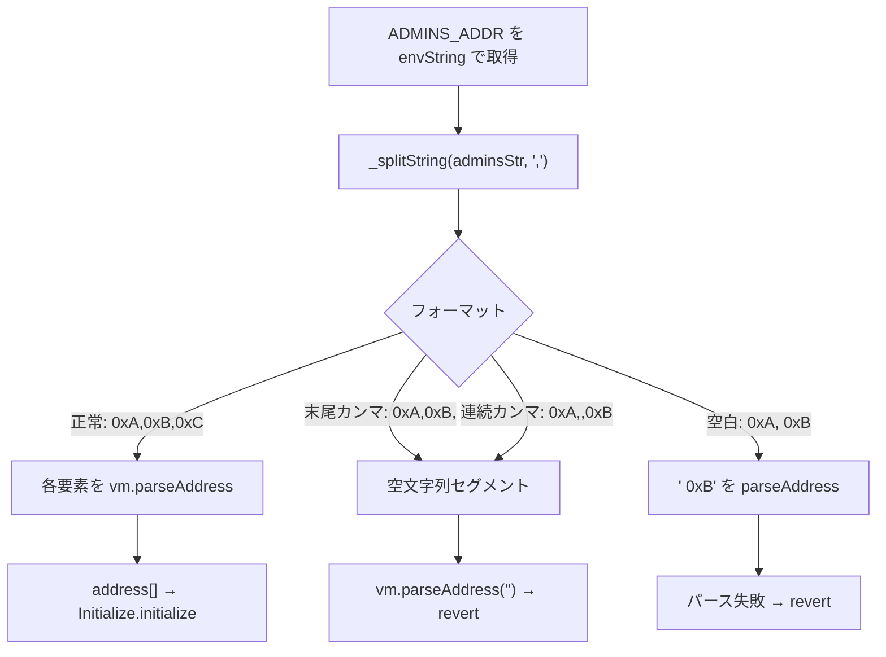

# F-2026-16947: デプロイスクリプトの管理者アドレス用カスタム文字列パーサーを Foundry 標準 cheatcode に置き換える

| 項目 | 内容 |
|------|------|
| コード | F-2026-16947 |
| 種別 | Vulnerability |
| 深刻度 | Info（Impact 1/5, Likelihood 5/5） |
| 対象 | `script/deploy/DeployInvestment.s.sol` |
| 状態 | **対応済**（2026-05-29 実装完了） |

---

## 1. 概要

`DeployInvestmentScript` は環境変数 `ADMINS_ADDR`（カンマ区切りの管理者アドレス列）を読み込むために、`_getAdminAddresses` / `_splitString` / `_substring` の **3 つの独自ヘルパー**（約 70 行）を実装している。

一方、同スクリプト内の `USDT_ADDR` および `SAFE_MULTISIG_WALLET_ADDR` はすでに Foundry の `vm.envAddress` を利用しており、**読み込み方式が不統一**である。

独自パーサーは末尾カンマ・連続カンマ・区切り後の空白など、運用で起こりうるフォーマット揺れを正規化しない。その結果、空文字列セグメントに対する `vm.parseAddress` が失敗し、**原因の分かりにくい revert** になりうる。

Foundry は `vm.envAddress(name, delim)` により、環境変数から **型付き `address[]` を直接取得**できる。パース・検証・エラー報告は cheatcode 側で行われるため、当該カスタムパーサーは **不要**である。

本指摘はオンチェーン契約の権限昇格や資金窃取ではなく、**デプロイスクリプトの保守性・運用時の失敗しやすさ**に関する Info レベルの改善である。

---

## 2. 現状の実装

### 2.1 `run()` — 読み込みの不統一

```solidity
function run() public startBroadcastWith("DEPLOYER_PRIV_KEY") {
    address[] memory admins = _getAdminAddresses(vm.envString("ADMINS_ADDR"));
    address usdtAddress = vm.envAddress("USDT_ADDR");
    address safeMultisigWallet = vm.envAddress("SAFE_MULTISIG_WALLET_ADDR");
    // ...
}
```

- `admins`: `envString` → 手動 split → 要素ごとに `parseAddress`
- 他 2 変数: `envAddress`（単一アドレス）

### 2.2 カスタムパーサー（`DeployInvestment.s.sol` L28–97）

```solidity
function _getAdminAddresses(string memory adminsStr) internal pure returns (address[] memory) {
    string[] memory adminsArray = _splitString(adminsStr, ",");
    address[] memory admins = new address[](adminsArray.length);
    for (uint256 i = 0; i < adminsArray.length; i++) {
        admins[i] = vm.parseAddress(adminsArray[i]);
    }
    return admins;
}
```

`_splitString` は区切り文字の出現回数で配列長を決め、区切り位置で `_substring` するだけ。**トリム・空要素の除去は行わない。**

### 2.3 環境変数の例（`.env.example`）

```
ADMINS_ADDR=0x1,0x2,0x3
```

正しい形式であれば現状でも動作する。実運用例（Anvil 等）も同様のカンマ区切りチェックサム付きアドレス列。

---

## 3. 問題のメカニズム



### 3.1 フォーマット例と挙動（現状）

| `ADMINS_ADDR` の例 | 独自パーサーの結果 |
|--------------------|-------------------|
| `0x7099...,0x3C44...,0x90F7...` | 正常（想定どおり） |
| `0x7099...,0x3C44...,` | 空要素 → `parseAddress` で revert |
| `0x7099...,,0x3C44...` | 空要素 → revert |
| `0x7099..., 0x3C44...` | 先頭空白付きトークン → revert しうる |

### 3.2 悪用可能性・影響

| 観点 | 内容 |
|------|------|
| Exploitability | **Independent**（攻撃者による悪用ではなく、設定・手入力ミス） |
| オンチェーン | デプロイ **前** のスクリプト失敗。チェーン上の資金・権限には直接影響しない |
| Likelihood 5/5 | `.env` 編集・コピペ・末尾カンマなどで遭遇しやすい |
| Impact 1/5 | デプロイ不能・デバッグコスト増。再デプロイで回復可能 |
| 関連指摘 | F-2026-16872 実装後、`initialize` は calldata 内の **重複 admin を revert**。デプロイスクリプト側の重複検出は任意（§6.3） |

---

## 4. 監査推奨（要約）

`run()` 内の管理者配列取得を、Foundry 標準の配列読み込みに置き換える。

```solidity
address[] memory admins = vm.envAddress("ADMINS_ADDR", ",");
```

`_getAdminAddresses`、`_splitString`、`_substring` の 3 関数を **削除**する。

---

## 5. 対応方針（確定）

### 5.1 基本方針: `vm.envAddress` に一本化

| 判断 | 理由 |
|------|------|
| 監査推奨どおり cheatcode を採用 | 不要コード削減、他 env 読み込みとの一貫性 |
| カスタムパーサーは削除 | 二重実装のメンテ負荷・エッジケース漏れを排除 |
| `.env` 形式は現状維持 | `ADMINS_ADDR=addr1,addr2,...` は delimiter `","` と互換 |

### 5.2 `DeployInvestment.s.sol` への変更

**変更箇所（1 行）:**

```solidity
// 変更前
address[] memory admins = _getAdminAddresses(vm.envString("ADMINS_ADDR"));

// 変更後
address[] memory admins = vm.envAddress("ADMINS_ADDR", ",");
```

**削除対象:**

- `_getAdminAddresses`（L28–37 付近）
- `_splitString`（L45–75 付近）
- `_substring`（L84–97 付近）
- `// Helper Functions` セクションが空になる場合はセクションごと削除

### 5.3 オフチェーン検証（任意・F-2026-16872 連携）

本指摘の **必須範囲外** だが、F-2026-16872 対応後は `initialize` が重複 admin で revert する。デプロイ前に以下を行うと運用ミスを早期検出できる。

| 手段 | 内容 |
|------|------|
| CI / シェル | `ADMINS_ADDR` を分割しユニーク性・ゼロアドレスを検証 |
| スクリプト内ループ | `envAddress` 取得後、O(n²) で重複チェックして `revert`（16872 doc §6.3 推奨） |

`vm.envAddress` 単体では **重複は拒否しない**（オンチェーンで最終防御）。

### 5.4 変更しないもの

| 対象 | 理由 |
|------|------|
| `InvestmentDeployer.sol` | `address[] memory admins` の受け口は不変 |
| `Initialize.sol` | オンチェーン検証は 16872 等で対応済 |
| `.env.example` のキー名 `ADMINS_ADDR` | 変更不要（値の形式も同一） |

---

## 6. 代替案の比較

| 方式 | メリット | デメリット | 採用 |
|------|----------|------------|------|
| **A. `vm.envAddress` に置換**（監査推奨） | 簡潔・Foundry 標準・他変数と統一 | Foundry バージョン依存（本リポジトリは既に API 利用可） | **採用** |
| B. カスタムパーサーを改善（trim・空要素スキップ） | 挙動を細かく制御可能 | 依然として二重実装・テスト負荷 | 不採用 |
| C. 対応不要 | 実装不要 | 監査未クローズ・運用 revert リスク残存 | 不採用 |

---

## 7. 実装タスクチェックリスト

### 7.1 スクリプト

- [x] `DeployInvestment.s.sol` — `run()` を `vm.envAddress("ADMINS_ADDR", ",")` に変更（§5.2）
- [x] `DeployInvestment.s.sol` — `_getAdminAddresses` / `_splitString` / `_substring` を削除

### 7.2 検証

- [x] `forge build` でスクリプトのコンパイル確認
- [ ] 既存 `.env` / `.env.example` 形式で `forge script script/deploy/DeployInvestment.s.sol`（またはプロジェクト標準のデプロイ手順）が成功すること（RPC/秘密鍵が必要なため手動）
- [ ] 意図的に不正な `ADMINS_ADDR` を与えた場合、従来より分かりやすいエラーになること（手動確認）

### 7.3 ドキュメント・監査

- [x] 本ファイルのステータスを **対応済** に更新
- [ ] 監査報告書への正式回答

---

## 8. 監査返答案（ドラフト）

> F-2026-16947 について、`DeployInvestment.s.sol` が `ADMINS_ADDR` のパースに独自の `_splitString` / `_substring` ヘルパーを用いており、末尾カンマや連続カンマ等のフォーマット揺れで分かりにくい revert が起こりうる点を認識した。同一スクリプトの他環境変数は既に `vm.envAddress` を使用しており、実装が不統一である。  
> 対応として、監査推奨どおり `address[] memory admins = vm.envAddress("ADMINS_ADDR", ",");` に置き換え、不要な 3 ヘルパー関数を削除する。本変更はデプロイスクリプトの保守性向上であり、オンチェーンのセキュリティモデルには影響しない。管理者配列の重複検証は F-2026-16872 にて `initialize` 側で対応済みであり、本指摘の必須範囲外のオフチェーン強化として任意でデプロイ前チェックを検討する。

---

## 9. 参考リンク

| リソース | パス |
|----------|------|
| デプロイスクリプト | `script/deploy/DeployInvestment.s.sol` |
| デプロイライブラリ | `script/deploy/InvestmentDeployer.sol` |
| 初期化（admin 検証） | `src/investment/functions/initializer/Initialize.sol` |
| 環境変数例 | `.env.example` |
| Vm API（`envAddress` 配列） | `lib/mc/src/devkit/Flattened.sol`, `lib/mc/docs/05-resources/03-devkit/03-api-reference/Flattened.sol/interface.VmSafe.md` |
| 関連（initialize 重複） | `docs/audit/fix/F-2026-16872-initialize-duplicate-admin-check.md` §6.3 |

---

## 10. 変更履歴

| 日付 | 内容 |
|------|------|
| 2026-05-29 | 初版作成（監査指摘 F-2026-16947 の整理・対応方針: `vm.envAddress` への置換） |
| 2026-05-29 | 実装完了: `DeployInvestment.s.sol` を `vm.envAddress("ADMINS_ADDR", ",")` に置換、カスタムパーサー3関数削除、`forge build` 確認 |
