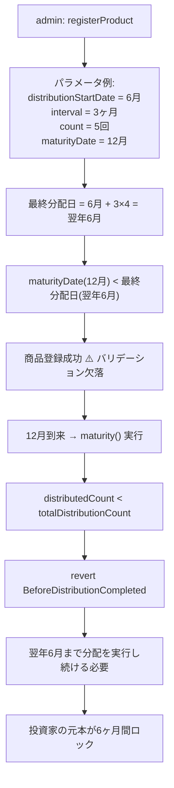

# F-2026-16949: 分配スケジュール終了日と満期日の制約欠落による元本ロック

| 項目 | 内容 |
|------|------|
| コード | F-2026-16949 |
| 種別 | Vulnerability |
| 深刻度 | Low（Impact 4/5, Likelihood 2/5） |
| 対象 | `RegisterProduct.sol` |
| 状態 | **対応済**（2026-05-27 実装完了） |

---

## 1. 概要

`RegisterProduct.registerProduct` は `offeringEndDate`、`operationStartDate`、`distributionStartDate`、`maturityDate` の時系列を検証しているが、分配スケジュール全体（`distributionStartDate` + `distributionInterval` × (`totalDistributionCount` - 1)）が `maturityDate` 以前に完了するかの検証を行っていない。

最終分配日が `maturityDate` を超えて設定された商品が登録されると、満期処理は全分配完了まで `BeforeDistributionCompleted` で revert し続け、投資家の元本がスケジュール超過分の期間（月〜年単位）ロックされる。

商品登録はワンショット操作であり、`maturityDate` および分配パラメータの事後変更手段は存在しない。

---

## 2. 現状の実装

### 2.1 商品登録時のバリデーション（`RegisterProduct.sol`）

```solidity
if (args.maturityDate < args.offeringEndDate) {
    revert IInvestmentErrors.InvalidMaturityDate();
}
if (args.operationStartDate < args.offeringEndDate) {
    revert IInvestmentErrors.InvalidOperationStartDate();
}
if (args.distributionStartDate < args.operationStartDate) {
    revert IInvestmentErrors.InvalidDistributionStartDate();
}
// ❌ lastDistributionDate <= maturityDate のチェックが存在しない
```

検証される時系列:
```
block.timestamp <= offeringEndDate <= operationStartDate <= distributionStartDate
                   offeringEndDate <= maturityDate
```

検証されない制約:
```
lastDistributionDate <= maturityDate
```

### 2.2 満期処理の前提条件（`Maturity.sol`）

```solidity
if (product.totalDistributionCount > product.distributedCount) {
    revert IInvestmentErrors.BeforeDistributionCompleted();
}
```

`maturity` は全分配回数 (`totalDistributionCount`) が完了するまで実行不可。

### 2.3 分配日の算出（`DistributionDateLib.sol`）

```solidity
function calculateNextDistributionDate(
    uint256 distributionStartDate,
    uint256 distributionInterval,
    uint256 distributedCount,
    bool isMonthEndFlag
) internal pure returns (uint256) {
    uint256 monthsToAdd = distributionInterval * distributedCount;
    uint256 nextDate = addMonths(distributionStartDate, monthsToAdd);
    nextDate = normalizeToMidnight(nextDate);
    if (isMonthEndFlag) {
        nextDate = adjustToMonthEnd(nextDate);
    }
    return nextDate;
}
```

各 `distributeYield` 呼び出しは `nextDistributionDate` によるタイムゲートがあり、スケジュール通りの日付が到来するまで実行できない。

---

## 3. 脆弱性のメカニズム



### 3.1 具体例

| パラメータ | 値 |
|-----------|-----|
| `distributionStartDate` | 2025-06-01 |
| `distributionInterval` | 3 ヶ月 |
| `totalDistributionCount` | 5 |
| `maturityDate` | 2025-12-01 |

最終分配日 = 2025-06-01 + 3 × 4 = **2026-06-01**

→ `maturityDate`（2025-12-01）を **6 ヶ月超過**。満期返還は 2026-06-01 の分配完了まで不可。

### 3.2 復旧不能

- `registerProduct` は `productId` ごとのワンショット操作
- `maturityDate` のセッター不在
- 分配パラメータ（`totalDistributionCount`, `distributionInterval`）のセッター不在
- → 誤設定された商品のオンチェーン修正手段は **存在しない**

---

## 4. 影響

| 観点 | 内容 |
|------|------|
| 資金ロック | 分配スケジュール超過分の期間（月〜年）、投資家元本がコントラクト内にロック |
| 可用性 | 開示された `maturityDate` に満期処理を実行できない |
| 回復 | オンチェーンでの修正手段なし（Dictionary アップグレードによるプロキシ変更のみ） |
| 発生可能性 | 管理者の入力ミスに依存（Semi-Dependent）。バリデーション追加で完全防止可能 |
| 深刻度 | Low（意図的な攻撃ではなく設定ミスに起因するが、影響は大きい） |

---

## 5. 監査推奨

### 5.1 推奨内容

`registerProduct` に最終分配日の算出と `maturityDate` との比較バリデーションを追加:

```solidity
uint256 lastDistributionDate = DistributionDateLib.calculateNextDistributionDate(
    args.distributionStartDate,
    args.distributionInterval,
    args.totalDistributionCount - 1,
    DistributionDateLib.isMonthEndDate(args.distributionStartDate)
);
if (lastDistributionDate > args.maturityDate) {
    revert IInvestmentErrors.InvalidMaturityDate();
}
```

### 5.2 推奨の妥当性

**妥当である。** 理由:

1. `DistributionDateLib.calculateNextDistributionDate` は既に本プロジェクトで利用・テスト済みのライブラリ
2. 月末モード（`isMonthEnd`）への対応が含まれる
3. 既存エラー `InvalidMaturityDate` の再利用で追加定義不要
4. ガスコストの影響は商品登録のみ（低頻度操作）

---

## 6. 対応方針

### 6.1 修正内容

`RegisterProduct.sol` の `registerProduct` 関数に、最終分配日 ≤ `maturityDate` のバリデーションを追加する。

### 6.2 実装詳細

既存の `distributionInterval` バリデーション（79行目）の直後に、以下のチェックを挿入:

```solidity
// distributionInterval 検証の後（79行目以降）

// isMonthEnd をバリデーションブロック内に移動して再利用
bool isMonthEnd = DistributionDateLib.isMonthEndDate(args.distributionStartDate);

uint256 lastDistributionDate = DistributionDateLib.calculateNextDistributionDate(
    args.distributionStartDate,
    args.distributionInterval,
    args.totalDistributionCount - 1,
    isMonthEnd
);
if (lastDistributionDate > args.maturityDate) {
    revert IInvestmentErrors.InvalidMaturityDate();
}
```

変更点のまとめ:

| # | 変更 |
|---|------|
| 1 | `bool isMonthEnd = ...` の算出を95行目 → バリデーションブロック内（79行目の後）に移動 |
| 2 | `calculateNextDistributionDate` で最終分配日を算出 |
| 3 | `lastDistributionDate > maturityDate` の場合 `InvalidMaturityDate` で revert |
| 4 | 移動済みのため95行目の重複 `isMonthEnd` 宣言を削除 |

### 6.3 エッジケース考慮

| ケース | 挙動 |
|--------|------|
| `totalDistributionCount == 1` | `count - 1 == 0` → `calculateNextDistributionDate` は `normalizeToMidnight(distributionStartDate)` を返す。通常の日付順序で `maturityDate` 以前 |
| 月末モード | `adjustToMonthEnd` 適用後の日付で比較。月末特有のずれ（例: 1/31 → 2/28）も正しく検出 |
| 閏年 | `DateTime.getDaysInMonth` が閏年判定済み。`addMonths` でのクランプも正常動作 |
| `distributionStartDate > maturityDate` | `lastDistributionDate >= distributionStartDate > maturityDate` で必ず revert（既存チェックでは検出不能だった暗黙の不整合も捕捉） |

### 6.4 既存テストへの影響

`RegisterProduct.sol` のテストにおける正常系テストデータを確認:

| テスト | distributionStartDate | interval | count | 最終分配日 | maturityDate | 結果 |
|--------|----------------------|----------|-------|-----------|-------------|------|
| `test_registerProduct_success` | 2025-06-01 | 3ヶ月 | 3 | 2025-12-01 | 2026-01-01 | OK（12/01 <= 01/01） |
| `testFuzz_registerProduct_success` | 動的 | 動的 | 動的 | 動的 | `distributionStartDate + interval*count + 30 days` | OK（十分なマージン） |

既存の正常系テストは新バリデーション追加後もパスする。ただし fuzz テストの `maturityDate` 算出は **秒単位** で `distributionInterval` を加算しているため、月単位のスケジュール算出（`DistributionDateLib`）との比較で不整合が起きる可能性がある。fuzz テストの `maturityDate` 算出を `DistributionDateLib` ベースに修正する必要がある。

---

## 7. 代替案の比較

| 方式 | メリット | デメリット | 採用 |
|------|----------|------------|------|
| **A. registerProduct にバリデーション追加**（推奨） | 根本原因を登録時に防止、ガス影響最小 | なし（低頻度操作） | **採用** |
| B. maturity で分配未完了を許容 | maturityDate に満期可能 | 未分配分の利払いが欠損、投資家不利益 | 不採用 |
| C. maturityDate / 分配パラメータのセッター追加 | 事後修正可能 | ワンショット設計の崩壊、ガバナンスリスク | 不採用 |

---

## 8. タスクチェックリスト

### 8.1 コントラクト

- [x] `RegisterProduct.sol` — `isMonthEnd` 算出の移動 + 最終分配日 ≤ `maturityDate` バリデーション追加

### 8.2 テスト

- [x] `RegisterProduct.sol`（同梱テスト）— 最終分配日 > `maturityDate` での revert テスト追加
- [x] `RegisterProduct.sol`（同梱テスト）— 最終分配日 == `maturityDate` での成功テスト（境界値）
- [x] `RegisterProduct.sol`（同梱テスト）— 月末モードで最終分配日 > `maturityDate` の revert テスト
- [x] `RegisterProduct.sol`（同梱テスト）— fuzz テストの `maturityDate` 算出を `DistributionDateLib` ベースに修正
- [x] `test/fix/F-2026-16949_PoCVerification.t.sol` — PoC 検証テスト新規作成
- [x] 既存テスト全体の回帰確認（`forge test` 254 tests passed）

### 8.3 ドキュメント

- [x] 本ファイル（`docs/audit/fix/F-2026-16949-distribution-schedule-exceeds-maturity.md`）の作成

---

## 9. 参考リンク

| リソース | パス |
|----------|------|
| 商品登録 | `src/investment/functions/onlyWhiteLists/RegisterProduct.sol` |
| 日付算出ライブラリ | `src/investment/utils/DistributionDateLib.sol` |
| 満期処理 | `src/investment/functions/onlyWhiteLists/Maturity.sol` |
| エラー定義 | `src/investment/interfaces/IInvestmentErrors.sol` |
| 関連（別指摘） | `docs/audit/fix/F-2026-16871-push-payment-blacklist.md` |

---

## 10. 変更履歴

| 日付 | 内容 |
|------|------|
| 2026-05-26 | 初版作成（監査指摘 F-2026-16949 の整理・対応方針） |
| 2026-05-27 | 実装完了: バリデーション追加、同梱テスト修正/追加、PoC 検証テスト作成、`forge test` 254 件 Green |
