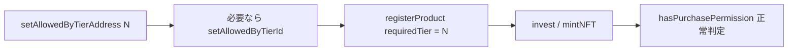
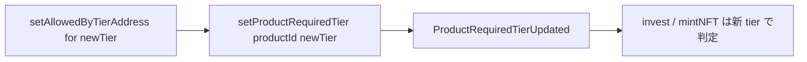
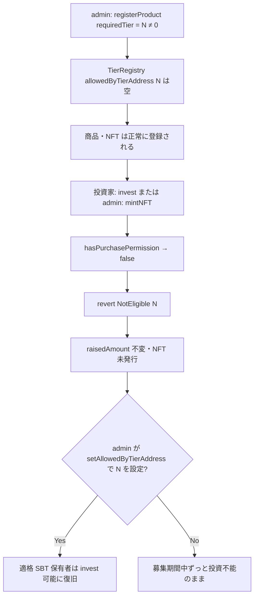
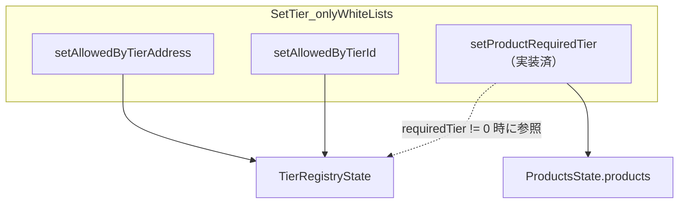
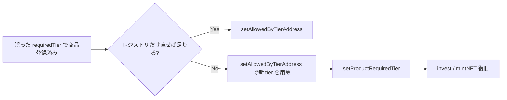

# F-2026-16955: 商品登録時の Tier Registry 未検証により投資が一時的にブロックされる

| 項目 | 内容 |
|------|------|
| コード | F-2026-16955 |
| 種別 | Vulnerability |
| 深刻度 | Info（Impact 2/5, Likelihood 2/5） |
| 対象 | `RegisterProduct.sol`, `PurchasePermissionLib.sol`（参照: `Invest.sol`, `MintNFT.sol`） |
| 状態 | **対応済**（2026-05-29 登録時検証 + 追補 `setProductRequiredTier` 実装完了） |

---

## 1. 概要

修正前は `registerProduct` が `requiredTier`（`uint8`）を検証せず、`requiredTier != 0` かつ `TierRegistry` の `allowedByTierAddress[requiredTier]` が空のまま商品が登録できた。`PurchasePermissionLib.hasPurchasePermission` は空配列を走査して常に `false` を返すため、`invest` / `mintNFT` は全員 `NotEligible(requiredTier)` で revert し、**当該商品への投資が誰からも行えない** 一時 DoS 状態になっていた。

**対応後**は `requiredTier != 0` のとき登録前に `allowedByTierAddress[requiredTier].length > 0` を要求し、未設定 tier 付き商品の作成と CREATE2 による NFT の無駄デプロイを防止する。

本番コントラクトに `SetTier.setProductRequiredTier` により、登録後の `requiredTier` 更新が可能（§11 追補対応済）。

登録済み商品が事後に投資不能になる典型パターンと復旧手段:

| 原因 | `setAllowedByTierAddress` のみで復旧可能か | 追補 API が必要なケース |
|------|---------------------------------------------|-------------------------|
| 当該 tier のレジストリが空／不適切 | **可** — レジストリを正せば `requiredTier` はそのままで invest 可能 | 不要 |
| 商品の `requiredTier` 自体が誤設定（例: BRONZE 指定だが運用は NONE 想定） | **不可** — レジストリを直しても `product.requiredTier` が変わらない | **要** — §11 の更新 API |

商品・NFT コントラクト・`productId` の永久喪失には至らない。

### 1.1 関連する既存対応

| コード | 内容 | 状態 |
|--------|------|------|
| F-2026-16949 | `registerProduct` で最終分配日 ≤ `maturityDate` を検証 | **対応済** |
| F-2026-17004 | `setAllowedByTierAddress` でゼロアドレス・非コントラクト・重複を拒否 | **対応済** |
| F-2026-17027 | `ProductRegistered` に `requiredTier` / `isMonthEnd` を含める | **対応済** |
| **F-2026-16955** | `registerProduct` で `requiredTier != 0` 時に TierRegistry 存在チェック；追補 `setProductRequiredTier` | **対応済** |

---

## 2. 対応後の実装

### 2.1 商品登録（`RegisterProduct.sol`）

F-2026-16949 の最終分配日検証の直後、CREATE2 デプロイの前に `TierNotConfigured` チェックを追加。

```solidity
if (lastDistributionDate > args.maturityDate) {
    revert IInvestmentErrors.InvalidMaturityDate();
}

if (
    args.requiredTier != 0
        && Storage.TierRegistryState().allowedByTierAddress[args.requiredTier].length == 0
) {
    revert IInvestmentErrors.TierNotConfigured(args.requiredTier);
}

// Deploying an NFT Contract Using CREATE2
```

| `requiredTier` | 登録時 | 投資時 |
|----------------|--------|--------|
| `0`（NONE） | レジストリ不要 | `hasPurchasePermission` は常に `true` |
| `1+` | `allowedByTierAddress[tier]` が空なら `TierNotConfigured` | 適格 SBT 保有が必要。不適格は `NotEligible` |

登録成功時は `ProductRegistered` に `requiredTier` と `isMonthEnd` が含まれる（F-2026-17027）。

### 2.2 エラー定義（`IInvestmentErrors.sol`）

```solidity
/// @notice Thrown when registering a product with a tier that has no SBT contracts configured in the registry
error TierNotConfigured(uint8 tier);
```

### 2.3 購入資格（`PurchasePermissionLib.sol`）— 変更なし

`invest` / `mintNFT` は引き続き `hasPurchasePermission` で判定。登録時チェックと併せて二段構え:

| 段階 | チェック | エラー |
|------|----------|--------|
| 商品登録 | `allowedByTierAddress[tier].length > 0` | `TierNotConfigured` |
| 投資・ミント | ユーザーが登録済み SBT/id を保有 | `NotEligible` |

ERC1155 でアドレスのみ登録・`allowedByTierId` が空の misconfiguration は登録時には弾かれない（別種の運用ミス。投資時に `NotEligible`）。

### 2.4 推奨運用フロー



`requiredTier == 0` の商品は従来どおり Tier Registry 設定なしで登録可能。

**登録後の `requiredTier` 修正**（レジストリだけでは直せない誤設定）:



満期済み商品でも `setProductRequiredTier` は利用可能（`MaturedProduct` チェックなし）。詳細は §11。

### 2.5 テスト

| 対象 | 内容 |
|------|------|
| `RegisterProduct.sol`（同梱 MCTest） | `test_registerProduct_revert_whenRequiredTierNotConfigured` — 未設定 tier で `TierNotConfigured` |
| 同上 | `test_registerProduct_storesRequiredTier` — 事前にレジストリへ SBT アドレス登録後に成功 |
| `Investment.scenario9.t.sol` | Tier 設定 → 商品登録の順に更新 |
| `docs/test/scenario/scenario9.md` | 手順 1・2 の順序を更新 |

---

## 3. 修正前の脆弱性（参考）



**対応後**はノード B の直前（登録時）で `TierNotConfigured` により revert し、C 以降の誤登録パスを遮断する。

### 3.1 登録後にレジストリを空にした場合（本対応のスコープ外）

商品登録時に tier `N` が正しく設定されていても、後から `setAllowedByTierAddress(N, [])` でクリアすると **同様に全員 `NotEligible`** となる。登録時検証とは別問題として運用でカバーする。

### 3.2 検証スコープの境界

| 状態 | 登録時 | `hasPurchasePermission` |
|------|--------|-------------------------|
| `allowedByTierAddress[tier].length == 0` | `TierNotConfigured` | — |
| アドレスはあるが ERC1155 のみ・`allowedByTierId` が空 | 登録可 | 常に `false` |
| `address(0)` 等 | `setAllowedByTierAddress` 時に拒否（F-2026-17004） | — |

---

## 4. 影響（修正前）

| 観点 | 内容 |
|------|------|
| 可用性 | 当該商品への全投資・管理者ミントが拒否（一時 DoS） |
| 資産・データ | 商品レコード・NFT・`productId` は残存 |
| 復旧 | レジストリ空・不備 → `setAllowedByTierAddress`（＋ ERC1155 なら `setAllowedByTierId`）。商品の `requiredTier` 誤設定 → `setProductRequiredTier`（§11） |
| ガス | 誤登録時に CREATE2 まで進んでいた |

---

## 5. 監査返答案

> F-2026-16955 について、`registerProduct` に `requiredTier` に対する Tier Registry の存在チェックを追加した。  
> `requiredTier != 0` かつ `allowedByTierAddress[requiredTier]` が空の場合は `TierNotConfigured` で登録を拒否し、未設定 tier 付き商品の作成および CREATE2 による NFT の無駄デプロイを防止する。  
> 追補として `SetTier.setProductRequiredTier` を追加し、誤設定された `requiredTier` を商品単位で修正できる recovery path を提供する（非ゼロ tier は登録時と同様にレジストリ必須。満期済み商品も更新可。`ProductRequiredTierUpdated` で観測可能）。

---

## 6. 代替案の比較

| 方式 | 採用 |
|------|------|
| **A. 登録時 `allowedByTierAddress.length > 0` チェック**（監査推奨） | **採用・実装済** |
| B. 登録後 `requiredTier` 更新 API を追加（§11） | **追補採用・実装済** |
| C. `setAllowedByTierAddress` で空配列を禁止 | 不採用 |
| D. 対応不要（運用のみ） | 不採用 |

---

## 7. 実装タスクチェックリスト

### 7.1 コントラクト

- [x] `IInvestmentErrors.sol` — `error TierNotConfigured(uint8 tier);` を追加
- [x] `RegisterProduct.sol` — CREATE2 前にチェック追加、NatSpec 更新

### 7.2 テスト

- [x] `RegisterProduct.sol`（同梱 MCTest）— revert / 成功テスト
- [x] `Investment.scenario9.t.sol` — Tier 設定を商品登録より前に移動
- [x] `docs/test/scenario/scenario9.md` — 手順順序の更新
- [x] 関連シナリオドキュメント（scenario8/10/11）— 登録順序の注記を更新
- [x] `forge test` 回帰確認（対象スイート）

### 7.3 追補（`setProductRequiredTier`）

- [x] `SetTier.sol` — 関数本体・`ProductRequiredTierUpdated` emit
- [x] `IInvestmentEvents.sol` / `IInvestmentFunctions.sol` / `InvestmentFacade.sol` / `InvestmentDeployer.sol`
- [x] `SetTierTest` — 成功・revert・noop・満期済み成功
- [x] `docs/design/sequence/Sequence-SetProductRequiredTier.md` 新規
- [x] `docs/design/ja|en/access-control.md` — whiteList 一覧に追記

### 7.3 ドキュメント

- [x] 本ファイルのステータスを **対応済** に更新
- [x] `docs/references/特殊ケースまとめ.md` — tier 登録制約を追記
- [x] `docs/requirements/ja/セキュリティリスク.md` / `en/Security-Risks.md` — 対策項目を追記

---

## 8. 実装メモ

- `requiredTier == 0`（NONE）は従来どおりレジストリ不要。
- tier 番号の上限（例: 1〜4 のみ）は本指摘の範囲外。`uint8` の任意値は許容し、未登録 tier のみ拒否。
- `setAllowedByTierAddress` で空配列への置換は引き続き可能（登録済み商品の事後 DoS リスクは残存）。
- シナリオ8/10/11 のテストコードも **Tier 設定 → 商品登録** 順に更新済み。

---

## 11. 追補対応: 登録後 `requiredTier` 更新 API（実装済）

監査は「追加の administrative recovery path」として、登録後に `requiredTier` を変更する管理者関数の追加を **任意** で提案している。F-2026-16955 本体（登録時 `TierNotConfigured`）に加え、`SetTier.setProductRequiredTier` で **誤った `requiredTier` が既に商品に保存された場合** のリカバリを提供する。満期済み商品も更新可能（`MaturedProduct` チェックは不採用）。

### 11.1 配置場所: `SetTier.sol` でよいか

**結論: 妥当。採用を推奨する。**

| 観点 | `SetTier.sol` に置く | 別コントラクト（例: `UpdateProduct.sol`） |
|------|----------------------|------------------------------------------|
| 責務のまとまり | Tier Registry 設定（`setAllowedByTierAddress` / `setAllowedByTierId`）と、商品側の tier 要件（`requiredTier`）は運用上セットで扱うことが多い | 商品全般の更新用に分離できるが、現状ほかの商品フィールド更新 API は無い |
| 権限 | 既存の `onlyWhiteLists` と一致（管理者のみ） | 同様に `onlyWhiteLists` が必要 |
| デプロイ | `InvestmentDeployer._useSetTierFunctions` に selector を 1 本追加するだけ | 新 Facet 追加でデプロイ・Dictionary コスト増 |
| 監査文脈 | 「Tier まわりの misconfiguration リカバリ」として説明しやすい | 商品更新全般の入口に見える |

`RegisterProduct.sol` に置かない理由: 当ファイルは **新規登録（CREATE2 含む）** に特化しており、既存 `Product` の単一フィールド更新は `SetTier` の「中央レジストリ＋商品 tier 要件」管理と相性がよい。



### 11.2 関数仕様（案）

| 項目 | 内容 |
|------|------|
| コントラクト | `SetTier.sol`（`OnlyWhiteListsBase` 継承） |
| 関数名 | `setProductRequiredTier` |
| シグネチャ | `function setProductRequiredTier(uint256 productId, uint8 requiredTier) external onlyWhiteLists` |
| ストレージ | `Storage.ProductsState().products[productId].requiredTier` を上書き |
| 権限 | `onlyWhiteLists`（`RegisterProduct` / `setAllowedByTierAddress` と同じ） |

**処理フロー（案）:**

```solidity
function setProductRequiredTier(uint256 productId, uint8 requiredTier) external onlyWhiteLists {
    Schema.Product storage product = Storage.ProductsState().products[productId];
    if (product.productId == 0) {
        revert IInvestmentErrors.ProductNotFound();
    }
    if (
        requiredTier != 0
            && Storage.TierRegistryState().allowedByTierAddress[requiredTier].length == 0
    ) {
        revert IInvestmentErrors.TierNotConfigured(requiredTier);
    }

    uint8 previousRequiredTier = product.requiredTier;
    if (previousRequiredTier == requiredTier) {
        return; // または DuplicateEntry / 専用 no-op revert — 実装時に決定
    }

    product.requiredTier = requiredTier;

    emit IInvestmentEvents.ProductRequiredTierUpdated(productId, previousRequiredTier, requiredTier);
}
```

`registerProduct` と **同じ「設定済み」の定義** を用いる: `requiredTier != 0` のとき `allowedByTierAddress[requiredTier].length > 0` のみ（ERC1155 の `allowedByTierId` 中身までは見ない）。

### 11.3 バリデーション方針

| チェック | 採用 | 理由 |
|----------|------|------|
| `ProductNotFound` | **必須** | 存在しない `productId` への書き込み防止 |
| `TierNotConfigured` | **必須** | `registerProduct` と対称。未設定 tier への変更を拒否 |
| `MaturedProduct` | **不採用** | 満期済み商品でも `requiredTier` の誤設定を修正できるようにする。`invest` / `mintNFT` は従来どおり `MaturedProduct` で拒否されるため、満期後の新規投資は発生しない |
| `requiredTier` 変更なしで early return | **採用** | ガス節約。イベントは出さない |
| `raisedAmount > 0` で変更禁止 | **不採用（初期）** | 誤設定リカバリの目的と矛盾。既存 NFT 保有者への影響は運用・開示でカバー |
| 募集期間外のみ許可 | **不採用（初期）** | レジストリ空による事後 DoS は募集終了後も修正したい |

### 11.4 既存投資・NFT への影響（運用上の注意）

本 API は **既存の `raisedAmount` / 発行済み NFT を変更しない**。変更後の `invest` / `mintNFT` のみ新しい `requiredTier` で `hasPurchasePermission` が評価される。

| 変更例 | 既存 NFT 保有者 | 今後の invest / mintNFT |
|--------|----------------|-------------------------|
| `0 → 1`（NONE → BRONZE） | NFT は保持されたまま | 新規投資は tier 必須。既存保有者は SBT なしでも NFT は残る（F-2026-17023 と同型） |
| `1 → 0`（BRONZE → NONE） | 同上 | 誰でも新規投資可能に |
| `1 → 2`（tier 差し替え） | 同上 | 新 tier の SBT 条件で判定 |

→ **オフチェーンでイベントを監視し、変更を開示する** こと。イベント追加は F-2026-17027 の観測性方針に沿う。

### 11.5 イベント（案）

`IInvestmentEvents.sol` に追加:

```solidity
/// @notice Emitted when an admin updates a product's required tier
event ProductRequiredTierUpdated(
    uint256 indexed productId,
    uint8 previousRequiredTier,
    uint8 newRequiredTier
);
```

`ProductRegistered` は登録時のみ。更新経路は別イベントで追跡可能にする。

### 11.6 インターフェース・デプロイ・ドキュメント（実装時タスク）

| 対象 | 変更内容 |
|------|----------|
| `SetTier.sol` | 上記関数本体 |
| `IInvestmentErrors.sol` | 新規エラーは原則不要（既存を再利用） |
| `IInvestmentEvents.sol` | `ProductRequiredTierUpdated` |
| `IInvestmentFunctions.sol` / `InvestmentFacade.sol` | 関数宣言追加 |
| `InvestmentDeployer.sol` | `mc.use("setProductRequiredTier", SetTier.setProductRequiredTier.selector, setTier)` |
| `SetTier.sol` 同梱 MCTest | 成功・`ProductNotFound`・`TierNotConfigured`・満期済み商品での成功 等 |
| `docs/design/ja/access-control.md` 等 | whiteList 関数一覧に 1 行追加 |

### 11.7 復旧フロー（追補後）



### 11.8 監査返答案（追補用ドラフト）

> 登録時の `TierNotConfigured` に加え、管理者向けに `SetTier.setProductRequiredTier` を追加し、誤設定された `requiredTier` を商品単位で修正できる recovery path を提供する。新 tier が非ゼロの場合は `registerProduct` と同様にレジストリ存在を要求する。満期済み商品も更新可能とし（オンチェーン記録の整合・監査用）、既存 NFT は変更しない。満期後の `invest` / `mintNFT` は従来どおり `MaturedProduct` でブロックされる。

### 11.9 実装タスクチェックリスト（追補）

- [x] `SetTier.sol` — `setProductRequiredTier` 実装（`MaturedProduct` チェックなし）
- [x] `IInvestmentEvents.sol` — `ProductRequiredTierUpdated`
- [x] `IInvestmentFunctions.sol` / `InvestmentFacade.sol` / `InvestmentDeployer.sol`
- [x] `SetTier` 同梱テスト（満期済み商品での成功を含む）
- [x] `docs/design/ja/access-control.md`（および en）更新
- [x] 本ファイル §11 更新

---

## 9. 参考リンク

| リソース | パス |
|----------|------|
| 商品登録 | `src/investment/functions/onlyWhiteLists/RegisterProduct.sol` |
| 購入資格 | `src/investment/utils/PurchasePermissionLib.sol` |
| Tier 設定・追補 API | `src/investment/functions/onlyWhiteLists/SetTier.sol`（`setProductRequiredTier` 含む） |
| シーケンス（追補） | `docs/design/sequence/Sequence-SetProductRequiredTier.md` |
| エラー定義 | `src/investment/interfaces/IInvestmentErrors.sol` |
| シナリオ9 | `test/investment/Investment.scenario9.t.sol`, `docs/test/scenario/scenario9.md` |
| 関連（分配日と満期） | `docs/audit/fix/F-2026-16949-distribution-schedule-exceeds-maturity.md` |
| 関連（Tier 入力検証） | `docs/audit/fix/F-2026-17004-setAllowedByTierAddress-zero-duplicate.md` |
| 関連（イベント） | `docs/audit/fix/F-2026-17027-missing-event-emissions-off-chain-observability.md` |

---

## 10. 変更履歴

| 日付 | 内容 |
|------|------|
| 2026-05-27 | 初版作成（監査指摘 F-2026-16955 の整理・対応方針） |
| 2026-05-29 | コードベース同期（未対応時点の現状整理） |
| 2026-05-29 | 実装完了: `TierNotConfigured` 追加、RegisterProduct 検証、テスト・シナリオドキュメント更新 |
| 2026-05-29 | §11 追記: 登録後 `requiredTier` 更新 API（`SetTier.setProductRequiredTier` 案）の設計 |
| 2026-05-29 | 追補実装: `setProductRequiredTier`、イベント・デプロイ・テスト。満期済み商品も更新可（`MaturedProduct` チェック不採用） |
