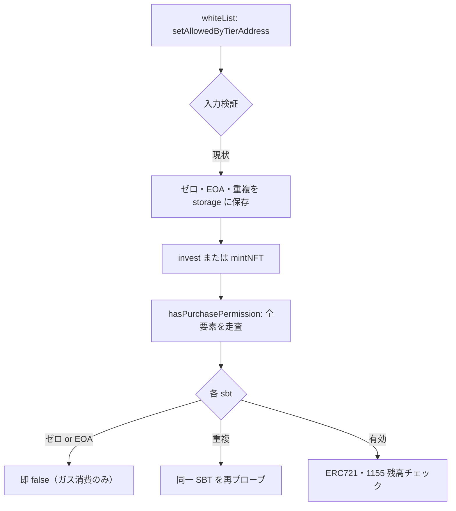
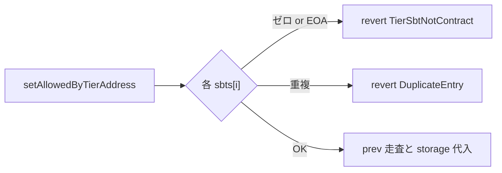

# F-2026-17004: setAllowedByTierAddress がゼロアドレス・重複エントリをフィルタしない

| 項目 | 内容 |
|------|------|
| コード | F-2026-17004 |
| 種別 | Vulnerability |
| 深刻度 | Info（Impact 1/5, Likelihood 2/5） |
| 対象 | `SetTier.sol`, `PurchasePermissionLib.sol`, `Invest.sol`, `MintNFT.sol` |
| 状態 | **対応済**（2026-05-27 実装完了） |

---

## 1. 概要

`SetTier.setAllowedByTierAddress` は、ティアに紐づく SBT コントラクトアドレス一覧（`allowedByTierAddress[tier]`）を calldata 配列のままストレージへ代入しており、**ゼロアドレス・コードのないアドレス（EOA）・重複アドレス**を拒否しない。

実行時の購入資格チェック（`PurchasePermissionLib.hasPurchasePermission`）は無効エントリをスキップするため **正しさは崩れない** が、一覧が肥大化すると **`invest` / `mintNFT` のたびに無駄なループ・外部呼び出しが増えガスコストが膨らむ**。同一 SBT の重複登録では、1 回の投資呼び出しあたり同じコントラクトを複数回プローブする。

本指摘はセキュリティ上の資金窃取や権限バイパスではなく、**管理者設定 API の入力検証不足とガス効率**に関する Info レベルの改善である。

---

## 2. 現状の実装

### 2.1 設定側（`SetTier.sol`）

```solidity
function setAllowedByTierAddress(uint8 tier, address[] calldata sbts) external onlyWhiteLists {
    // ゼロ・非コントラクト・重複を拒否（prev 走査より前で検証し原子性を確保）
    uint256 len = sbts.length;
    for (uint256 i = 0; i < len;) {
        address sbt = sbts[i];
        if (sbt == address(0) || sbt.code.length == 0) {
            revert IInvestmentErrors.TierSbtNotContract(sbt);
        }
        for (uint256 j = 0; j < i;) {
            if (sbts[j] == sbt) revert IInvestmentErrors.DuplicateEntry();
            unchecked { ++j; }
        }
        unchecked { ++i; }
    }

    // 一覧から外れた SBT の allowedByTierId[tier][addr] を削除
    address[] storage prev = Storage.TierRegistryState().allowedByTierAddress[tier];
    // ... prev と sbts の差分で delete ...

    Storage.TierRegistryState().allowedByTierAddress[tier] = sbts;
    emit IInvestmentEvents.TierAllowedByTierAddressUpdated(tier, sbts);
}
```

- 呼び出し権限: `onlyWhiteLists`（管理者のみ）
- **空配列**は意図的に許容（ティアの SBT 一覧をクリアする運用）

### 2.2 `setAllowedByTierId`（対応前の ids 配列）

`setAllowedByTierId` では SBT アドレスに対して **ゼロアドレス・非コントラクト・ERC1155** を拒否していたが、`ids` 配列は無検証で storage へ代入されていた。

```solidity
// 対応前: ids の重複もそのまま保存
Storage.TierRegistryState().allowedByTierId[tier][sbt] = ids;
```

**対応後（拡張）:** ERC1155 チェックの後、代入前に `ids` 内の重複を `DuplicateEntry` で拒否。`tokenId = 0` は許可、空配列も許可。

```solidity
for (uint256 i = 0; i < idsLen;) {
    uint256 id = ids[i];
    for (uint256 j = 0; j < i;) {
        if (ids[j] == id) revert IInvestmentErrors.DuplicateEntry();
        unchecked { ++j; }
    }
    unchecked { ++i; }
}
```

### 2.3 参照側（`PurchasePermissionLib.sol`）

`invest` / `mintNFT` は `hasPurchasePermission` 経由で `allowedByTierAddress[requiredTier]` を線形走査する。

```solidity
for (uint256 i = 0; i < len;) {
    address sbt = sbts[i];
    uint256[] storage ids = Storage.TierRegistryState().allowedByTierId[requiredTier][sbt];
    if (_hasPermissionByContract(user, sbt, ids)) {
        return true;
    }
    // ...
}
```

無効エントリは `_hasPermissionByContract` 内で即 `false` となり、権限判定結果は変わらない。

```solidity
if (sbt == address(0) || sbt.code.length == 0) {
    return false;
}
```

`PurchasePermissionLibTest.test_hasPurchasePermission_zeroAddressEntries_skipped_validSbtStillCounts` は、このランタイム挙動をテストで明示している（直接 storage を操作したケース）。

---

## 3. 脆弱性のメカニズム



### 3.1 監査指摘の要点

| 入力 | 正しさへの影響 | ガスへの影響 |
|------|----------------|--------------|
| `address(0)` | なし（常に false） | 毎回ループで無駄な分岐 |
| コードなし（EOA） | なし（常に false） | 同上 |
| 同一アドレスの重複 | なし（1 回目で true なら十分） | 重複分だけ外部呼び出し増 |

### 3.2 悪用可能性

| 観点 | 内容 |
|------|------|
| 外部攻撃者 | `onlyWhiteLists` のため、**単独では配列を汚染できない** |
| 前提条件 | 管理者の誤設定、または whiteList 権限の侵害 |
| 典型規模 | ティアあたり SBT 数件の運用想定 → 実害は限定的 |
| 理論上 | 極端に長い配列を登録すると、全投資者の `invest` / `mintNFT` view コストが増大し得る |

---

## 4. 影響

| 観点 | 内容 |
|------|------|
| 資金・権限 | **影響なし**（購入可否の判定結果は変わらない） |
| 可用性 | ガス増による UX 悪化（特に L2 以外・長大リスト時） |
| 一貫性 | `setAllowedByTierId` と `setAllowedByTierAddress` で検証ポリシーが不一致 |
| 運用 | 誤ってゼロや重複を入れても revert せず、気づきにくい |

---

## 5. 監査推奨（要約）

`allowedByTierAddress[tier] = sbts` の**直前**に、calldata 配列に対する検証ループを追加する。

```solidity
for (uint256 i = 0; i < sbts.length; ++i) {
    if (sbts[i] == address(0) || sbts[i].code.length == 0) {
        revert IInvestmentErrors.TierSbtNotContract(sbts[i]);
    }
    for (uint256 j = 0; j < i; ++j) {
        if (sbts[j] == sbts[i]) revert IInvestmentErrors.DuplicateEntry();
    }
}
```

---

## 6. 対応方針（推奨）

### 6.1 基本方針: 設定時に拒否（fail-fast）

ランタイム側（`PurchasePermissionLib`）の「無効エントリをスキップ」は **防御的フォールバックとして維持**し、正規の設定経路である `setAllowedByTierAddress` で不正入力を revert する。



### 6.2 `SetTier.sol` への変更

**挿入位置:** 既存の `prev` 走査（削除対象 `allowedByTierId` のクリア）の**前**（関数先頭）。監査案は storage 代入直前だが、`prev` 走査は `allowedByTierId` を既に delete するため、検証失敗時の不整合を避けるため先頭で calldata のみ検証する。

**検証内容:**

| チェック | エラー | 備考 |
|----------|--------|------|
| `sbts[i] == address(0)` | `TierSbtNotContract(sbts[i])` | `setAllowedByTierId` と同一 |
| `sbts[i].code.length == 0` | `TierSbtNotContract(sbts[i])` | EOA 等 |
| `sbts[j] == sbts[i]`（j < i） | `DuplicateEntry()` | **新規エラー**（`IInvestmentErrors` に追加） |

**空配列:** ループ 0 回のため引き続き許容（ティアクリア）。

**ガス:** 設定時 O(n²) の重複チェック。n は運用上小さい想定で許容。

### 6.3 `IInvestmentErrors.sol` への変更

```solidity
/// @notice Thrown when an array argument contains duplicate entries.
error DuplicateEntry();
```

（`TierSbtNotContract` は既存定義を再利用）

### 6.4 変更しないもの

| 対象 | 理由 |
|------|------|
| `PurchasePermissionLib` | ランタイムの防御的スキップは残す。直接 storage を触るテスト・将来の読み取り経路への耐性 |
| `setAllowedByTierId` の `ids` 配列 | **対応済**（ids 重複を `DuplicateEntry` で拒否。tokenId=0 は許可） |
| `Getter.getAllowedByTierAddress` | 返却値は設定済みの正規化済み一覧となる |

### 6.5 設計判断の根拠

| 判断 | 理由 |
|------|------|
| 設定時検証を採用 | 根本原因は「汚染された storage の永続化」。参照側だけでは管理者ミスを防げない |
| `TierSbtNotContract` を流用 | `setAllowedByTierId` とポリシー統一 |
| 重複を revert | 無意味なガス増を防ぎ、運用ミスを早期検出 |
| Info でも修正 | 監査クローズ・API 一貫性・将来のリスト肥大化リスク低減 |

---

## 7. 代替案の比較

| 方式 | メリット | デメリット | 採用 |
|------|----------|------------|------|
| **A. 設定時バリデーション**（監査推奨） | 最小変更、ポリシー明確、ガス DoS 予防 | 設定 tx のガス微増（n 小） | **採用** |
| B. 参照時にフィルタのみ | 既存 storage はそのまま | 汚染データが残り、毎回 invest で無駄走査 | 不採用 |
| C. 対応不要（運用で回避） | 実装不要 | API 非対称・監査未クローズ | 不採用 |

---

## 8. 実装タスクチェックリスト

### 8.1 コントラクト

- [x] `IInvestmentErrors.sol` — `DuplicateEntry()` を追加
- [x] `SetTier.sol` — `setAllowedByTierAddress` に §6.2 の検証ループを追加
- [x] `SetTier.sol` — `setAllowedByTierId` の `ids` 重複検証を追加

### 8.2 テスト（`SetTier.sol` 内 `SetTierTest`）

- [x] `setAllowedByTierAddress` に `address(0)` を含む → `TierSbtNotContract` で revert
- [x] コードなしアドレス（EOA）を含む → `TierSbtNotContract` で revert
- [x] 同一アドレスを 2 回含む → `DuplicateEntry` で revert
- [x] 空配列でのクリア → 引き続き成功（既存 `test_setAllowedByTierAddress_success_canClearWithEmptyArray`）
- [x] 既存成功系テストの回帰（`forge test` 250 件 Green）

### 8.2b テスト（`setAllowedByTierId` ids 重複・拡張）

- [x] `setAllowedByTierId` に重複 tokenId → `DuplicateEntry` で revert
- [x] `tokenId = 0` は許可（`test_setAllowedByTierId_success_whenZeroId`）
- [x] 空配列は従来どおり許可

### 8.3 ドキュメント・監査

- [x] 本ファイル（`docs/audit/fix/F-2026-17004-setAllowedByTierAddress-zero-duplicate.md`）の作成
- [x] 実装完了後に本ファイルのステータスを **対応済** に更新
- [ ] 監査報告書への正式回答

---

## 9. 監査返答案（ドラフト）

> F-2026-17004 について、`setAllowedByTierAddress` において calldata 配列を無検証で storage へ保存していた点を認識した。  
> 実行時の `PurchasePermissionLib.hasPurchasePermission` はゼロアドレスおよび非コントラクトをスキップするため、購入資格の正しさは維持されるが、無効・重複エントリは全投資者の `invest` / `mintNFT` における不要な走査・外部呼び出しを招く。  
> 対応として、`setAllowedByTierAddress` ではゼロアドレス・非コントラクトを `TierSbtNotContract` で拒否し、配列内の重複を `DuplicateEntry` で拒否する検証を storage 代入前に追加した。空配列によるティアクリアは従来どおり許容する。  
> あわせて `setAllowedByTierId` の `ids` 配列についても重複を `DuplicateEntry` で拒否するよう拡張した（`tokenId = 0` は ERC1155 上 Valid のため許可）。

---

## 10. 参考リンク

| リソース | パス |
|----------|------|
| ティア設定 | `src/investment/functions/onlyWhiteLists/SetTier.sol` |
| 購入資格 | `src/investment/utils/PurchasePermissionLib.sol` |
| 投資 | `src/investment/functions/Invest.sol` |
| 管理者ミント | `src/investment/functions/onlyMinters/MintNFT.sol` |
| エラー定義 | `src/investment/interfaces/IInvestmentErrors.sol` |
| スキーマ | `src/investment/storage/Schema.sol`（`allowedByTierAddress`） |
| アクセス制御 | `docs/design/ja/access-control.md` |
| 関連（ティア設計） | `.cursor/plans/multi-erc1155-tier-registry_8d9dcf37.plan.md` |

---

## 11. 変更履歴

| 日付 | 内容 |
|------|------|
| 2026-05-27 | 初版作成（監査指摘 F-2026-17004 の整理・対応方針） |
| 2026-05-27 | 実装完了: `SetTier.sol` 検証ループ、`DuplicateEntry` エラー、`SetTierTest` revert テスト 3 件、`forge test` 250 件 Green |
| 2026-05-27 | 拡張: `setAllowedByTierId` の `ids` 重複検証、`SetTierTest` 2 件追加 |
