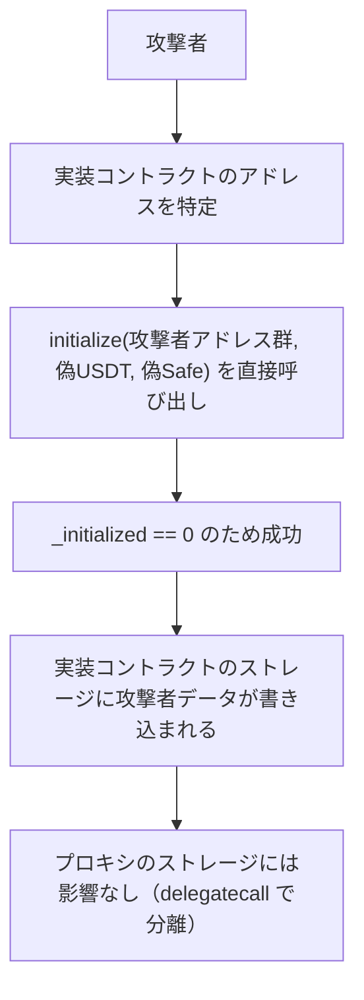

# F-2026-17010: 実装コントラクトの Initialize が `_disableInitializers` で保護されていない

| 項目 | 内容 |
|------|------|
| コード | F-2026-17010 |
| 種別 | Vulnerability |
| 深刻度 | Info（Impact 1/5, Likelihood 2/5） |
| 対象 | `Initialize.sol` |
| 状態 | **対応済**（2026-05-27 実装完了） |

---

## 1. 概要

`Initialize` コントラクトは OpenZeppelin の `Initializable` を継承し、`initialize` 関数に `initializer` 修飾子を付与している。
しかし、constructor で `_disableInitializers()` を呼んでいないため、**実装コントラクト自体に対して `initialize` を直接呼び出すことが可能**。

ERC-7546 / MC フレームワークでは、ファンクションコントラクトはスタンドアロンの通常コントラクトとしてデプロイされる。
プロキシ層（Dictionary + delegatecall）は実装コントラクト自身の初期化を防止する機構を持たないため、実装コントラクトの `_initialized` スロットが初期値 `0` のまま残り、外部から 1 回だけ `initialize` を成功させることができる。

---

## 2. 修正前の実装

```solidity
// src/investment/functions/initializer/Initialize.sol（修正前）
contract Initialize is Initializable {
    // constructor なし — _disableInitializers() が呼ばれない

    function initialize(
        address[] calldata admins,
        address usdtAddress,
        address safeMultisigWallet
    ) external initializer {
        for (uint8 i = 0; i < admins.length; i++) {
            if (admins[i] == address(0)) revert IInvestmentErrors.InvalidAddress();
            Storage.WhiteListsState().admins.push(admins[i]);
            emit IInvestmentEvents.AdminAdded(admins[i], msg.sender);
        }
        Storage.ConfigState().USDT_ADDRESS = usdtAddress;
        Storage.ConfigState().SAFE_MULTISIG_WALLET = safeMultisigWallet;
    }
}
```

---

## 3. 攻撃シナリオ



### 3.1 影響の限定性

| 観点 | 影響 |
|------|------|
| プロキシ経由の動作 | **影響なし** — プロキシは delegatecall で自身のストレージを使用するため、実装コントラクトのストレージは参照されない |
| 実際の資金リスク | **なし** — 実装コントラクトのストレージ書き換えでは資金移動やプロキシの制御奪取は不可 |
| defense-in-depth | **低下** — OpenZeppelin の標準的な保護が欠落 |
| ブロックエクスプローラ | 実装コントラクトを直接参照した場合に、攻撃者が書き込んだ admin / USDT / Safe アドレスが表示され、誤解を招く |
| 監視ツール | 初期化イベント（`AdminAdded`）が実装コントラクトから emit されるため、アラート誤検知の原因になり得る |

---

## 4. 対応方針

### 4.1 修正内容

OpenZeppelin の標準推奨に従い、constructor に `_disableInitializers()` を追加する。

```solidity
contract Initialize is Initializable {
    /// @custom:oz-upgrades-unsafe-allow constructor
    constructor() {
        _disableInitializers();
    }

    function initialize(
        address[] calldata admins,
        address usdtAddress,
        address safeMultisigWallet
    ) external initializer {
        // 既存ロジック変更なし
    }
}
```

`_disableInitializers()` は `_initialized` スロットを `type(uint64).max` に設定し、以降の `initializer` / `reinitializer` 修飾子付き関数の呼び出しをすべて revert させる。

### 4.2 プロキシへの影響

- constructor は **デプロイ時の実装コントラクト自身** にのみ作用する
- プロキシは delegatecall でファンクションを呼び出すため、**プロキシのストレージ（`_initialized` スロット含む）には一切影響しない**
- プロキシ経由の `initialize` 呼び出しは従来どおり正常に動作する

### 4.3 既存デプロイ済みコントラクトへの注意

本修正は **新規デプロイ時** にのみ有効。既にデプロイ済みの実装コントラクトの `_initialized` スロットが `0` のまま残っている場合は、先に誰かが `initialize` を呼べばロックされるが、攻撃者が先に呼ぶ可能性もある。

再デプロイを行う場合は、修正済みコントラクトで実施すること。

---

## 5. テストへの影響

### 5.1 既存テスト

`InitializeTest` は `_use()` でプロキシ経由のセットアップを行っているため、constructor に `_disableInitializers()` を追加しても **既存テストに影響しない**。

| テスト関数 | 影響 |
|-----------|------|
| `test_initialize_success` | プロキシ経由 — 影響なし |
| `test_initialize_revert_withZeroAddress` | プロキシ経由 — 影響なし |
| `test_initialize_revert_cannotReinitialize` | プロキシ経由 — 影響なし |

### 5.2 追加テスト（実装済み）

| テスト関数 | 内容 | 状態 |
|---------|------|------|
| `test_initialize_revert_directCallToImplementation` | 実装コントラクトに対して直接 `initialize` を呼び出すと revert することを確認 | PASS |

---

## 6. 影響範囲

| カテゴリ | ファイル | 修正 |
|---------|---------|------|
| コントラクト | `src/investment/functions/initializer/Initialize.sol` | constructor 追加 — 済 |
| テスト | `src/investment/functions/initializer/Initialize.sol`（同梱テスト） | `test_initialize_revert_directCallToImplementation` 追加 — 済 |
| デプロイ | `script/deploy/InvestmentDeployer.sol` | 変更不要（`new Initialize()` で constructor が自動実行される） |
| ドキュメント | 本ファイル | 新規作成 — 済 |
| セキュリティリスク | `docs/requirements/ja/セキュリティリスク.md`、`docs/requirements/en/Security-Risks.md` | §4.3 に追記 — 済 |

---

## 7. 監査返答案（ドラフト）

> F-2026-17010 について、指摘を受け入れる。  
> `Initialize` コントラクトの constructor に `_disableInitializers()` を追加し、実装コントラクト自体の直接初期化を防止する。  
> OpenZeppelin の標準推奨に従った defense-in-depth の強化として対応する。  
> プロキシ経由の `initialize` 呼び出しには影響しない。

---

## 8. 変更履歴

| 日付 | 内容 |
|------|------|
| 2026-05-27 | 初版作成（監査指摘 F-2026-17010 の整理・対応方針） |
| 2026-05-27 | 実装完了: constructor 追加、テスト追加（全 248 テスト PASS）、セキュリティリスク文書更新 |
