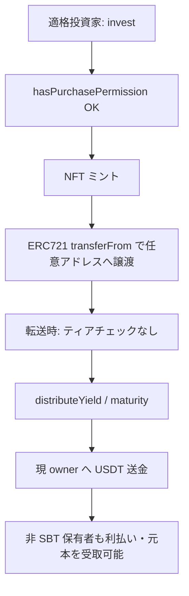

# F-2026-17023: NFT の無制限な譲渡により階層型アクセス制御が迂回される

| 項目 | 内容 |
|------|------|
| コード | F-2026-17023 |
| 種別 | Vulnerability |
| 深刻度 | Medium（衝突率 3/5、尤度比 3/5） |
| 対象 | `InvestmentNFT.sol`, `PurchasePermissionLib.sol`, `Invest.sol`, `MintNFT.sol`, `DistributeYield.sol`, `Maturity.sol` |
| 状態 | **対応不要（設計受容 / Option C）** |

---

## 1. 概要

監査では、商品の `requiredTier` による参加資格チェックが **購入時（`invest` / `mintNFT`）のみ** である一方、`InvestmentNFT` は標準 ERC721 として **転送制限なし** であり、分配・満期時は **その時点の NFT 保有者** に USDT が送金されるため、適格投資家が購入後に NFT を非適格アドレスへ譲渡すると、後続の利払い・元本返還を非 SBT 保有者が受け取り得る、と指摘されている。

本プロジェクトではこれを **実装不具合ではなく意図した設計** とみなし、オンチェーンでの転送制限・分配時再検証は行わない（監査推奨の Option C: 設計受容と文書化）。

---

## 2. 現状の実装

### 2.1 購入資格（ティアゲート）

`Invest` および `MintNFT` は `PurchasePermissionLib.hasPurchasePermission` を呼び、不適格なら `NotEligible(requiredTier)` で revert する。

```solidity
// Invest.sol（抜粋）
if (!PurchasePermissionLib.hasPurchasePermission(msg.sender, product.requiredTier)) {
    revert IInvestmentErrors.NotEligible(product.requiredTier);
}
```

| `requiredTier` | 意味 |
|----------------|------|
| `0` | NONE — SBT チェックなし |
| `1+` | TierRegistry に登録された会員 SBT（ERC721 / ERC1155）の保有が必要 |

- 会員 **SBT** は購入資格・会員表示用（Soulbound 想定はオフチェーン / 外部コントラクト側）。
- **InvestmentNFT** は商品への出資単位であり、会員 SBT とは別トークン。

### 2.2 InvestmentNFT（譲渡可能）

`InvestmentNFT` は OpenZpelin `ERC721` をそのまま継承し、`_update` のオーバーライドによる転送制限はない。

```solidity
contract InvestmentNFT is IInvestmentNFT, ERC721, Ownable {
    // No _update override, no transfer restriction
}
```

単体テストでも `safeTransferFrom` による譲渡成功が期待されている（`testTransferToken_success` 等）。

### 2.3 分配・満期（保有者への Push 送金）

`distributeYield` / `maturity` は `getNFTInfos` で取得した **当該 tokenId の `owner`** に USDT を送金する。`hasPurchasePermission` の再呼び出しはない。

```solidity
// DistributeYield.sol（抜粋）
usdt.safeTransfer(nftInfos[i].owner, individualPeriodYield);

// Maturity.sol（抜粋）
usdt.safeTransfer(nftInfos[i].owner, nftInfos[i].investmentAmount);
```

---

## 3. 指摘のメカニズム



### 3.1 監査 PoC の要点

1. `requiredTier` 付き商品を登録（例: BRONZE = 1）。
2. 非適格アドレスが直接 `invest` → `NotEligible` で失敗。
3. 適格投資家が `invest` し NFT を取得。
4. 適格投資家が NFT を非適格アドレスへ `transferFrom`（成功）。
5. `distributeYield` / `maturity` 実行後、非適格アドレスの USDT 残高が増加。

PoC: `test/PoC_TierBypassViaTransfer.t.sol`（監査提出物、現行コードで pass）

### 3.2 オンチェーン上の是正手段

- 個別アドレスの権利剥奪・凍結・分配除外用の管理関数は **存在しない**。
- 挙動変更には Dictionary 経由の **プロキシアップグレード**（マルチシグ）が必要で、全商品実装に影響する。

---

## 4. 影響

| 観点 | 内容 |
|------|------|
| コンプライアンス | 購入時 KYC/ティア要件を **保有・受取時まで** オンチェーンで強制したい規制モデルとは不一致 |
| セキュリティ（伝統的） | 「アクセス制御の迂回」として Medium 評価され得る |
| 本プロジェクトの意図 | NFT = **譲渡可能な経済権利のバーナー証券**、SBT = **初回申込資格のゲート** |
| 二次流通 | 適格投資家による購入後の OTC / ウォレット間譲渡を許容する設計 |

Tier4（`requiredTier = 4`）商品であっても構造は同一である。初回購入のハードルが高いだけで、**譲渡後の受取主体は「現 NFT owner」** というルールは変わらない。

---

## 5. 監査推奨との対応

### 5.1 監査が提示した選択肢

| オプション | 内容 | 本プロジェクト |
|------------|------|----------------|
| **A** | InvestmentNFT をソウルバウンド化（ミント/バーン以外の転送禁止） | 採用しない |
| **B** | 転送時に `hasPurchasePermission(to, requiredTier)` を再検証 | 採用しない |
| **C** | 二次流通を想定し、ティアゲートが購入時のみであることを文書化 | **採用（本ドキュメント）** |

### 5.2 設計受容の理由

1. **トークン役割の分離**  
   - 会員 SBT: 誰が **申込できるか**（購入資格）。  
   - InvestmentNFT: 誰が **利払い・元本を受け取るか**（出資ポジションの保有者）。

2. **譲渡可能 NFT としての経済実態**  
   ポジションの売買・相続・ウォレット移行等を ERC721 標準の転送で表現する。分配・満期は `ownerOf(tokenId)` に送金するのが自然な bearer モデル。

3. **既存テスト・ドキュメントとの整合**  
   - `InvestmentNFT.sol` 内テストで譲渡成功を検証。  
   - `docs/frontend/ai-frontend-development-guide.md` で InvestmentNFT と会員 SBT を区別し、購入資格は `invest` 前のチェックとして記載（分配時の再検証は記載なし）。

4. **コード変更コストと副作用**  
   - Option A: 二次流通・ウォレット移行が不能。  
   - Option B: 受取人が SBT を失効した場合に NFT が動かせなくなる等、運用・UX への影響大。  
   - いずれも現行ビジネス要件と合致しない。

### 5.3 残存リスクとオフチェーンでの位置づけ

オンチェーンでは「購入時適格・保有時は bearer」のため、次は **スマートコントラクト単体では防止できない**。

- 非適格者への意図的なポジション譲渡  
- 制裁リスト・退会会員への経済的利益の移転  

**補完（任意・運用・法務）:**

- 利用規約で「出資 NFT の譲渡は譲渡人・譲受人の適格性を各自が確保する」旨を明記  
- オフチェーン KYC / 制裁スクリーニング（入金・出金・サポート窓口）  
- 必要に応じたマーケットプレイス側の取引ルール  

規制上 **保有者の継続適格をオンチェーンで強制する** 要件が将来発生した場合は、Option B の導入または商品別のソウルバウンド化を **別チケット** で検討する。

---

## 6. 対応方針（確定）

| 項目 | 方針 |
|------|------|
| コントラクト修正 | **行わない** |
| 監査への回答 | 意図した設計（Option C）。本ドキュメントおよび既存フロント開発ガイドを根拠とする |
| 仕様の明文化 | 本ファイル + 必要なら利用規約・リスク開示への追記 |
| 再評価トリガー | 規制要件変更、全商品の譲渡禁止方針、マーケットプレイスでの KYC 連動譲渡のオンチェーン化 |

### 6.1 監査返答案（ドラフト）

> F-2026-17023 について、当該挙動は実装漏れではなく設計どおりである。  
> `requiredTier` および `PurchasePermissionLib` は、投資申込（`invest`）および管理者ミント（`mintNFT`）における **参加資格の事前ゲート** を目的とする。  
> InvestmentNFT は出資ポジションを表す譲渡可能な ERC721 であり、利払い分配（`distributeYield`）および満期返還（`maturity`）は ERC721 の標準的な bearer モデルに従い、実行時点の `ownerOf(tokenId)` へ送金する。  
> したがって、適格投資家が購入した NFT を第三者へ譲渡した場合、譲受人が当該ポジションの経済的利益を受け取ることは仕様である。会員 SBT（Soulbound 想定）と InvestmentNFT の責務は分離している。  
> コンプライアンス上の継続適格要件は、利用規約およびオフチェーン手続きで補完する。オンチェーンでの転送制限（Option A）および転送時ティア再検証（Option B）は現行ビジネス要件では採用しない。

---

## 7. 代替案の比較（参考）

| 方式 | メリット | デメリット | 採用 |
|------|----------|------------|------|
| **C. 設計受容 + 文書化** | 二次流通・標準 ERC721 互換、実装単純 | オンチェーンでは購入後の適格性を強制しない | **採用** |
| A. ソウルバウンド NFT | 購入後のティア迂回を原理的に防止 | 譲渡・ウォレット移行不可 | 不採用 |
| B. 転送時 `hasPurchasePermission` | 受取人のティアをオンチェーンで強制 | SBT 失効時に NFT がロックされ得る、実装・ガス増 | 不採用 |
| Dictionary アップグレードのみ | 柔軟 | 全商品に影響、個別アドレス除外は不可 | 現状不要 |

---

## 8. タスクチェックリスト

### 8.1 コントラクト

- [x] 修正不要（設計受容）

### 8.2 ドキュメント・監査

- [x] 本ファイル（`docs/fix/F-2026-17023-nft-transfer-tier-bypass.md`）の作成
- [ ] 監査報告書への正式回答（上記ドラフトをベースに提出）
- [ ] 必要に応じて利用規約・投資家向けリスク開示への 1 文追記
- [ ] フロント開発ガイド §11 に「購入資格は申込時のみ。NFT 譲渡後の受取人適格はオンチェーンでは検証しない」注記（任意）

### 8.3 テスト

- [ ] 監査 PoC は **現行仕様のデモ** として維持可（修正後 pass の要件はない）
- [ ] シナリオテストで「譲渡後も owner が分配を受け取る」ことを仕様として明示するテスト追加は任意

---

## 9. 参考リンク

| リソース | パス |
|----------|------|
| 購入資格ライブラリ | `src/investment/utils/PurchasePermissionLib.sol` |
| 投資 | `src/investment/functions/Invest.sol` |
| 管理者ミント | `src/investment/functions/onlyMinters/MintNFT.sol` |
| NFT | `src/periphery/InvestmentNFT.sol` |
| 利払い分配 | `src/investment/functions/onlyWhiteLists/DistributeYield.sol` |
| 満期 | `src/investment/functions/onlyWhiteLists/Maturity.sol` |
| フロント設計（トークン区別） | `docs/frontend/ai-frontend-development-guide.md` §2.3, §11 |
| 監査 PoC | `test/PoC_TierBypassViaTransfer.t.sol`（想定） |
| 関連（別指摘） | `docs/fix/F-2026-16871-push-payment-blacklist.md` |

---

## 10. 変更履歴

| 日付 | 内容 |
|------|------|
| 2026-05-21 | 初版作成（監査指摘 F-2026-17023 の整理・設計受容方針） |
