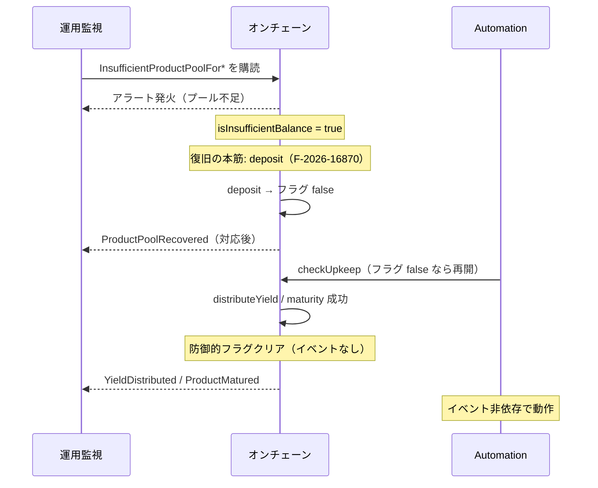

# F-2026-17027: 状態変更関数のイベント欠落によりオフチェーン観測性が低下する

| 項目 | 内容 |
|------|------|
| コード | F-2026-17027 |
| 種別 | Vulnerability |
| 深刻度 | Info（Impact 1/5, Likelihood 4/5） |
| 対象 | `DistributeYield.sol`, `Maturity.sol`, `Deposit.sol`, `IInvestmentEvents.sol`, `InvestmentNFT.sol`, `RegisterProduct.sol` |
| 状態 | **対応済**（2026-05-29 実装完了） |

---

## 1. 概要

プロトコル内の複数の状態変更パスが、永続ストレージを更新しているにもかかわらず、その変更を十分に捉えるイベントを発行していない。オンチェーンのミューテーションとイベントログの対称性が崩れ、オフチェーンのコンシューマ・監視システム・インデクサ・Automation keeper が依存するログベースの状態再構築・アラートが不完全になる。

本件は **直接のセキュリティ脆弱性（資金窃取等）ではない**。状態は view 関数で読み取れるためプロトコルは動作する。一方で運用上の整合性（operational integrity）が低下し、特に次の 3 点が指摘されている。

| # | 指摘 | 影響の要約 |
|---|------|------------|
| 1 | `isInsufficientBalance` の **クリア** にイベントがない | 不足検知アラートの「復旧」確認にポーリングが必要（**対応後: `deposit` 時のみ `ProductPoolRecovered` を emit**） |
| 2 | `InvestmentNFT.setURI` が `baseTokenURI` 更新時にイベントを出さない | メタデータ変更のログ追跡不可 |
| 3 | `ProductRegistered` に `requiredTier` / `isMonthEnd` が含まれない | イベントのみから商品設定を完全再構築できない |

関連: F-2026-16870 により `deposit` は `isInsufficientBalance` をクリアするようになったが、**クリア時のイベントは依然として未実装**（本指摘の範囲に含める）。

---

## 2. 現状の実装

### 2.1 `isInsufficientBalance` — SET 時はイベントあり、CLEAR 時はサイレント

**フラグ SET（イベントあり）**

```solidity
// DistributeYield.sol L100-105
if (periodYield + periodToleranceRemainder - product.distributedYieldPerCount > product.productPool) {
    product.isInsufficientBalance = true;
    emit IInvestmentEvents.InsufficientProductPoolForDistribution(productId);
    return;
}

// Maturity.sol L57-62
if (product.raisedAmount - product.totalReturnedAmount > product.productPool) {
    product.isInsufficientBalance = true;
    emit IInvestmentEvents.InsufficientProductPoolForMaturity(productId);
    return;
}
```

**フラグ CLEAR（イベントなし）**

| ファイル | 行付近 | トリガー |
|----------|--------|----------|
| `DistributeYield.sol` | L157-158 | 分配処理が正常完了 |
| `DistributeYield.sol` | L70 | `raisedAmount == 0` の早期 return（`YieldDistributed` は emit） |
| `Maturity.sol` | L122-124 | 満期処理が正常完了 |
| `Maturity.sol` | L52 | `raisedAmount == 0` の早期 return（`ProductMatured` は emit） |
| `Deposit.sol` | L51-52 | 管理者 `deposit`（F-2026-16870 対応済） |

```solidity
// DistributeYield.sol（正常完了時）
product.productPool -= _distributedYield;
product.isInsufficientBalance = false;

// Maturity.sol（正常完了時）
product.productPool -= _returnedAmount;
product.isInsufficientBalance = false;

// Deposit.sol
product.productPool += depositAmount;
product.isInsufficientBalance = false;
```

**Automation への影響**: `Automation.sol` の `checkUpkeep` はストレージ上の `isInsufficientBalance` を参照するため、**オンチェーン自動化のロジック自体はイベントに依存しない**。影響は監視・アラート・インデクサに限定される。

### 2.2 `InvestmentNFT.setURI` — メタデータ URI 更新がサイレント

```solidity
// InvestmentNFT.sol L77-95
function setURI(string memory newBaseTokenURI) external {
    // admin チェック ...
    baseTokenURI = newBaseTokenURI;
}
```

`baseTokenURI` はコレクション内の全 NFT の `tokenURI` に影響する。`Investment.scenario5.t.sol` では `tokenURI` の変化のみ検証しており、イベントは検証していない。

### 2.3 `ProductRegistered` — ストレージに書くがイベントに載せないフィールド

**ストレージへの書き込み**（`RegisterProduct.sol`）:

```solidity
bool isMonthEnd = DistributionDateLib.isMonthEndDate(args.distributionStartDate);
// ...
Schema.Product memory product = Schema.Product({
    // ...
    requiredTier: args.requiredTier,
    isMonthEnd: isMonthEnd
});
```

**イベント定義**（`IInvestmentEvents.sol`）— 11 パラメータ、`requiredTier` / `isMonthEnd` なし:

```solidity
event ProductRegistered(
    uint256 indexed productId,
    uint256 offeringAmount,
    uint256 minInvestment,
    uint256 offeringEndDate,
    uint256 maturityDate,
    uint256 expectedYield,
    uint256 operationStartDate,
    uint256 distributionStartDate,
    uint256 totalDistributionCount,
    uint256 distributionInterval,
    address nftContractAddress
);
```

| フィールド | ソース | イベント上の欠落の意味 |
|------------|--------|------------------------|
| `requiredTier` | `RegisterProductArgs.requiredTier` | ティアゲート設定をログだけから復元不可 |
| `isMonthEnd` | `distributionStartDate` から導出 | 月末ベースの分配スケジュール種別をログだけから復元不可 |

### 2.4 `ProductRequiredTierUpdated`（F-2026-16955 追補・本チケット対象外）

登録後に `requiredTier` を変更する `SetTier.setProductRequiredTier` では、変更時のみ `ProductRequiredTierUpdated(productId, previousRequiredTier, newRequiredTier)` を emit する。同一値の更新は early return でイベントなし。

| 観点 | 内容 |
|------|------|
| 目的 | 誤設定リカバリのオフチェーン開示・インデクサ追跡 |
| 登録時 | 引き続き `ProductRegistered` の `requiredTier` を参照 |
| 関連 | `docs/audit/fix/F-2026-16955-missing-tier-registry-validation-register-product.md` §11、`docs/design/sequence/Sequence-SetProductRequiredTier.md` |

---

## 3. 問題のメカニズム（監視・アラート視点）



監視が `InsufficientProductPoolFor*` を購読している場合、**復旧の意味論上は `deposit` 時の `ProductPoolRecovered` でアラート解消を追う**。分配・満期成功は `YieldDistributed` / `ProductMatured` で処理完了を示し、フラグは防御的にサイレントクリアする（§6.1 参照）。

分配期間中に `productPool` を増やせる本番経路は **`deposit` のみ**（`invest` は `offeringEndDate` 前のみ、`mintNFT` は `productPool` を増やさない）。そのため Automation 再開の典型フローは **deposit → フラグクリア → checkUpkeep 再開** である。

---

## 4. 影響

| 観点 | 内容 |
|------|------|
| セキュリティ | 資金喪失・権限昇格なし（Info） |
| 可用性（オンチェーン） | なし（view / ストレージで状態は取得可能） |
| 運用・監視 | アラートの解消確認にポーリングが必要、復旧検知に遅延 |
| インデクサ / ダッシュボード | 商品レジストリ・メタデータ履歴がイベントだけでは不完全 |
| マーケットプレイス連携 | `setURI` 変更をログで追えない |
| ABI 互換 | `ProductRegistered` 変更は **イベントシグネチャ（topic0）が変わる** — 既存インデクサ要対応 |

---

## 5. 監査推奨（原文要約）

1. **`ProductPoolRecovered`** を定義し、`DistributeYield` / `Maturity` でフラグリセット時に emit
2. **`BaseTokenURIUpdated`** を `InvestmentNFT` に定義し、`setURI` 後に emit
3. **`ProductRegistered`** に `requiredTier` と `isMonthEnd` を追加し、emit 引数にも含める

**本リポジトリでの差分**: (1) の emit 箇所は **`deposit` のみ** とし、distribute/maturity では防御的サイレントクリアのみ（§6.1.3）。監査返答は §10 ドラフト参照。

---

## 6. 対応方針（確定）

監査推奨の **イベント追加・`ProductRegistered` 拡張は採用** する。  
`ProductPoolRecovered` の **emit 箇所のみ監査原文と異なる** — 運用意味論に合わせ **`deposit` のみ emit**、`distributeYield` / `maturity` は **防御的フラグクリアのみ（イベントなし）** とする（§6.1）。

### 6.1 指摘 1: `ProductPoolRecovered` とフラグクリアの役割分担

#### 6.1.1 イベント定義（`IInvestmentEvents.sol`）

```solidity
/// @notice Emitted when admin deposit clears the insufficient-balance stall (operational recovery)
/// @param productId ID of the product
event ProductPoolRecovered(uint256 indexed productId);
```

#### 6.1.2 `deposit` — クリア + emit（運用上の復旧シグナル）

F-2026-16870 で導入済みの無条件クリアを、条件付き emit に置き換える。

```solidity
product.productPool += depositAmount;

if (product.isInsufficientBalance) {
    product.isInsufficientBalance = false;
    emit IInvestmentEvents.ProductPoolRecovered(productId);
}
```

| 観点 | 内容 |
|------|------|
| emit 条件 | フラグが `true` → `false` に遷移したときのみ |
| 意味 | **管理者による資金補充（復旧操作）** — Automation 再開の前提 |
| 注意 | F-16870 どおり `deposit` はプール残高に関わらずフラグを下ろす。イベントは「プールが十分になった」ではなく **「不足ストールに対する復旧操作が行われた」** を示す。足りなければ次の `distributeYield` / `maturity` で再び `Insufficient*` が emit される |

#### 6.1.3 `distributeYield` / `maturity` — 防御的クリアのみ（イベントなし）

監査は成功パスでの emit を推奨しているが、本リポジトリでは **採用しない**。理由:

1. 不足解消の本筋は `deposit` であり、16870 後の正常フローでは **deposit 時点で既にフラグが false** になっている（成功時の emit は冗長・二重）
2. 監視上の対称性は **`Insufficient*` ↔ `ProductPoolRecovered`（deposit）** で足りる。処理完了は **`YieldDistributed` / `ProductMatured`** で追う
3. 末尾の **無条件** `= false` は不要な SSTORE になるため、`true` のときだけクリアする

```solidity
// DistributeYield.sol（正常完了時・L157-158 付近）
product.productPool -= _distributedYield;
if (product.isInsufficientBalance) {
    product.isInsufficientBalance = false;
}

// Maturity.sol（正常完了時・L122-124 付近）
product.totalReturnedAmount += _returnedAmount;
product.productPool -= _returnedAmount;
if (product.isInsufficientBalance) {
    product.isInsufficientBalance = false;
}
```

防御的クリアを残す理由: 手動 `distributeYield` / `maturity` 等の稀な経路でフラグが残り続けるのを防ぐ（多層防御）。**イベントは出さない**。

`raisedAmount == 0` の早期 return（`DistributeYield` L70、`Maturity` L52）も同様に、フラグが `true` のときのみサイレントクリア。通常はもともと `false` のため no-op。

#### 6.1.4 対象ファイル（本番）まとめ

| ファイル | フラグクリア | `ProductPoolRecovered` |
|----------|-------------|------------------------|
| `Deposit.sol` | `true` → `false` のとき | **emit** |
| `DistributeYield.sol` | `true` → `false` のとき（防御的） | emit しない |
| `Maturity.sol` | `true` → `false` のとき（防御的） | emit しない |

### 6.2 指摘 2: `BaseTokenURIUpdated`（`InvestmentNFT.sol`）

監査案どおり NFT コントラクト内に定義（`IInvestmentEvents` には載せない）。

```solidity
event BaseTokenURIUpdated(string newBaseTokenURI);

// setURI 末尾
baseTokenURI = newBaseTokenURI;
emit BaseTokenURIUpdated(newBaseTokenURI);
```

任意拡張（本チケットでは必須としない）: `address indexed admin` を追加して操作者をログに残す。

### 6.3 指摘 3: `ProductRegistered` の拡張

**イベント定義**（末尾にパラメータ追加）:

```solidity
event ProductRegistered(
    uint256 indexed productId,
    // ... 既存 10 フィールド ...
    address nftContractAddress,
    uint8 requiredTier,
    bool isMonthEnd
);
```

**本番 emit**: `RegisterProduct.sol` の `registerProduct` 内 emit 1 箇所に `args.requiredTier`, `isMonthEnd` を追加。

**インデクサ / ABI 注意**:

- Solidity ではパラメータ追加により **event の topic0（シグネチャ）が変わる**
- デプロイ済みチェーン上の過去 `ProductRegistered` ログには新フィールドが存在しない
- オフチェーンは「旧シグネチャ + 新シグネチャ」のデコード対応、または再インデックスが必要
- `isMonthEnd` はオンチェーンで `distributionStartDate` から再計算可能だが、イベントに含めることでインデクサの再計算ロジック重複を避ける

---

## 7. 代替案の比較

| 方式 | メリット | デメリット | 採用 |
|------|----------|------------|------|
| **A. `ProductPoolRecovered` を `deposit` のみ emit** | 運用意味が明確、二重イベントなし、監視ペアが整理される | 監査原文（distribute/maturity emit）と異なる | **採用** |
| B. 監査推奨どおり distribute/maturity でも emit | 監査文案と一致 | deposit 後の成功分配で冗長、イベント意味が「入金」と「決済完了」で混在 | 不採用 |
| C. 毎回のフラグクリアで無条件 emit | 実装単純 | フラグ false の通常分配でもノイズ | 不採用 |
| D. distribute/maturity のクリア自体を削除 | 単一責任（deposit のみ） | 手動決済等の稀経路でフラグ残留リスク | 不採用（防御的クリアは残す） |
| E. `ProductRegistered` を新イベント名で追加 | 旧インデクサと共存しやすい | イベント名が増え、ドキュメント複雑化 | 不採用（既存イベント拡張を採用） |
| F. 対応不要（ポーリングのみ） | コード変更なし | 監査指摘未解消、運用負荷継続 | 不採用 |

---

## 8. 修正内容（実装スケッチ）

### 8.1 `IInvestmentEvents.sol`

- `ProductPoolRecovered(uint256 indexed productId)` を Product Events セクションに追加
- `ProductRegistered` に `uint8 requiredTier`, `bool isMonthEnd` を追加（NatSpec 更新）

### 8.2 `Deposit.sol`

- 無条件 `product.isInsufficientBalance = false` を §6.1.2 の条件付きクリア + `ProductPoolRecovered` emit に置換

### 8.3 `DistributeYield.sol` / `Maturity.sol`

- 無条件 `= false` を §6.1.3 の **条件付きサイレントクリア** に置換（**emit なし**）

### 8.4 `InvestmentNFT.sol`

- `BaseTokenURIUpdated` 定義 + `setURI` で emit

### 8.5 `RegisterProduct.sol`

- 本番 `emit ProductRegistered(...)` に `args.requiredTier`, `isMonthEnd` を追加

### 8.6 変更対象ファイル一覧

| 優先度 | ファイル | 修正内容 |
|--------|----------|----------|
| 必須 | `src/investment/interfaces/IInvestmentEvents.sol` | イベント定義追加・拡張 |
| 必須 | `src/investment/functions/onlyWhiteLists/Deposit.sol` | 条件付きクリア + `ProductPoolRecovered` emit |
| 必須 | `src/investment/functions/onlyWhiteLists/DistributeYield.sol` | 条件付きサイレントクリア（emit なし） |
| 必須 | `src/investment/functions/onlyWhiteLists/Maturity.sol` | 同上 |
| 必須 | `src/periphery/InvestmentNFT.sol` | `BaseTokenURIUpdated` + emit |
| 必須 | `src/investment/functions/onlyWhiteLists/RegisterProduct.sol` | `ProductRegistered` 引数拡張 |
| 必須 | テスト（下記 §9） | `vm.expectEmit` 更新・新規検証 |
| 推奨 | `docs/design/sequence/*.md` | シーケンス図・イベント一覧の追記 |

---

## 9. テスト計画

### 9.1 新規・更新テスト

| テスト | 内容 |
|--------|------|
| `test/fix/F-2026-17027_ProductPoolRecovered.t.sol`（新規推奨） | 不足イベント後、`deposit` で `ProductPoolRecovered` が 1 回 emit されること |
| 同上 | 成功 `distributeYield` / `maturity` では `ProductPoolRecovered` が **出ない** こと |
| 同上 | フラグがもともと `false` の `deposit` では `ProductPoolRecovered` が **出ない** こと |
| `F-2026-16870_DepositClearsFlag.t.sol` | deposit 後フラグクリアの回帰（必要なら `expectEmit` 追加） |
| `DistributeYieldTest` / `MaturityTest` | 防御的クリアの回帰（`ProductPoolRecovered` の expectEmit は **追加しない**） |
| `InvestmentNFT` テスト | `setURI` 後に `BaseTokenURIUpdated` |
| `RegisterProductTest` | `ProductRegistered` の新引数を `expectEmit` で検証 |
| `Investment.scenario3.t.sol` 等 | `InsufficientProductPool*` を購読しているシナリオがあれば回帰 |

### 9.2 回帰コマンド

```bash
forge test --match-contract DistributeYieldTest -vv
forge test --match-contract MaturityTest -vv
forge test --match-contract DepositTest -vv
forge test --match-contract RegisterProductTest -vv
forge test --match-path "test/fix/F-2026-17027*" -vv
forge test
```

---

## 10. 監査返答案（ドラフト）

> F-2026-17027 について、指摘のとおりオフチェーン観測性を高めるため、以下のイベント追加・拡張を実施する。  
> (1) `ProductPoolRecovered` を `IInvestmentEvents` に定義し、**管理者による資金補充（`deposit`）で `isInsufficientBalance` が `true` から `false` に遷移したときのみ** emit する。分配・満期成功時は防御的にフラグのみサイレントクリアし、処理完了は既存の `YieldDistributed` / `ProductMatured` で示す（監査文案の distribute/maturity emit は、運用意味論および 16870 後のフローに合わせ deposit 限定とする）。  
> (2) `InvestmentNFT.setURI` 実行後に `BaseTokenURIUpdated` を emit する。  
> (3) `ProductRegistered` に `requiredTier` および `isMonthEnd` を追加し、商品登録時のストレージ内容とイベントログの対称性を確保する。  
> 本件は Severity Info のとおり直接のセキュリティ影響はなく、監視・インデクサ・運用アラートの完全性向上が目的である。`ProductRegistered` のシグネチャ変更に伴い、オフチェーンは新旧イベントのデコード対応または再インデックスを行う。

---

## 11. 実装タスクチェックリスト

### 11.1 コントラクト

- [x] `IInvestmentEvents.sol` — `ProductPoolRecovered` 追加、`ProductRegistered` 拡張
- [x] `Deposit.sol` — 条件付きクリア + `ProductPoolRecovered` emit
- [x] `DistributeYield.sol` — 条件付きサイレントクリア（emit なし）
- [x] `Maturity.sol` — 同上
- [x] `InvestmentNFT.sol` — `BaseTokenURIUpdated` + `setURI` emit
- [x] `RegisterProduct.sol` — `ProductRegistered` emit 引数更新

### 11.2 テスト

- [x] `test/fix/F-2026-17027_*.t.sol` 新規（推奨）
- [x] 既存テストの `expectEmit` / シナリオテスト更新
- [x] `forge test` 全体 Green

### 11.3 ドキュメント

- [x] 本ファイルのステータスを **対応済** に更新
- [x] `docs/design/sequence/Sequence-DistributeYield.md` — 防御的サイレントクリア（イベントなし）を明記
- [x] `docs/design/sequence/Sequence-Maturity.md` — 同上
- [x] `docs/design/sequence/Sequence-Deposit.md` — `ProductPoolRecovered` 追記
- [x] `docs/design/sequence/Sequence-RegisterProduct.md` — `ProductRegistered` 引数更新
- [x] `docs/design/sequence/Sequence-SetProductRequiredTier.md` — F-2026-16955 追補（`ProductRequiredTierUpdated`）
- [ ] フロント / インデクサ向けイベント仕様（別リポジトリがあれば連携）

---

## 12. 実装メモ

- **`ProductPoolRecovered` と F-2026-16870 の関係**: 16870 はフラグの **クリア動作** を deposit に追加した。17027 はその **ログ可視化** を `deposit` 経路に限定して補完する。
- **16870 からの deposit 変更**: 現状は `product.isInsufficientBalance = false` を無条件実行。17027 実装時は **条件付きクリア + 条件付き emit** に置き換える（既に `false` なら SSTORE も emit もスキップ）。
- **distribute / maturity**: F-16870 以前から末尾で無条件クリアしていた名残。17027 では **条件付きサイレントクリア** に整理し、イベントは出さない。
- **監視ペア**: `InsufficientProductPoolForDistribution` / `InsufficientProductPoolForMaturity` ↔ `ProductPoolRecovered`（deposit）。決済完了は `YieldDistributed` / `ProductMatured`。
- **`raisedAmount == 0` パス**: フラグが `true` のときのみサイレントクリア。通常は no-op。
- **ガス**: 条件付きクリア / emit は `SLOAD` + 分岐。無条件 SSTORE より効率的。
- **`setURI` の `string` イベント**: indexed にできないため non-indexed。監査例と同様で可。

---

## 13. 参考リンク

| リソース | パス |
|----------|------|
| イベント定義 | `src/investment/interfaces/IInvestmentEvents.sol` |
| 利払い分配 | `src/investment/functions/onlyWhiteLists/DistributeYield.sol` |
| 満期 | `src/investment/functions/onlyWhiteLists/Maturity.sol` |
| 入金 | `src/investment/functions/onlyWhiteLists/Deposit.sol` |
| NFT URI | `src/periphery/InvestmentNFT.sol` |
| 商品登録 | `src/investment/functions/onlyWhiteLists/RegisterProduct.sol` |
| Product スキーマ | `src/investment/storage/Schema.sol` |
| Automation | `src/periphery/Automation.sol` |
| 関連（フラグクリア動作） | `docs/audit/fix/F-2026-16870-deposit-insufficient-balance-flag.md` |
| シーケンス（分配） | `docs/design/sequence/Sequence-DistributeYield.md` |
| シーケンス（満期） | `docs/design/sequence/Sequence-Maturity.md` |
| シーケンス（入金） | `docs/design/sequence/Sequence-Deposit.md` |
| シーケンス（登録） | `docs/design/sequence/Sequence-RegisterProduct.md` |
| シーケンス（requiredTier 更新） | `docs/design/sequence/Sequence-SetProductRequiredTier.md` |
| 関連（Tier 追補） | `docs/audit/fix/F-2026-16955-missing-tier-registry-validation-register-product.md` |

---

## 14. 変更履歴

| 日付 | 内容 |
|------|------|
| 2026-05-29 | 初版作成（監査指摘 F-2026-17027 の整理・対応方針。Ask モードでのコード照合結果を反映） |
| 2026-05-29 | §6.1 更新: `ProductPoolRecovered` は `deposit` のみ emit。distribute/maturity は防御的サイレントクリアのみ |
| 2026-05-29 | 実装完了: イベント追加・テスト `test/fix/F-2026-17027_ProductPoolRecovered.t.sol`、シーケンス図更新 |
| 2026-05-29 | ドキュメント追記: F-2026-16955 追補 `ProductRequiredTierUpdated` / `Sequence-SetProductRequiredTier.md`（§2.4） |
