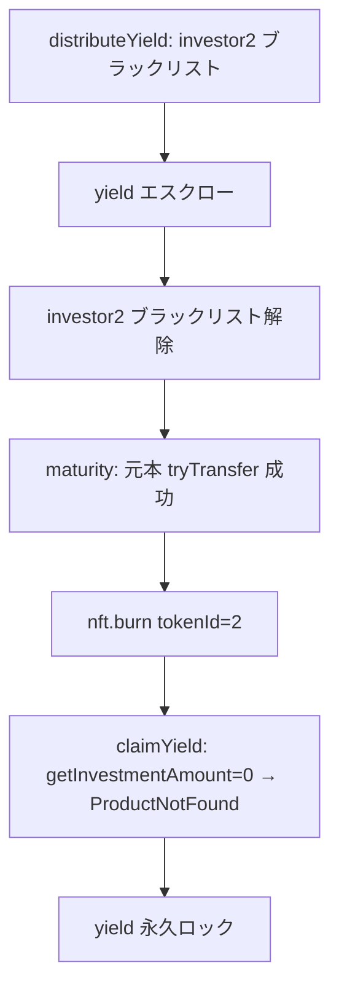
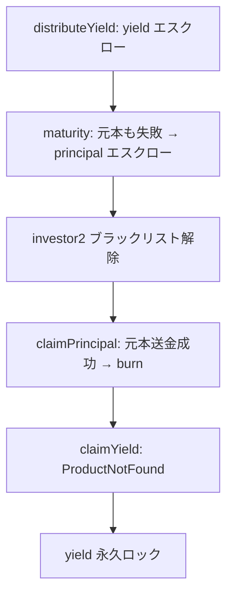
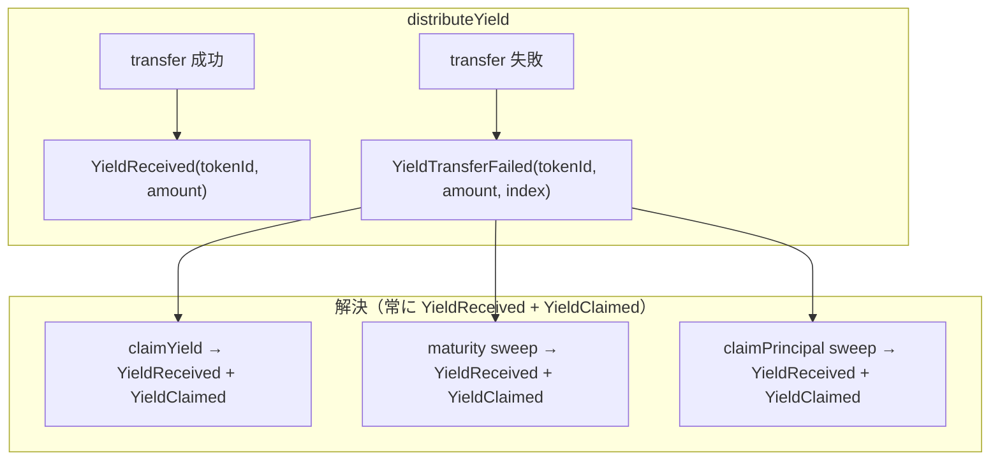

# F-2026-17209: NFT Burn 後にエスクロー済み Yield が永久ロックされる

| 項目 | 内容 |
|------|------|
| コード | F-2026-17209 |
| 種別 | Vulnerability |
| 深刻度 | Medium（Impact 4/5, Likelihood 2/5） |
| 対象 | `Maturity.sol`, `Claim.sol`, `InvestmentNFT.sol` |
| 状態 | **対応予定** |
| 前提 | F-2026-16871 の修正（per-token エスクロー導入）適用済み |

---

## 1. 概要

F-2026-16871 の修正で導入した per-token yield エスクロー（`unclaimedYield[productId][tokenId][distributionIndex]`）に対し、`claimYield` は NFT の存在確認と所有者チェックで認可を行う。

一方、`maturity` の成功ブランチおよび `claimPrincipal` は元本送金成功時に **即座に NFT を burn** する。burn 後は `nft.getInvestmentAmount(tokenId)` が 0 を返し、`ownerOf(tokenId)` は revert するため、`claimYield` は常に `ProductNotFound` で失敗する。

結果として、**yield 分配が失敗してエスクローされたまま、元本が正常に返還された投資家は、エスクロー済み yield を永久に回収できない**。

---

## 2. 影響を受けるフロー

### 2.1 パターン A: maturity 成功ブランチ → yield ロック



### 2.2 パターン B: claimPrincipal → yield ロック



---

## 3. 現状の問題コード

### 3.1 `Maturity.sol` — 成功ブランチで即 burn

```solidity
// Maturity.sol L70-74
if (UsdtTransferLib.tryTransfer(usdt, nftInfos[i].owner, investmentAmount)) {
    nft.burn(nftInfos[i].tokenId);  // ← yield 残があっても即 burn
    _returnedAmount += investmentAmount;
    emit IInvestmentEvents.InvestmentReturned(...);
}
```

### 3.2 `Claim.sol` — claimPrincipal で即 burn

```solidity
// Claim.sol L83-88
if (!UsdtTransferLib.tryTransfer(usdt, msg.sender, amount)) {
    escrow.unclaimedPrincipal[productId][tokenId] = amount;
    revert IInvestmentErrors.ClaimTransferFailed();
}
nft.burn(tokenId);  // ← yield 残があっても即 burn
```

### 3.3 `Claim.sol` — claimYield の NFT 存在チェック

```solidity
// Claim.sol L33-35
if (nft.getInvestmentAmount(tokenId) == 0) {
    revert IInvestmentErrors.ProductNotFound();  // ← burned NFT で常に revert
}
```

---

## 4. 根本原因

| 要因 | 説明 |
|------|------|
| burn のタイミング | 元本返還成功 = 投資完了として即 burn するが、yield エスクロー残の有無を確認していない |
| 認可モデル | `claimYield` が NFT 存在 + ownerOf に依存するため、burn 後は認可不可能 |
| 会計の非対称性 | yield は `distributeYield` 時に `productPool` から減算済み。`withdraw` でも回収できない |

---

## 5. 影響

| 観点 | 内容 |
|------|------|
| 資金ロック | エスクロー済み yield がストレージに残るが、オンチェーンで回収する手段がない |
| 発生条件 | yield 分配失敗（BL/pause/compliance）→ その後の maturity or claimPrincipal が成功 |
| 尤度 | 低〜中（BL 入り自体は稀だが、一度起これば確実にロック） |
| 回収可否 | `productPool` 既減算のため `withdraw` 不可。管理者にも回収パスなし |
| 悪用 | 意図的悪用は不可（自身の yield が失われるだけ）。外部要因（Tether BL 等）による被害 |

---

## 6. 対応方針（採用: A' — sweep + 個別 YieldClaimed emit）

### 6.1 基本戦略

NFT を burn する前に、当該 tokenId の全 unclaimed yield を集計し、元本と合わせて **1 回の tryTransfer** で送金する。

- 送金成功 → yield escrow クリア + burn（通常完了）
- 送金失敗 → 元本もエスクロー（yield もそのまま）、burn しない

これにより「burn 後に yield が取り残される」状態を構造的に排除する。

**イベント設計の要点:** sweep 成功時は、合算イベントではなく **slot ごとに個別の `YieldReceived` + `YieldClaimed` を emit** する。これにより `YieldTransferFailed` と `YieldClaimed` が常に **1:1 対応** となり、フロントエンド / indexer のイベント解釈がシンプルになる。また `YieldReceived` も併せて emit することで、push 成功時（`distributeYield`）と同じ「事実イベント」が発行され、`YieldReceived` だけを監視すれば push/pull 問わず全ての yield 受取を捕捉できる。

### 6.2 選定理由（A' を採用した背景）

検討した 3 案の比較:

| 案 | 概要 | イベント対称性 | ユーザー tx 数 | NFT 中間状態 |
|----|------|--------------|--------------|-------------|
| A（sweep + 合算 emit） | 合算額で 1 イベント | △ 合算で曖昧 | ◎ 0-1 | ○ なし |
| **A'（sweep + 個別 emit）** | slot ごとに `YieldClaimed` | **○ 1:1** | **◎ 0-1** | **○ なし** |
| B（conditional burn） | yield 残なら burn しない | ○ 1:1 | △ N 回 | △ あり |

A' は「イベント対称性」と「ユーザー UX（1 tx で完結）」を両立する。

**indexer のクエリが単純:**

```sql
-- 未解決の yield escrow
SELECT * FROM YieldTransferFailed f
WHERE NOT EXISTS (
  SELECT 1 FROM YieldClaimed c
  WHERE c.productId = f.productId
    AND c.tokenId = f.tokenId
    AND c.distributionIndex = f.distributionIndex
)
```

`YieldTransferFailed` の解決は、経路を問わず **常に `YieldClaimed`** で表現される:
- 投資家が `claimYield` で個別に claim した場合 → `YieldClaimed`
- `maturity` の sweep で自動回収された場合 → `YieldClaimed`（slot ごと）
- `claimPrincipal` の sweep で自動回収された場合 → `YieldClaimed`（slot ごと）

### 6.3 `Maturity.maturity` の修正

```solidity
for (uint256 i = 0; i < nftInfos.length; i++) {
    if (nftInfos[i].owner != address(0)) {
        uint256 investmentAmount = nftInfos[i].investmentAmount;
        uint256 tokenId = nftInfos[i].tokenId;
        address owner = nftInfos[i].owner;

        // 未請求 yield を集計
        uint256 totalUnclaimedYield = 0;
        for (uint256 j = 1; j <= product.distributedCount; j++) {
            totalUnclaimedYield += escrow.unclaimedYield[productId][tokenId][j];
        }

        uint256 totalAmount = investmentAmount + totalUnclaimedYield;

                if (UsdtTransferLib.tryTransfer(usdt, owner, totalAmount)) {
            // yield escrow をクリア + 個別 YieldReceived + YieldClaimed emit
            for (uint256 j = 1; j <= product.distributedCount; j++) {
                uint256 yieldAmount = escrow.unclaimedYield[productId][tokenId][j];
                if (yieldAmount > 0) {
                    escrow.unclaimedYield[productId][tokenId][j] = 0;
                    emit IInvestmentEvents.YieldReceived(productId, tokenId, owner, yieldAmount);
                    emit IInvestmentEvents.YieldClaimed(productId, tokenId, owner, yieldAmount, j);
                }
            }
            nft.burn(tokenId);
            _returnedAmount += investmentAmount;
            emit IInvestmentEvents.InvestmentReturned(productId, tokenId, owner, investmentAmount);
        } else {
            // 全額失敗 → 元本エスクロー、yield もそのまま、burn しない
            if (escrow.unclaimedPrincipal[productId][tokenId] != 0) {
                revert IInvestmentErrors.EscrowAlreadySet();
            }
            escrow.unclaimedPrincipal[productId][tokenId] = investmentAmount;
            _returnedAmount += investmentAmount;
            emit IInvestmentEvents.PrincipalTransferFailed(productId, tokenId, owner, investmentAmount);
        }
    }
    // ... バッチカーソル処理は既存のまま
}
```

**会計の整合性:**

- `totalUnclaimedYield` 分は `distributeYield` 時に既に `productPool` から減算済み
- `_returnedAmount` には `investmentAmount`（元本）のみ加算 → `product.productPool -= _returnedAmount` で元本分のみ減算
- コントラクト USDT 残高 = productPool + エスクロー済み yield + エスクロー済み元本 なので、合算 transfer は残高的に安全

### 6.4 `Claim.claimPrincipal` の修正

```solidity
function claimPrincipal(uint256 productId, uint256 tokenId) external nonReentrant {
    Schema.Product storage product = Storage.ProductsState().products[productId];
    if (product.productId == 0) revert IInvestmentErrors.ProductNotFound();

    IInvestmentNFT nft = IInvestmentNFT(product.nftContract);
    if (nft.getInvestmentAmount(tokenId) == 0) revert IInvestmentErrors.ProductNotFound();
    if (IERC721(product.nftContract).ownerOf(tokenId) != msg.sender) revert IInvestmentErrors.NotNFTOwner();

    Schema.$EscrowState storage escrow = Storage.EscrowState();
    uint256 principalAmount = escrow.unclaimedPrincipal[productId][tokenId];
    if (principalAmount == 0) revert IInvestmentErrors.NothingToClaim();

    // 未請求 yield を集計
    uint256 totalUnclaimedYield = 0;
    for (uint256 j = 1; j <= product.distributedCount; j++) {
        totalUnclaimedYield += escrow.unclaimedYield[productId][tokenId][j];
    }

    uint256 totalAmount = principalAmount + totalUnclaimedYield;

    IERC20 usdt = IERC20(Storage.ConfigState().USDT_ADDRESS);
    if (!UsdtTransferLib.tryTransfer(usdt, msg.sender, totalAmount)) {
        revert IInvestmentErrors.ClaimTransferFailed();
    }

    escrow.unclaimedPrincipal[productId][tokenId] = 0;

    // yield escrow をクリア + 個別 YieldReceived + YieldClaimed emit
    for (uint256 j = 1; j <= product.distributedCount; j++) {
        uint256 yieldAmount = escrow.unclaimedYield[productId][tokenId][j];
        if (yieldAmount > 0) {
            escrow.unclaimedYield[productId][tokenId][j] = 0;
            emit IInvestmentEvents.YieldReceived(productId, tokenId, msg.sender, yieldAmount);
            emit IInvestmentEvents.YieldClaimed(productId, tokenId, msg.sender, yieldAmount, j);
        }
    }

    nft.burn(tokenId);
    emit IInvestmentEvents.InvestmentReturned(productId, tokenId, msg.sender, principalAmount);
    emit IInvestmentEvents.PrincipalClaimed(productId, tokenId, msg.sender, principalAmount);
}
```

### 6.5 `claimYield` の変更

`claimYield` では `YieldClaimed` に加えて `YieldReceived` も emit するよう修正。これにより `distributeYield` の push 成功時と同じ「事実イベント」パターンとなり、`YieldReceived` だけ監視すれば push/pull 問わず全 yield 受取を捕捉できる（`claimPrincipal` が `InvestmentReturned` + `PrincipalClaimed` を emit するのと同じ2層パターン）。

投資家が maturity 前に個別に `claimYield` を呼ぶフローも引き続き有効:

```
claimYield(productId, tokenId, index) → YieldReceived(productId, tokenId, recipient, amount)
                                       → YieldClaimed(productId, tokenId, recipient, amount, index)
```

maturity 時は当該 slot が既にクリア済み（`yieldAmount == 0`）なので emit されず、**重複イベントは発生しない**。

### 6.6 イベントフローまとめ



**フロントエンドの表示ルール:**
- `YieldTransferFailed` emit → 「未受取利益あり」表示
- 同一 `(productId, tokenId, distributionIndex)` に対する `YieldClaimed` emit → 表示解除
- `YieldReceived` だけ監視すれば push/pull 問わず全 yield 受取を集計可能
- 解決の経路（誰が/どの関数が）を区別する必要なし

---

## 7. ガスコストへの影響

| 対象 | 追加コスト | 備考 |
|------|-----------|------|
| `maturity` ループ内 | `SLOAD × distributedCount × nftCount` | `distributedCount` は典型 3〜12。50 NFT バッチで最大 600 SLOAD 追加 |
| `claimPrincipal` | `SLOAD × distributedCount` | 1 トークン分のみ。軽微 |
| yield なしの場合 | 集計ループは `0` を加算するのみ | SSTORE（クリア）は発生しない |

`totalDistributionCount` が極端に大きい商品でない限り（設計上 12 が上限想定）、実用的なガス増は軽微。

---

## 8. イベント設計

### 8.1 既存イベントの再利用（A' の核心）

sweep 時に専用イベント（`YieldSweptOnMaturity` 等）を新設 **しない**。代わりに既存の `YieldClaimed` を slot ごとに emit する。

| シーン | emit されるイベント | 備考 |
|--------|-------------------|------|
| 投資家が `claimYield` で個別 claim | `YieldReceived` + `YieldClaimed(productId, tokenId, recipient, amount, distributionIndex)` | 2層パターン |
| `maturity` sweep で自動回収 | (`YieldReceived` + `YieldClaimed`) × N slot | **同じパターン** |
| `claimPrincipal` sweep で自動回収 | (`YieldReceived` + `YieldClaimed`) × N slot | **同じパターン** |

### 8.2 indexer にとってのメリット

- `YieldTransferFailed` の解決イベントは **常に `YieldReceived` + `YieldClaimed`** のペア
- `(productId, tokenId, distributionIndex)` で 1:1 紐づけ
- `YieldReceived` だけ監視すれば push/pull 問わず全 yield 受取を集計可能（`InvestmentReturned` で元本を集計するのと同じパターン）
- sweep 経路の区別が不要 → indexer のロジックが単純

### 8.3 新規イベントの追加は不要

A' では `YieldSweptOnMaturity` / `YieldSweptOnPrincipalClaim` は **追加しない**。
maturity/claimPrincipal 内で emit される `YieldReceived` + `YieldClaimed` と `InvestmentReturned` / `PrincipalClaimed` が **同一ブロック・同一 tx** に含まれることで、sweep が行われたことは推測可能。

`YieldReceived` は既存イベントを再利用しており、新規イベント定義は不要。

必要に応じて将来追加する余地はあるが、MVP では不要。

---

## 9. テスト計画

### 9.1 回帰テスト（既存 PoC の修正後動作）

| テスト | 修正前 | 修正後の期待 |
|--------|--------|-------------|
| `test_burnedNftLocksEscrowedYield` | pass（yield ロック再現） | maturity 時に yield が sweep され、investor2 に元本+yield が送金される |
| `test_principalClaimBurnsAndLocksYield` | pass（yield ロック再現） | claimPrincipal 時に yield が sweep される |

### 9.2 新規テストケース

| テスト案 | 内容 |
|----------|------|
| `test_maturity_sweepsUnclaimedYield` | yield エスクローあり → maturity 成功で sweep + burn |
| `test_maturity_escrowAll_whenSweepFails` | yield あり + 送金先 BL → 全額エスクロー、burn しない |
| `test_claimPrincipal_sweepsYield` | principal + yield エスクロー → claimPrincipal で一括回収 |
| `test_claimPrincipal_revert_whenSweepFails` | claim 時に BL → 全額ロールバック、エスクロー維持 |
| `test_maturity_noYieldEscrow_normalBurn` | yield エスクローなし → 従来どおり元本のみ送金 + burn |
| `test_maturity_multipleDistributions_sweep` | 複数回分配で部分的にエスクロー → maturity で全 slot sweep |
| `test_claimYield_beforeBurn_stillWorks` | yield あり → claimYield 先行 → claimPrincipal で burn（正常フロー） |

### 9.3 既存テストへの影響

| テスト | 影響 |
|--------|------|
| `MaturityTest.test_maturity_success` | yield エスクローなしの場合 → `totalUnclaimedYield == 0` で従来どおり動作。変更不要 |
| `MaturityTest.test_maturity_escrowOnTransferRevert` | 従来どおり元本エスクロー。変更不要 |
| `ClaimTest.test_claimYield_success_afterEscrow` | burn 前なので問題なし。変更不要 |
| シナリオテスト群 | yield エスクロー未発生なら挙動同一。回帰で Green 確認 |

---

## 10. 代替案の比較

| 方式 | メリット | デメリット | 採否 |
|------|----------|------------|------|
| **A'. burn 前 sweep + 個別 YieldClaimed emit** | 構造的に問題排除。1 tx で原子的。イベント 1:1 対称性 | distributedCount 分のループ + emit 追加 | **採用** |
| A. burn 前 sweep + 合算イベント | 1 tx で原子的 | `YieldTransferFailed` と解決イベントの紐づけが曖昧 | 不採用 |
| B. yield 残あれば burn しない（conditional burn） | 責務分離が明確。イベント 1:1 | ユーザー tx 数増。NFT 中間状態で権利曖昧化 | 不採用 |
| C. claimYield の NFT チェック緩和 | 既存フローへの影響最小 | 認可モデルの弱体化（burn 後は誰が権利者か不明確） | 不採用 |
| D. burn を遅延（全 claim 完了後に別関数で burn） | 確実に全額回収可能 | NFT ライフサイクルが複雑化、maturity 完了判定に影響 | 不採用 |
| E. escrow に owner アドレスを保存 | burn 後でも claim 可能 | ストレージ追加大、既存エスクロー構造の変更 | 不採用 |

---

## 11. 実装タスクチェックリスト

### 11.1 コントラクト

- [ ] `Maturity.sol` — 成功ブランチに yield sweep ロジック追加（§6.3）
- [ ] `Claim.sol` — `claimPrincipal` に yield sweep ロジック追加（§6.4）
- [ ] 既存 `MaturityTest` / `ClaimTest` の回帰確認
- [ ] 新規イベント追加は不要（既存 `YieldClaimed` を再利用）

### 11.2 テスト

- [ ] `test/fix/F202617209POC.t.sol` を修正後の期待結果に更新
- [ ] §9.2 の新規テストケース追加
- [ ] `forge test` 全体 Green

### 11.3 ドキュメント

- [ ] 本ファイルの状態を「対応済」に更新
- [ ] `docs/design/sequence/Sequence-Maturity.md` — sweep フローの追記
- [ ] 監査報告書への正式回答

---

## 12. 参考リンク

| リソース | パス |
|----------|------|
| 満期実装 | `src/investment/functions/onlyWhiteLists/Maturity.sol` |
| Claim 実装 | `src/investment/functions/Claim.sol` |
| エスクロー定義 | `src/investment/storage/Schema.sol` (`$EscrowState`) |
| 前提修正（F-2026-16871） | `docs/audit/fix/F-2026-16871-push-payment-blacklist.md` |
| 監査 PoC | `test/fix/F202617209POC.t.sol` |
| 分配実装 | `src/investment/functions/onlyWhiteLists/DistributeYield.sol` |

---

## 13. 変更履歴

| 日付 | 内容 |
|------|------|
| 2026-05-25 | 初版作成（監査指摘 F-2026-17209 の整理・対応方針策定） |
| 2026-05-25 | A' 案（sweep + 個別 YieldClaimed emit）に方針確定。イベント設計・代替案比較を更新 |
