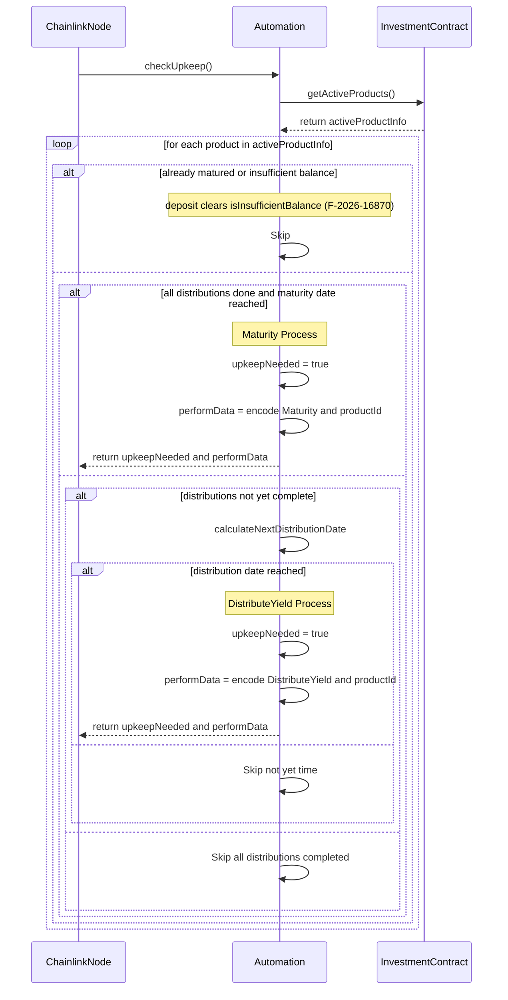
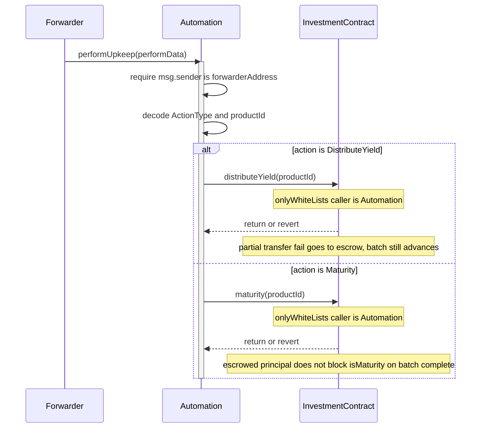

# Automation

## checkUpkeep

```mermaid
sequenceDiagram
    participant ChainlinkNode
    participant ChainlinkAutomation as Automation
    participant InvestmentContract

    ChainlinkNode->>ChainlinkAutomation: checkUpkeep()
    ChainlinkAutomation->>InvestmentContract: getActiveProducts()
    InvestmentContract-->>ChainlinkAutomation: return activeProductInfo
    loop for each product in activeProductInfo
        alt already matured or insufficient balance
            Note over ChainlinkAutomation: deposit clears isInsufficientBalance (F-2026-16870)
            ChainlinkAutomation->>ChainlinkAutomation: Skip
        else
            alt all distributions done and maturity date reached
                Note over ChainlinkAutomation: Maturity Process
                ChainlinkAutomation->>ChainlinkAutomation: upkeepNeeded = true
                ChainlinkAutomation->>ChainlinkAutomation: performData = encode Maturity and productId
                ChainlinkAutomation-->>ChainlinkNode: return upkeepNeeded and performData
            else
                alt distributions not yet complete
                    ChainlinkAutomation->>ChainlinkAutomation: calculateNextDistributionDate
                    alt distribution date reached
                        Note over ChainlinkAutomation: DistributeYield Process
                        ChainlinkAutomation->>ChainlinkAutomation: upkeepNeeded = true
                        ChainlinkAutomation->>ChainlinkAutomation: performData = encode DistributeYield and productId
                        ChainlinkAutomation-->>ChainlinkNode: return upkeepNeeded and performData
                    else
                        ChainlinkAutomation->>ChainlinkAutomation: Skip not yet time
                    end
                else
                    ChainlinkAutomation->>ChainlinkAutomation: Skip all distributions completed
                end
            end
        end
    end
```

## performUpkeep

```mermaid
sequenceDiagram
    participant Forwarder
    participant Automation
    participant InvestmentContract

    Forwarder->>Automation: performUpkeep(performData)
    activate Automation
    Automation->>Automation: require msg.sender is forwarderAddress
    Automation->>Automation: decode ActionType and productId
    alt action is DistributeYield
        Automation->>InvestmentContract: distributeYield(productId)
        Note over InvestmentContract: onlyWhiteLists caller is Automation
        InvestmentContract-->>Automation: return or revert
        Note over InvestmentContract: partial transfer fail goes to escrow, batch still advances
    else action is Maturity
        Automation->>InvestmentContract: maturity(productId)
        Note over InvestmentContract: onlyWhiteLists caller is Automation
        InvestmentContract-->>Automation: return or revert
        Note over InvestmentContract: escrowed principal does not block isMaturity on batch complete
    end
    deactivate Automation
```
