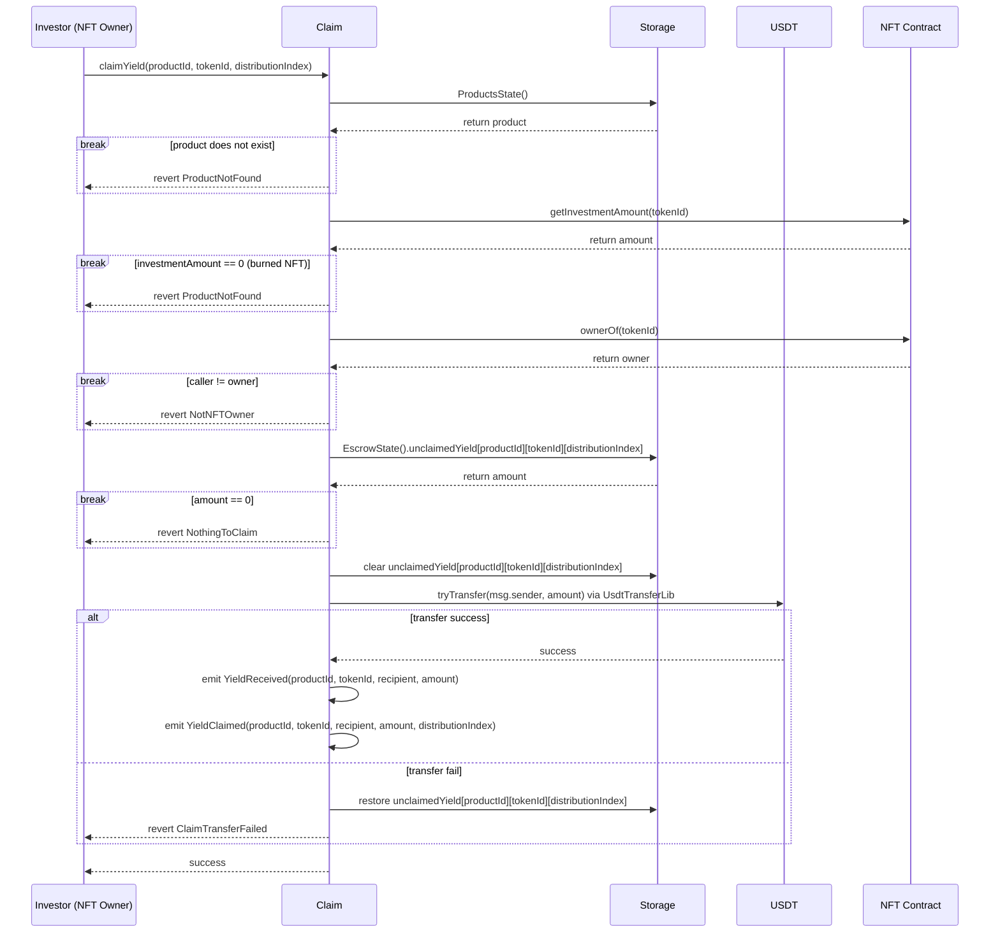
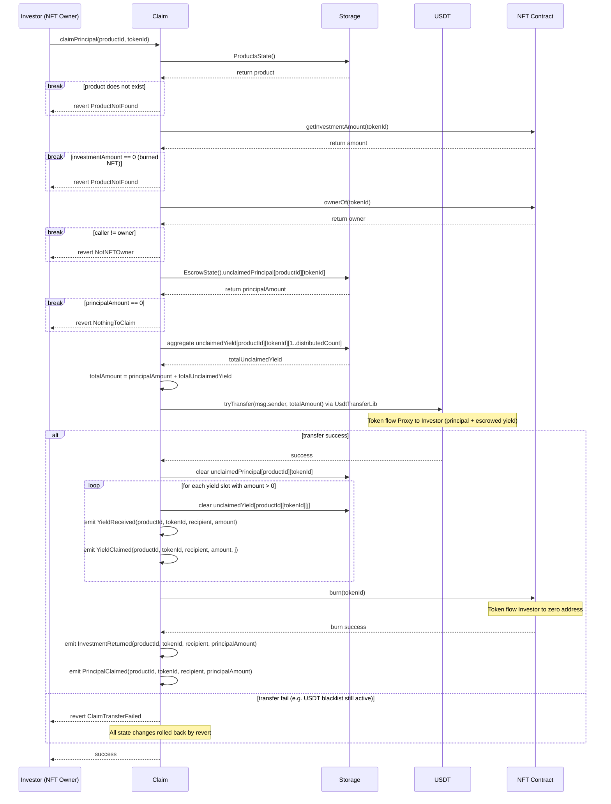

# Investment Contract

## Claim

### claimYield

```mermaid
sequenceDiagram
    participant investor as Investor (NFT Owner)
    participant claim as Claim
    participant storage as Storage
    participant usdt as USDT
    participant nft as NFT Contract

    investor->>claim: claimYield(productId, tokenId, distributionIndex)

    claim->>storage: ProductsState()
    storage-->>claim: return product
    break product does not exist
        claim-->>investor: revert ProductNotFound
    end

    claim->>nft: getInvestmentAmount(tokenId)
    nft-->>claim: return amount
    break investmentAmount == 0 (burned NFT)
        claim-->>investor: revert ProductNotFound
    end

    claim->>nft: ownerOf(tokenId)
    nft-->>claim: return owner
    break caller != owner
        claim-->>investor: revert NotNFTOwner
    end

    claim->>storage: EscrowState().unclaimedYield[productId][tokenId][distributionIndex]
    storage-->>claim: return amount
    break amount == 0
        claim-->>investor: revert NothingToClaim
    end

    claim->>storage: clear unclaimedYield[productId][tokenId][distributionIndex]
    claim->>usdt: tryTransfer(msg.sender, amount) via UsdtTransferLib
    alt transfer success
        usdt-->>claim: success
        claim->>claim: emit YieldReceived(productId, tokenId, recipient, amount)
        claim->>claim: emit YieldClaimed(productId, tokenId, recipient, amount, distributionIndex)
    else transfer fail
        claim->>storage: restore unclaimedYield[productId][tokenId][distributionIndex]
        claim-->>investor: revert ClaimTransferFailed
    end

    claim-->>investor: success
```

### claimPrincipal

```mermaid
sequenceDiagram
    participant investor as Investor (NFT Owner)
    participant claim as Claim
    participant storage as Storage
    participant usdt as USDT
    participant nft as NFT Contract

    investor->>claim: claimPrincipal(productId, tokenId)

    claim->>storage: ProductsState()
    storage-->>claim: return product
    break product does not exist
        claim-->>investor: revert ProductNotFound
    end

    claim->>nft: getInvestmentAmount(tokenId)
    nft-->>claim: return amount
    break investmentAmount == 0 (burned NFT)
        claim-->>investor: revert ProductNotFound
    end

    claim->>nft: ownerOf(tokenId)
    nft-->>claim: return owner
    break caller != owner
        claim-->>investor: revert NotNFTOwner
    end

    claim->>storage: EscrowState().unclaimedPrincipal[productId][tokenId]
    storage-->>claim: return principalAmount
    break principalAmount == 0
        claim-->>investor: revert NothingToClaim
    end

    claim->>storage: aggregate unclaimedYield[productId][tokenId][1..distributedCount]
    storage-->>claim: totalUnclaimedYield
    claim->>claim: totalAmount = principalAmount + totalUnclaimedYield

    claim->>usdt: tryTransfer(msg.sender, totalAmount) via UsdtTransferLib
    Note over usdt: Token flow Proxy to Investor (principal + escrowed yield)

    alt transfer success
        usdt-->>claim: success
        claim->>storage: clear unclaimedPrincipal[productId][tokenId]
        loop for each yield slot with amount > 0
            claim->>storage: clear unclaimedYield[productId][tokenId][j]
            claim->>claim: emit YieldReceived(productId, tokenId, recipient, amount)
            claim->>claim: emit YieldClaimed(productId, tokenId, recipient, amount, j)
        end
        claim->>nft: burn(tokenId)
        Note over nft: Token flow Investor to zero address
        nft-->>claim: burn success
        claim->>claim: emit InvestmentReturned(productId, tokenId, recipient, principalAmount)
        claim->>claim: emit PrincipalClaimed(productId, tokenId, recipient, principalAmount)
    else transfer fail (e.g. USDT blacklist still active)
        claim-->>investor: revert ClaimTransferFailed
        Note over claim: All state changes rolled back by revert
    end

    claim-->>investor: success
```
