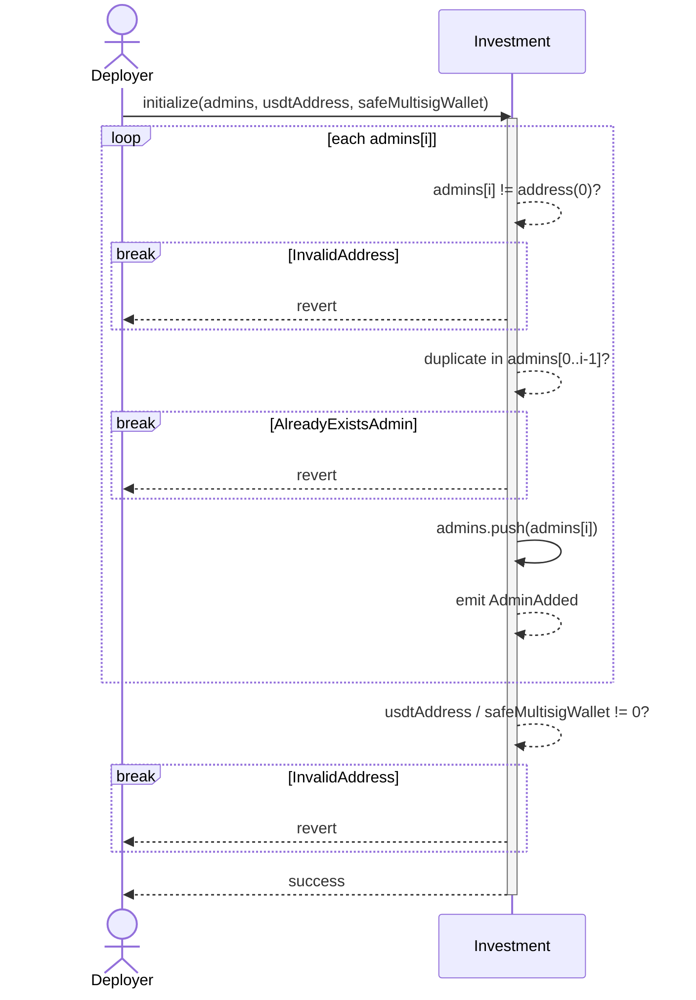
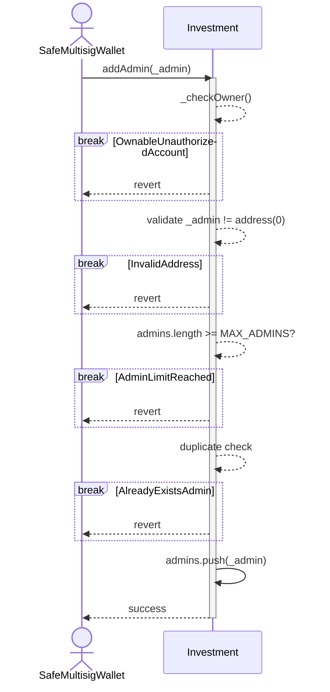
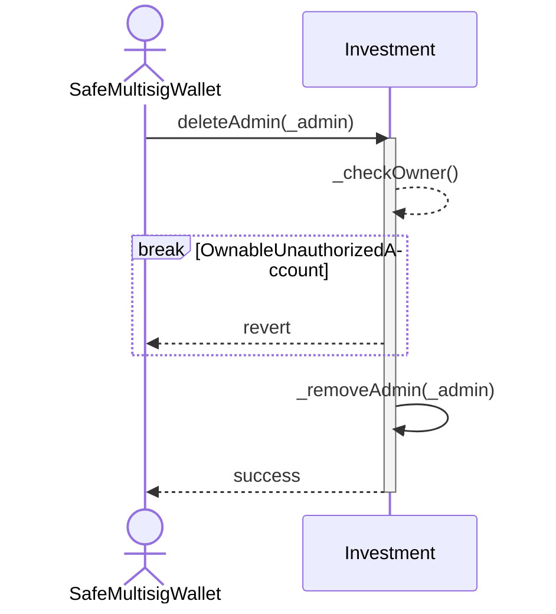

# ControllAdmin

## initialize（デプロイ時・1回のみ）

`InvestmentDeployer.deployInvestment` 経由でプロキシに対して呼び出される。

## addAdmin
onlyOwner(Safe Multisig Wallet only)
- admin数は最大255に制限（`MAX_ADMINS = 255`）

## deleteAdmin
onlyOwner(Safe Multisig Wallet only)

