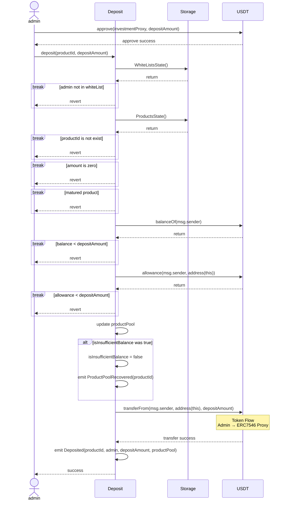

# Investment Contract

## Deposit

```mermaid
sequenceDiagram
  actor admin
  participant deposit as Deposit
  participant storage as Storage
  participant usdt as USDT

  admin ->> usdt: approve(investmentProxy, depositAmount)
  usdt -->> admin: approve success
  admin ->> deposit: deposit(productId, depositAmount)
  deposit ->> storage: WhiteListsState()
  storage -->> deposit: return
  break admin not in whiteList
    deposit -->> admin: revert
  end

  deposit ->> storage: ProductsState()
  storage -->> deposit: return
  break productId is not exist
    deposit -->> admin: revert
  end
  break amount is zero
    deposit -->> admin: revert
  end
   break matured product
    deposit -->> admin: revert
  end
  deposit ->> usdt: balanceOf(msg.sender)
  usdt -->> deposit: return
  break balance < depositAmount
    deposit -->> admin: revert
  end
  deposit ->> usdt: allowance(msg.sender, address(this))
  usdt -->> deposit: return
  break allowance < depositAmount
    deposit -->> admin: revert
  end

  deposit ->> deposit: update productPool
  alt isInsufficientBalance was true
    deposit ->> deposit: isInsufficientBalance = false
    deposit ->> deposit: emit ProductPoolRecovered(productId)
  end

  deposit ->> usdt: transferFrom(msg.sender, address(this), depositAmount)
  note over usdt: Token Flow <br/>Admin → ERC7546 Proxy
  usdt -->> deposit: transfer success


  deposit ->> deposit: emit Deposited(productId, admin, depositAmount, productPool)
  deposit -->> admin: success
```
