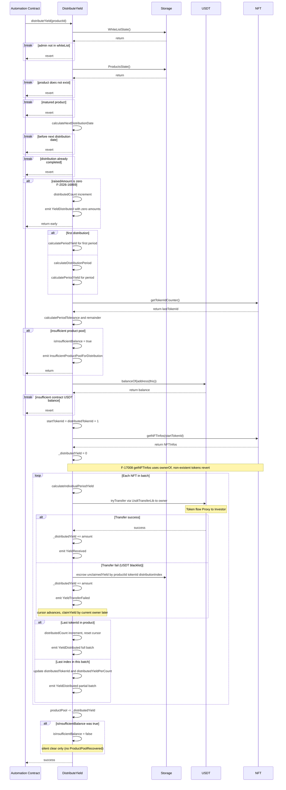

# Investment Contract

## DistributeYield

```mermaid
sequenceDiagram
    participant auto as Automation Contract
    participant dist as DistributeYield
    participant storage as Storage
    participant usdt as USDT
    participant nft as NFT

    auto->>dist: distributeYield(productId)

    dist->>storage: WhiteListState()
    storage-->>dist: return
    break admin not in whiteList
        dist-->>auto: revert
    end

    dist->>storage: ProductsState()
    storage-->>dist: return
    break product does not exist
        dist-->>auto: revert
    end
    break matured product
        dist-->>auto: revert
    end

    dist->>dist: calculateNextDistributionDate
    break before next distribution date
        dist-->>auto: revert
    end
    break distribution already completed
        dist-->>auto: revert
    end

    alt raisedAmount is zero F-2026-16869
        dist->>dist: distributedCount increment
        dist->>dist: emit YieldDistributed with zero amounts
        dist-->>auto: return early
    end

    alt first distribution
        dist->>dist: calculatePeriodYield for first period
    else
        dist->>dist: calculateDistributionPeriod
        dist->>dist: calculatePeriodYield for period
    end

    dist->>nft: getTokenIdCounter()
    nft-->>dist: return lastTokenId
    dist->>dist: calculatePeriodTolerance and remainder

    alt insufficient product pool
        dist->>dist: isInsufficientBalance = true
        dist->>dist: emit InsufficientProductPoolForDistribution
        dist-->>auto: return
    end

    dist->>usdt: balanceOf(address(this))
    usdt-->>dist: return balance
    break insufficient contract USDT balance
        dist-->>auto: revert
    end

    dist->>dist: startTokenId = distributedTokenId + 1
    dist->>nft: getNFTInfos(startTokenId)
    nft-->>dist: return NFTInfos
    dist->>dist: _distributedYield = 0

    Note over dist,nft: F-17008 getNFTInfos uses ownerOf, non-existent tokens revert
    loop Each NFT in batch
        dist->>dist: calculateIndividualPeriodYield
        dist->>usdt: tryTransfer via UsdtTransferLib to owner
        Note over usdt: Token flow Proxy to Investor
        alt Transfer success
            usdt-->>dist: success
            dist->>dist: _distributedYield += amount
            dist->>dist: emit YieldReceived
        else Transfer fail (USDT blacklist)
            dist->>storage: escrow unclaimedYield by productId tokenId distributionIndex
            dist->>dist: _distributedYield += amount
            dist->>dist: emit YieldTransferFailed
            Note over dist: cursor advances, claimYield by current owner later
        end
        alt Last tokenId in product
            dist->>dist: distributedCount increment, reset cursor
            dist->>dist: emit YieldDistributed full batch
        else Last index in this batch
            dist->>dist: update distributedTokenId and distributedYieldPerCount
            dist->>dist: emit YieldDistributed partial batch
        end
    end

    dist->>dist: productPool -= _distributedYield
    alt isInsufficientBalance was true
        dist->>dist: isInsufficientBalance = false
        Note over dist: silent clear only (no ProductPoolRecovered)
    end

    dist-->>auto: success
```
