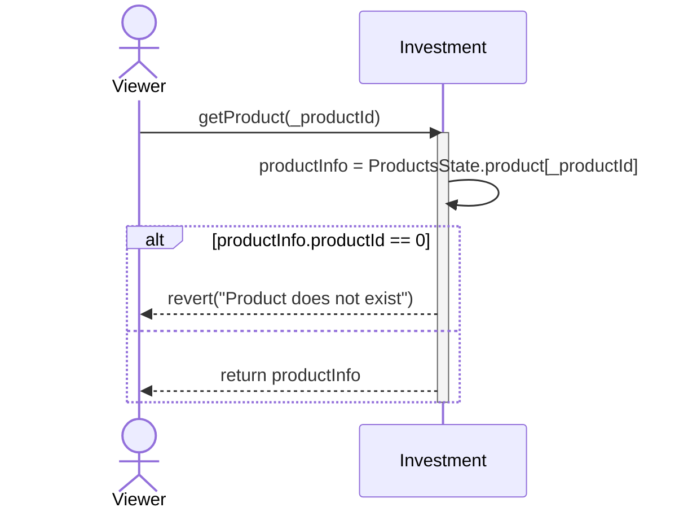
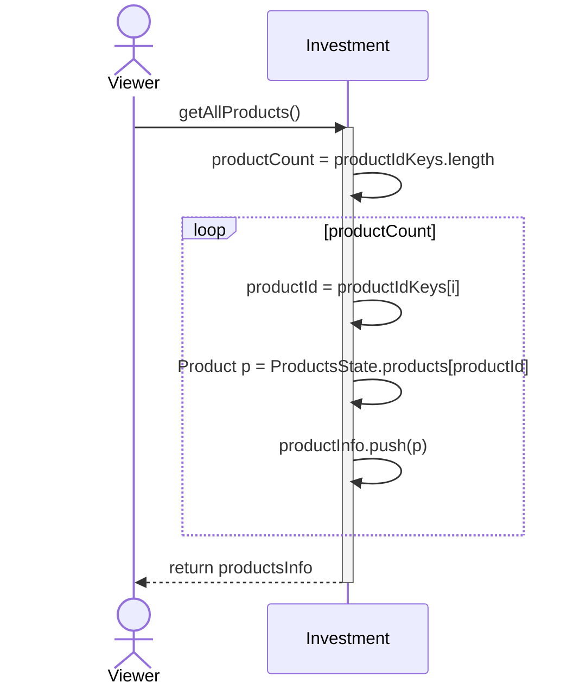
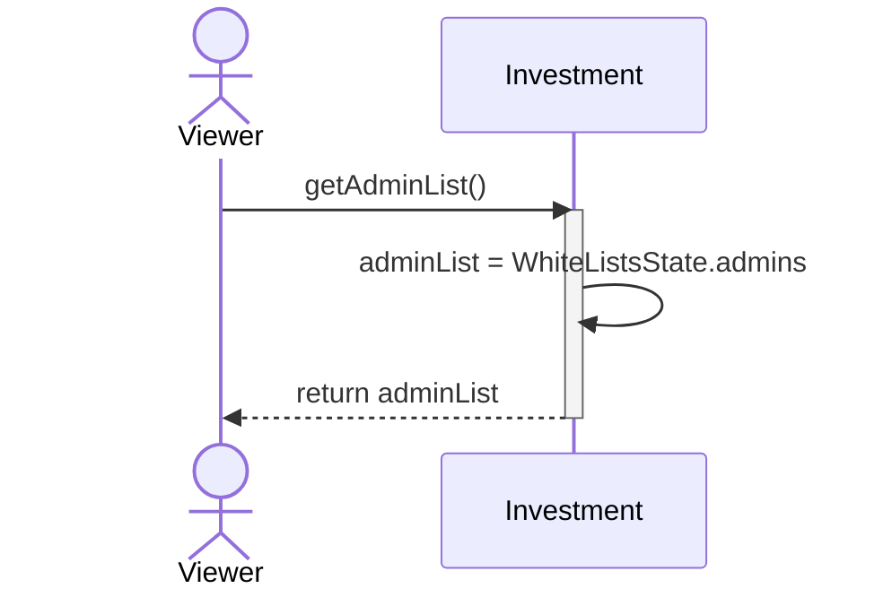
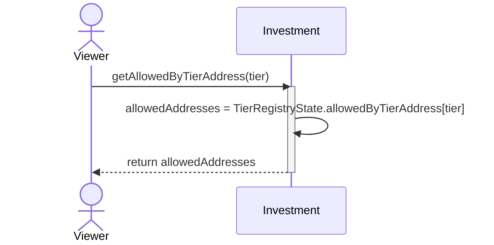
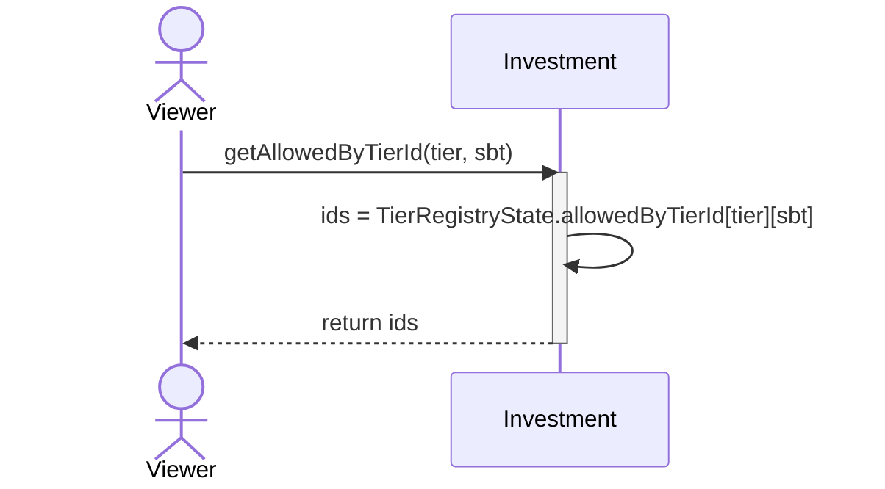
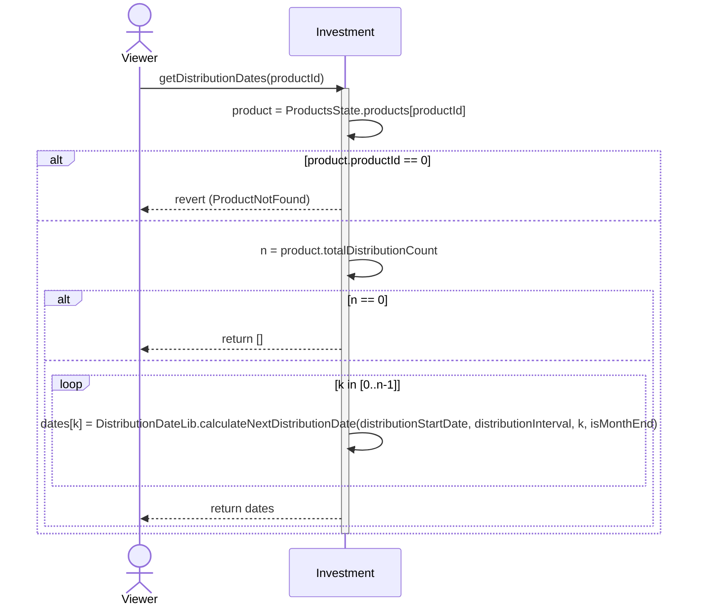
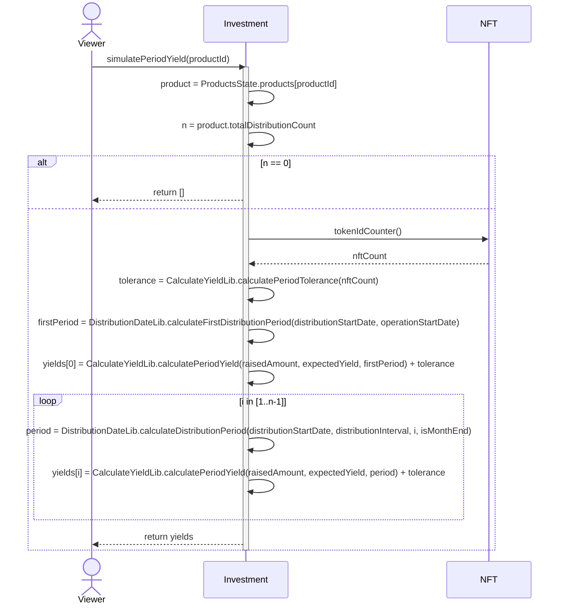
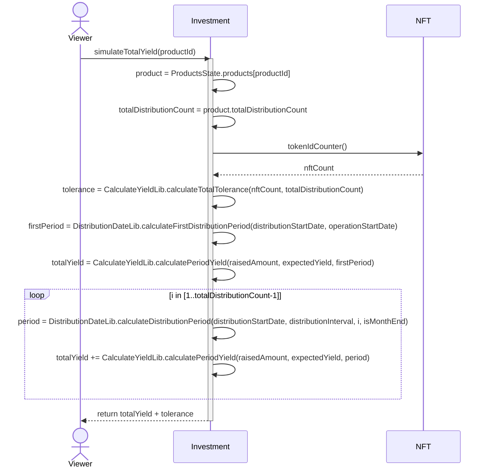
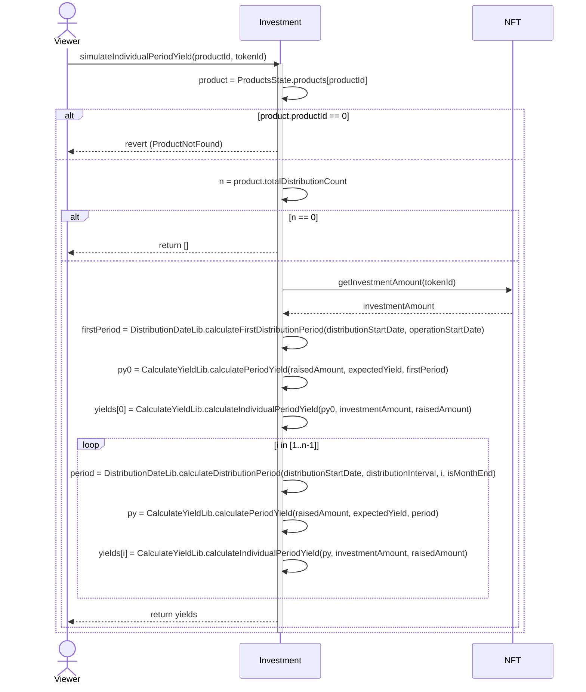
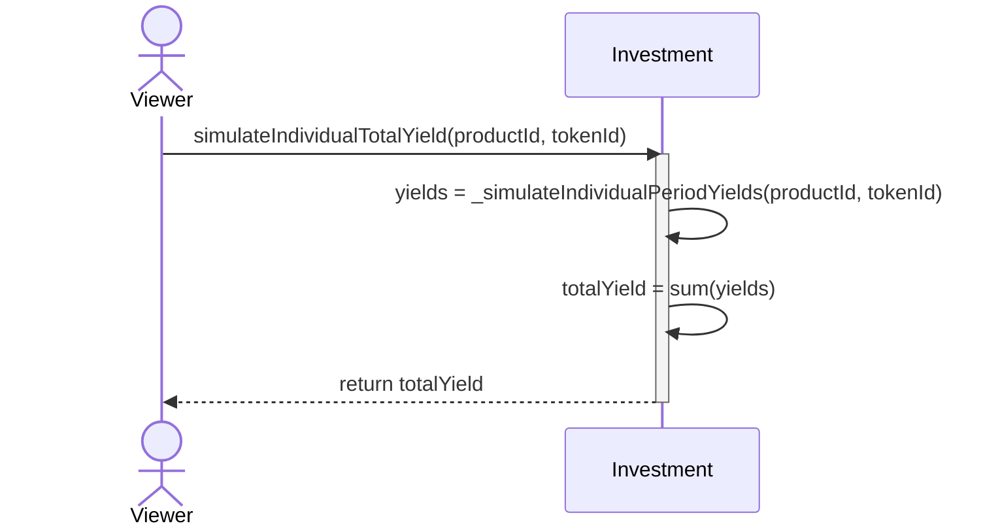

# Getter

## getProduct

## getAllProducts

## getAdminList

## getAllowedByTierAddress

## getAllowedByTierId

## getDistributionDates

## simulatePeriodYield

## simulateTotalYield

## simulateIndividualPeriodYield

## simulateIndividualTotalYield

