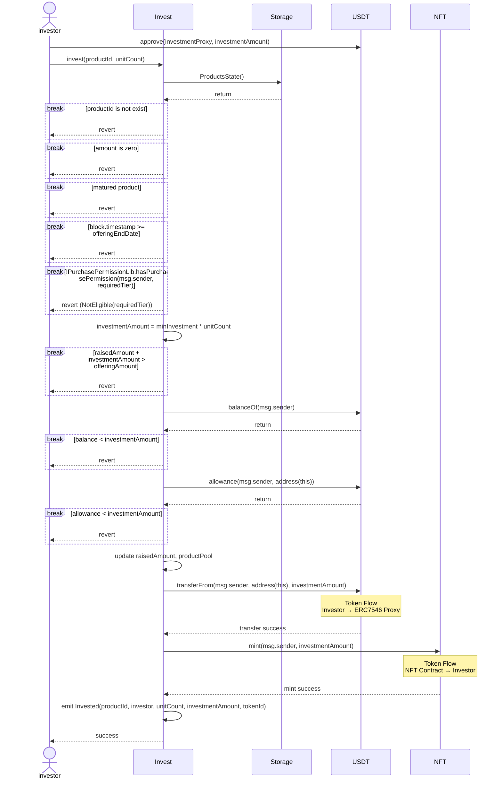

# Investment Contract

## Invest

```mermaid
sequenceDiagram
  actor investor
  participant invest as Invest
  participant storage as Storage
  participant usdt as USDT
  participant nft as NFT

  investor ->> usdt: approve(investmentProxy, investmentAmount)
  investor ->> invest: invest(productId, unitCount)
  invest ->> storage: ProductsState()
  storage -->> invest: return

  break productId is not exist
    invest -->> investor: revert
  end
  break amount is zero
    invest -->> investor: revert
  end
  break matured product
    invest -->> investor: revert
  end
  break block.timestamp >= offeringEndDate
    invest -->> investor: revert
  end

  break !PurchasePermissionLib.hasPurchasePermission(msg.sender, requiredTier)
    invest -->> investor: revert (NotEligible(requiredTier))
  end

  invest ->> invest: investmentAmount = minInvestment * unitCount
  break raisedAmount + investmentAmount > offeringAmount
    invest -->> investor: revert
  end
  invest ->> usdt: balanceOf(msg.sender)
  usdt -->> invest: return
  break balance < investmentAmount
    invest -->> investor: revert
  end
  invest ->> usdt: allowance(msg.sender, address(this))
  usdt -->> invest: return
  break allowance < investmentAmount
    invest -->> investor: revert
  end

  invest ->> invest: update raisedAmount, productPool

  invest ->> usdt: transferFrom(msg.sender, address(this), investmentAmount)
  note over usdt: Token Flow <br/>Investor → ERC7546 Proxy
  usdt -->> invest: transfer success
  invest ->> nft: mint(msg.sender, investmentAmount)
  note over nft: Token Flow <br/>NFT Contract → Investor
  nft -->> invest: mint success
  invest ->> invest: emit Invested(productId, investor, unitCount, investmentAmount, tokenId)
  invest -->> investor: success
```
