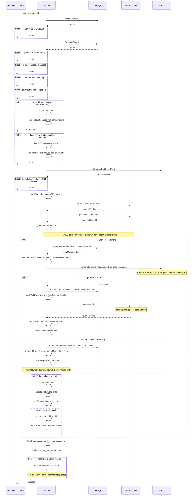

# Investment Contract

## Maturity

```mermaid
sequenceDiagram
    participant auto as Automation Contract
    participant maturity as Maturity
    participant storage as Storage
    participant nft as NFT Contract
    participant usdt as USDT

    auto->>maturity: maturity(productId)

    maturity->>storage: WhiteListState()
    storage-->>maturity: return
    break admin not in whiteList
        maturity-->>auto: revert
    end

    maturity->>storage: ProductsState()
    storage-->>maturity: return
    break product does not exist
        maturity-->>auto: revert
    end
    break product already matured
        maturity-->>auto: revert
    end
    break before maturity date
        maturity-->>auto: revert
    end
    break distribution not completed
        maturity-->>auto: revert
    end

    alt raisedAmount is zero F-2026-16869
        maturity->>maturity: isMaturity = true
        maturity->>maturity: emit ProductMatured with zero amounts
        maturity-->>auto: return early
    end

    alt insufficient product pool for maturity
        maturity->>maturity: isInsufficientBalance = true
        maturity->>maturity: emit InsufficientProductPoolForMaturity
        maturity-->>auto: return
    end

    maturity->>usdt: balanceOf(address(this))
    usdt-->>maturity: return balance
    break insufficient contract USDT balance
        maturity-->>auto: revert
    end

    maturity->>maturity: startTokenId = maturedTokenId + 1
    maturity->>nft: getNFTInfos(startTokenId)
    nft-->>maturity: return NFTInfos
    maturity->>nft: getTokenIdCounter()
    nft-->>maturity: return lastTokenId
    maturity->>maturity: _returnedAmount = 0

    Note over maturity,nft: F-17008 getNFTInfos uses ownerOf, non-existent tokens revert
    loop Each NFT in batch
        maturity->>storage: aggregate unclaimedYield slots for tokenId
        storage-->>maturity: totalUnclaimedYield
        maturity->>maturity: totalAmount = investmentAmount + totalUnclaimedYield
        maturity->>usdt: tryTransfer(owner, totalAmount) via UsdtTransferLib
        Note over usdt: Token flow Proxy to Investor (principal + escrowed yield)
        alt Transfer success
            usdt-->>maturity: success
            maturity->>storage: clear each unclaimedYield slot with nonzero amount
            maturity->>maturity: emit YieldReceived and YieldClaimed per slot
            maturity->>nft: burn(tokenId)
            Note over nft: Token flow Investor to zero address
            nft-->>maturity: burn success
            maturity->>maturity: _returnedAmount += investmentAmount
            maturity->>maturity: emit InvestmentReturned
        else Transfer fail (USDT blacklist)
            maturity->>storage: escrow unclaimedPrincipal for productId and tokenId
            maturity->>maturity: _returnedAmount += investmentAmount (no burn)
            maturity->>maturity: emit PrincipalTransferFailed
            Note over maturity: NFT retained, yield stays escrowed, claimPrincipal later
        end
        alt Last tokenId in product
            maturity->>maturity: isMaturity = true
            maturity->>maturity: update maturedTokenId
            maturity->>maturity: emit ProductMatured full batch
        else Last index in this batch
            maturity->>maturity: update maturedTokenId
            maturity->>maturity: emit ProductMatured partial batch
        end
    end

    maturity->>maturity: totalReturnedAmount += _returnedAmount
    maturity->>maturity: productPool -= _returnedAmount
    alt isInsufficientBalance was true
        maturity->>maturity: isInsufficientBalance = false
        Note over maturity: silent clear only (no ProductPoolRecovered)
    end
    maturity-->>auto: success
```
