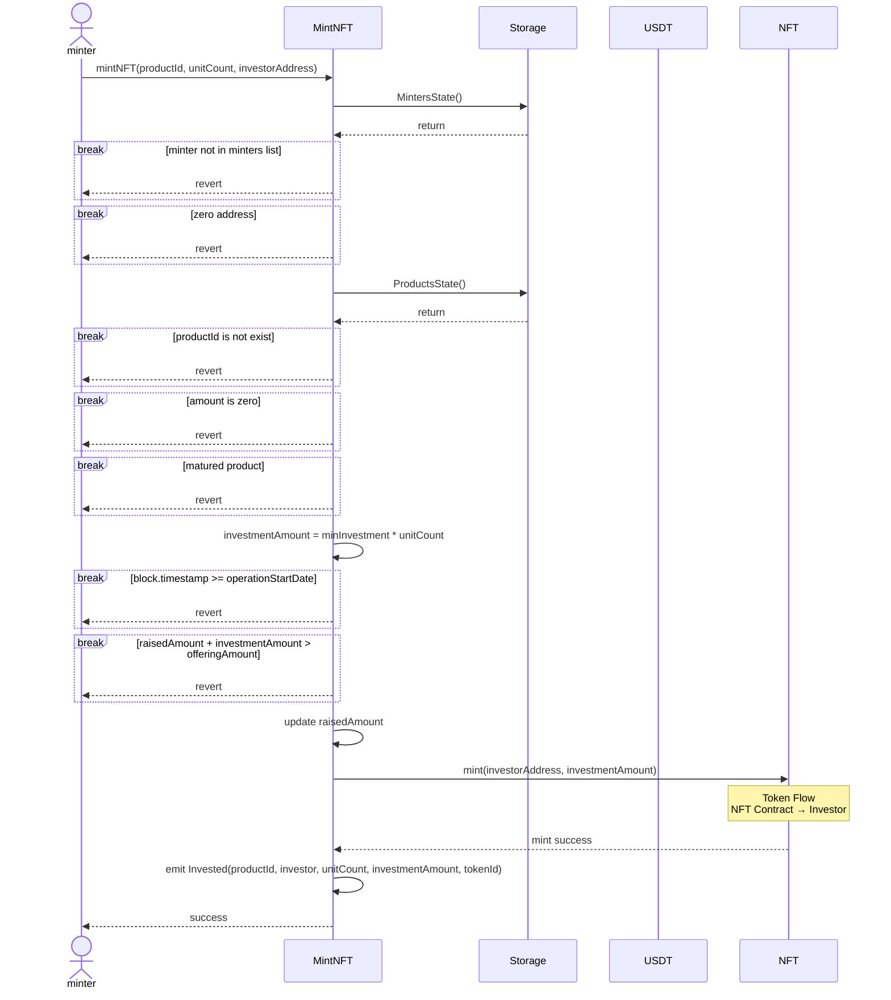

# Investment Contract

## MintNFT(JPY Payment)

```mermaid
sequenceDiagram
  actor minter
  participant mintnft as MintNFT
  participant storage as Storage
  participant usdt as USDT
  participant nft as NFT

  minter ->> mintnft: mintNFT(productId, unitCount, investorAddress)
  mintnft ->> storage: MintersState()
  storage -->> mintnft: return
  break minter not in minters list
    mintnft -->> minter: revert
  end
  break zero address
    mintnft -->> minter: revert
  end

  mintnft ->> storage: ProductsState()
  storage -->> mintnft: return
  break productId is not exist
    mintnft -->> minter: revert
  end
  break amount is zero
    mintnft -->> minter: revert
  end
  break matured product
    mintnft -->> minter: revert
  end

  mintnft ->> mintnft: investmentAmount = minInvestment * unitCount
  break block.timestamp >= operationStartDate
    mintnft -->> minter: revert
  end

  break raisedAmount + investmentAmount > offeringAmount
    mintnft -->> minter: revert
  end

  mintnft ->> mintnft: update raisedAmount

  mintnft ->> nft: mint(investorAddress, investmentAmount)
  note over nft: Token Flow <br/>NFT Contract → Investor
  nft -->> mintnft: mint success

  mintnft ->> mintnft: emit Invested(productId, investor, unitCount, investmentAmount, tokenId)
  mintnft -->> minter: success
```
