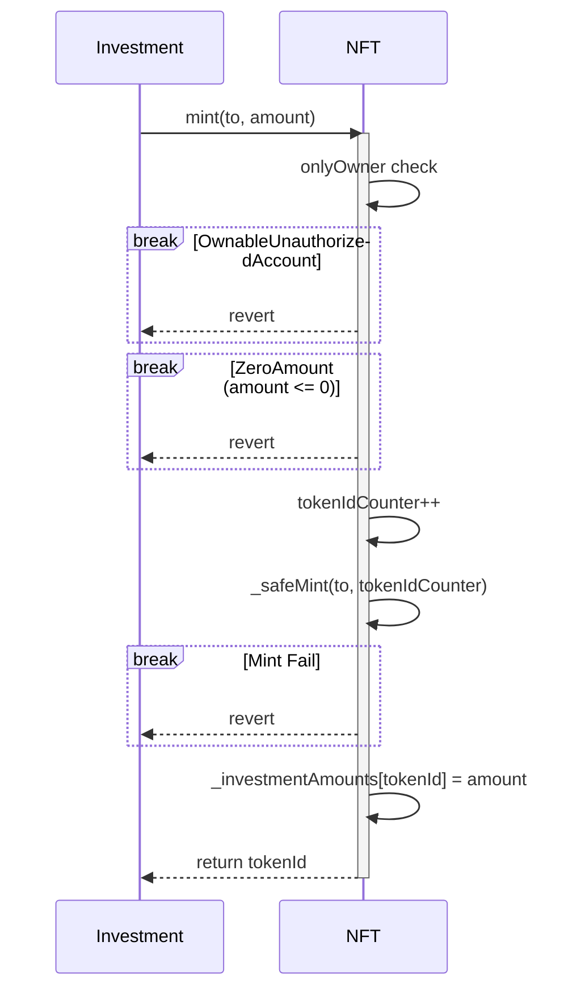
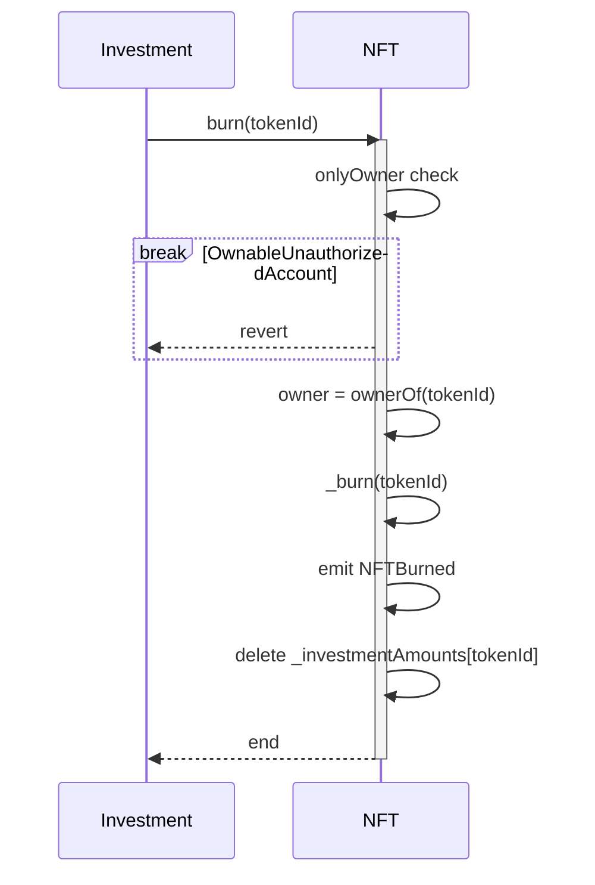
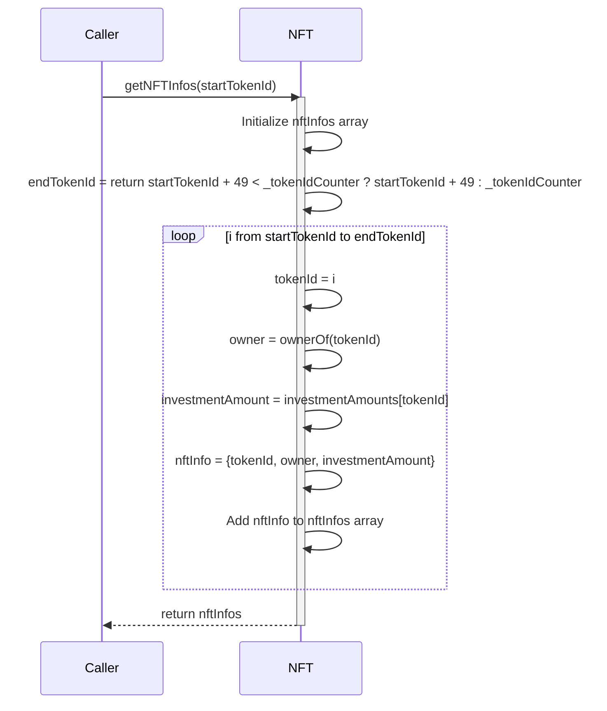
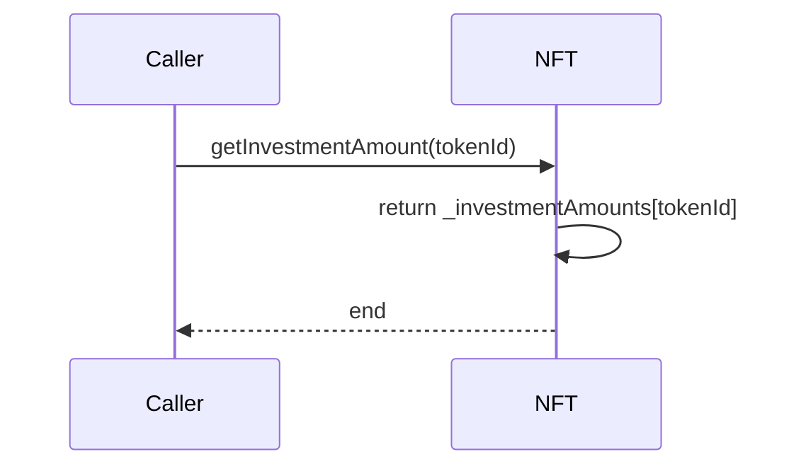
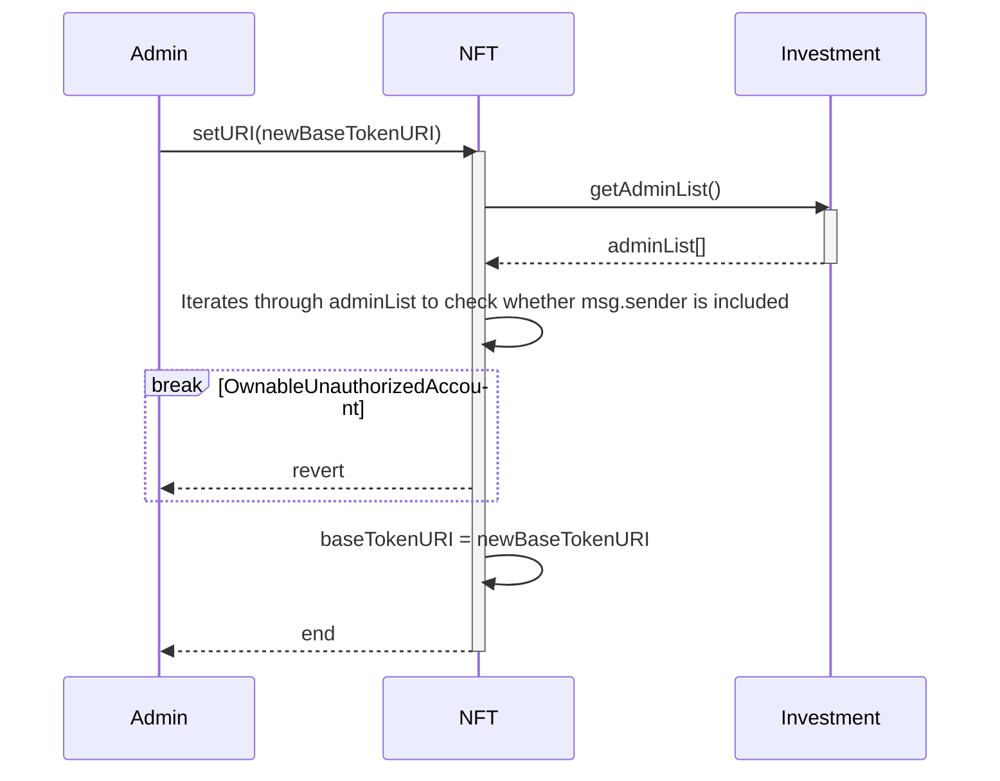
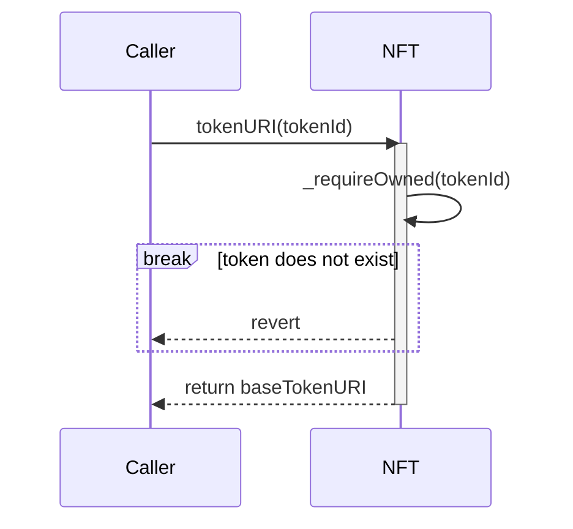

# Investment NFT

## mint
onlyOwner

## burn
onlyOwner

## getNFTInfos

## getInvestmentAmount

## setURI
onlyAdmin (Investment contract admin)

## tokenURI
All tokens share the same metadata.json (baseTokenURI)

