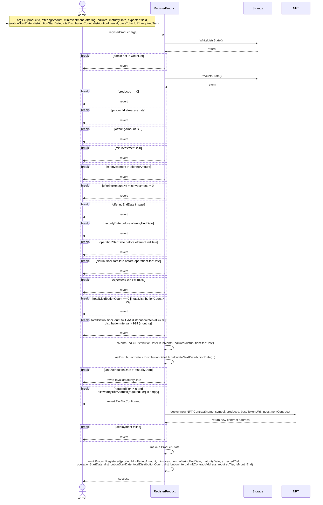

# Investment Contract

## RegisterProduct

```mermaid
sequenceDiagram
    actor admin
    participant register as RegisterProduct
    participant storage as Storage
    participant nft as NFT

    note over admin: args = {productId, offeringAmount, minInvestment, offeringEndDate, maturityDate, expectedYield,<br/>operationStartDate, distributionStartDate, totalDistributionCount, distributionInterval, baseTokenURI, requiredTier}
    admin ->> register: registerProduct(args)
    register ->> storage: WhiteListsState()
    storage -->> register: return
    break admin not in whiteList
        register -->> admin: revert
    end
    register ->> storage: ProductsState()
    storage -->> register: return
    break productId == 0
        register -->> admin: revert
    end
    break productId already exists
        register -->> admin: revert
    end
    break offeringAmount is 0
        register -->> admin: revert
    end
    break minInvestment is 0
        register -->> admin: revert
    end
    break minInvestment > offeringAmount
        register -->> admin: revert
    end
    break offeringAmount % minInvestment != 0
        register -->> admin: revert
    end
    break offeringEndDate in past
        register -->> admin: revert
    end
    break maturityDate before offeringEndDate
        register -->> admin: revert
    end
    break operationStartDate before offeringEndDate
        register -->> admin: revert
    end
    break distributionStartDate before operationStartDate
        register -->> admin: revert
    end
    break expectedYield >= 100%
        register -->> admin: revert
    end
    break totalDistributionCount == 0 || totalDistributionCount > 24
        register -->> admin: revert
    end
    break totalDistributionCount != 1 && distributionInterval == 0 || distributionInterval > 999 (months)
        register -->> admin: revert
    end
    register ->> register: isMonthEnd = DistributionDateLib.isMonthEndDate(distributionStartDate)
    register ->> register: lastDistributionDate = DistributionDateLib.calculateNextDistributionDate(...)
    break lastDistributionDate > maturityDate
        register -->> admin: revert InvalidMaturityDate
    end
    break requiredTier != 0 and allowedByTierAddress[requiredTier] is empty
        register -->> admin: revert TierNotConfigured
    end
    register ->> nft: deploy new NFT Contract(name, symbol, productId, baseTokenURI, investmentContract)
    nft -->> register: return new contract address
    break deployment failed
        register -->> admin: revert
    end
    register ->> register: make a Product State
    register ->> register: emit ProductRegistered(productId, offeringAmount, minInvestment, offeringEndDate, maturityDate, expectedYield,<br/>operationStartDate, distributionStartDate, totalDistributionCount, distributionInterval, nftContractAddress, requiredTier, isMonthEnd)
    register -->> admin: success
```
