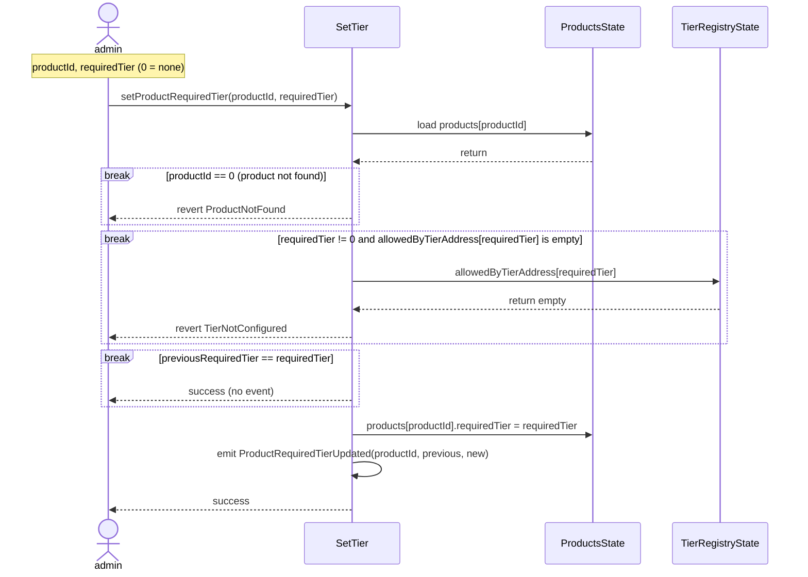

# Investment Contract

## SetProductRequiredTier

登録済み商品の `requiredTier` を管理者が更新する（F-2026-16955 追補 API）。満期済み（`isMaturity == true`）商品も更新可能。`invest` / `mintNFT` は従来どおり満期時に `MaturedProduct` で拒否される。

### 関連

| 項目 | 内容 |
|------|------|
| 実装 | `src/investment/functions/onlyWhiteLists/SetTier.sol` |
| イベント | `ProductRequiredTierUpdated`（`IInvestmentEvents.sol`） |
| 登録時検証 | `Sequence-RegisterProduct.md`（CREATE2 前の `TierNotConfigured`） |
| 監査 | `docs/audit/fix/F-2026-16955-missing-tier-registry-validation-register-product.md` §11 |
