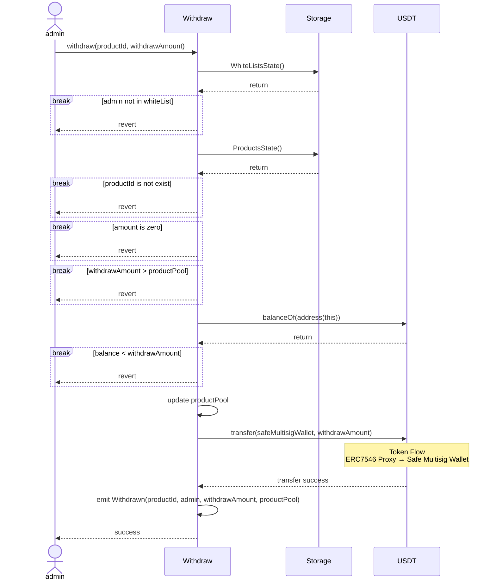

# Investment Contract

## Withdraw

```mermaid
sequenceDiagram
  actor admin
  participant withdraw as Withdraw
  participant storage as Storage
  participant usdt as USDT

  admin ->> withdraw: withdraw(productId, withdrawAmount)
  withdraw ->> storage: WhiteListsState()
  storage -->> withdraw: return
  break admin not in whiteList
    withdraw -->> admin: revert
  end

  withdraw ->> storage: ProductsState()
  storage -->> withdraw: return
  break productId is not exist
    withdraw -->> admin: revert
  end
  break amount is zero
    withdraw -->> admin: revert
  end
  break withdrawAmount > productPool
    withdraw -->> admin: revert
  end
  withdraw ->> usdt: balanceOf(address(this))
  usdt -->> withdraw: return
  break balance < withdrawAmount
    withdraw -->> admin: revert
  end
  withdraw ->> withdraw: update productPool

  withdraw ->> usdt: transfer(safeMultisigWallet, withdrawAmount)
  note over usdt: Token Flow <br/>ERC7546 Proxy → Safe Multisig Wallet
  usdt -->> withdraw: transfer success

  withdraw ->> withdraw: emit Withdrawn(productId, admin, withdrawAmount, productPool)
  withdraw -->> admin: success
```
