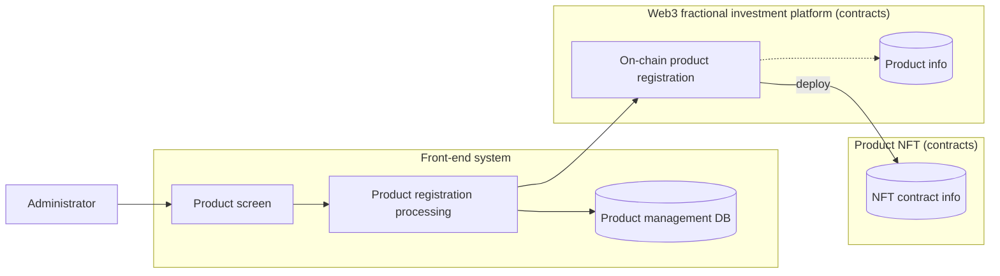
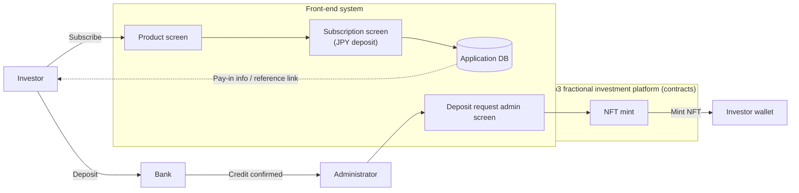
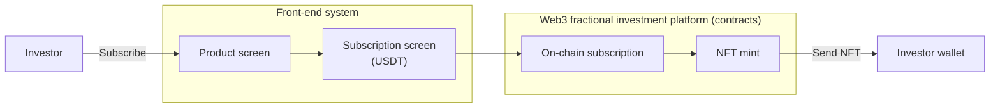
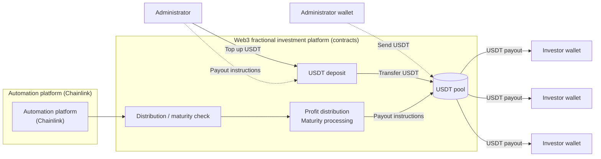
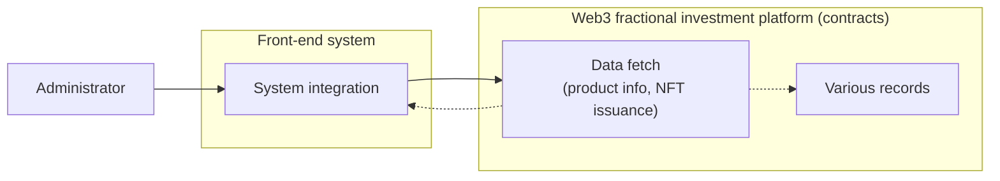

# Business Flow Diagrams (Markdown)

---

## 1. Product Registration

### Notes

- Administrator enters product information.  
- Front end runs product registration processing.  
- Data is saved to the product management DB.  
- Contracts register the product on-chain and deploy the NFT contract.

---

## 2. Subscription (JPY) → NFT Issuance

### Deposit confirmation information

- Depositor (reference number, name)  
- Deposit amount  

### Notes

- Investor applies for JPY deposit from the product screen.  
- Application data is stored in the front-end DB.  
- Investor deposits at the bank.  
- After credit confirmation, administrator mints NFT from the admin screen.  
- NFT is issued to the investor wallet.

---

## 3. Subscription (USDT) → NFT Issuance

### Notes

- Investor subscribes with USDT from the product screen.  
- Contracts process the subscription.  
- NFT is minted to the investor wallet.

---

## 4. Profit Distribution and Maturity

### Notes

- The automation platform triggers at the target time.  
- Contracts determine distribution or maturity targets.  
- Administrator tops up USDT as needed.  
- USDT is sent from the pool to each investor wallet (immediate push on success).  
- **On transfer failure**: amounts are escrowed; batch continues; current NFT owner **`claimYield` / `claimPrincipal`**.  
- **For maturity**, on success: sweep all unclaimed yield with principal in a single transfer, then burn NFT. On failure: escrow principal (yield stays escrowed), do not burn.

### UC: Claim escrowed yield/principal (investor)

| Item | Detail |
|------|--------|
| Precondition | `YieldTransferFailed` or `PrincipalTransferFailed` emitted |
| Actor | `ownerOf(tokenId)` |
| Flow | Check unclaimed via getters → transfer NFT to a clean wallet if needed → `claimYield` (per slot) or `claimPrincipal` (principal + all remaining yield in one tx) |
| Outcome | `claimYield`: `YieldClaimed` on success, revert on failure (funds stay). `claimPrincipal`: individual `YieldClaimed` per slot + `PrincipalClaimed` + burn on success; revert on failure (all funds remain escrowed) |
| Note | `claimPrincipal` aggregates all unclaimed yield slots with principal for a single transfer then burns (F-2026-17209) |

---

## 5. System Integration

### Notes

- Administrator runs integration from the front-end system.  
- Contracts expose product and NFT issuance data.  
- Results are referenced as operational records.

---

## 6. Component Summary

| Component | Main role |
|-----------|-----------|
| Front-end system | Product screens, applications, DB storage, admin UI |
| Web3 fractional investment platform | Product registration, subscription, NFT issuance, distributions, maturity |
| Bank | JPY deposit channel |
| Administrator | Product registration, credit confirmation, USDT top-up, operations |
| Investor | Subscribes in JPY/USDT, receives NFT, receives returns |
| Chainlink | Scheduled execution trigger |

---
