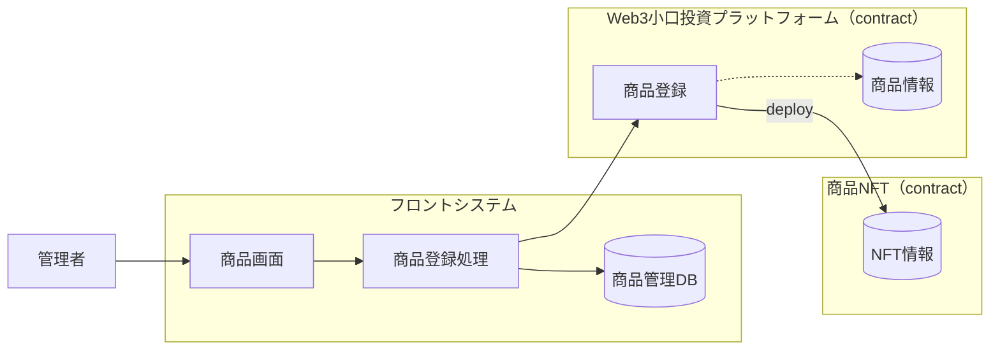
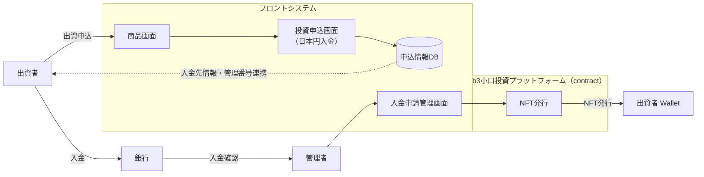
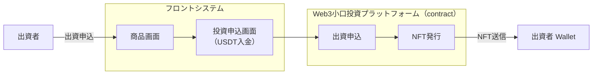
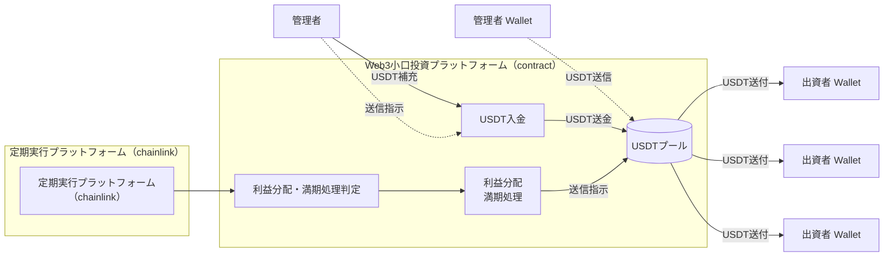
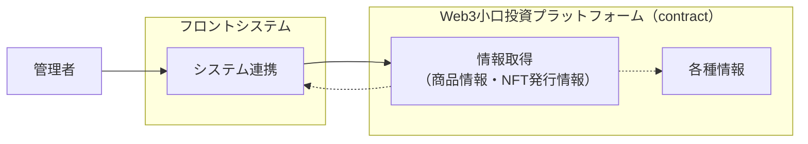

# 業務フロー図（Markdown化）

---

## 1. 商品登録

### 補足
- 管理者が商品情報を入力
- フロント側で商品登録処理を実施
- 商品管理DBへ保存
- コントラクト側で商品登録を行い、NFT コントラクトを deploy

---

## 2. 出資申込（日本円）→ NFT 発行

### 入金確認情報
- 入金者（管理番号・名前）
- 入金金額

### 補足
- 出資者は商品画面から日本円入金の申込を行う
- 申込情報はフロント側DBに保存
- 出資者は銀行へ入金
- 管理者が着金確認後、管理画面から NFT を発行
- NFT は出資者ウォレットへ発行

---

## 3. 出資申込（USDT）→ NFT 発行

### 補足
- 出資者が商品画面から USDT で出資申込
- コントラクト側で出資申込を処理
- NFT を発行して出資者ウォレットへ発行

---

## 4. 利益分配・満期処理

### 補足
- Chainlink の定期実行基盤が対象時期をトリガ
- コントラクト側で利益分配または満期処理対象を判定
- 必要に応じて管理者が USDT を補充
- USDT プールから各出資者ウォレットへ送付（成功時は即時 Push）
- **送金失敗時**: 利回り・元本をエスクロー計上しバッチは継続。投資家が **`claimYield` / `claimPrincipal`** で請求（現 NFT 保有者のみ）
- **満期処理の場合**、送金成功時は **未請求 yield も含めて合算送金し** NFT を焼却。送金失敗時は元本エスクロー（yield もそのまま）、NFT は burn しない

### UC: エスクロー利回りの請求（投資家）

| 項目 | 内容 |
|------|------|
| 前提 | 分配または満期 Push で `YieldTransferFailed` / `PrincipalTransferFailed` が発生 |
| 主体 | 当該 `tokenId` の `ownerOf` |
| 手順 | マイページで未請求残を確認 → 必要なら NFT をクリーンなウォレットへ移転 → `claimYield`（個別 slot）または `claimPrincipal`（元本 + 残 yield 一括）を実行 |
| 結果 | `claimYield`: 成功時 `YieldClaimed`、失敗時 revert（資金留保）。`claimPrincipal`: 成功時 slot ごとに `YieldClaimed` + `PrincipalClaimed` + burn、失敗時 revert（全て留保） |
| 備考 | `claimPrincipal` は未請求 yield 全 slot を元本と合算して 1 回で送金し burn する（F-2026-17209 対応）|

---

## 5. システム連携

### 補足
- 管理者がフロントシステムから情報連携を実行
- コントラクト側から商品情報・NFT発行情報などを取得
- 取得結果を各種情報として参照

---

## 6. 構成まとめ

| 区分 | 主な役割 |
|---|---|
| フロントシステム | 商品画面、申込、DB保存、管理画面 |
| Web3小口投資プラットフォーム | 商品登録、出資申込、NFT発行、利益分配、満期処理 |
| 銀行 | 日本円入金の受け皿 |
| 管理者 | 商品登録、着金確認、USDT補充、運用管理 |
| 出資者 | 日本円/USDTで出資、NFT受領、利益受取 |
| Chainlink | 定期実行トリガ |

---
